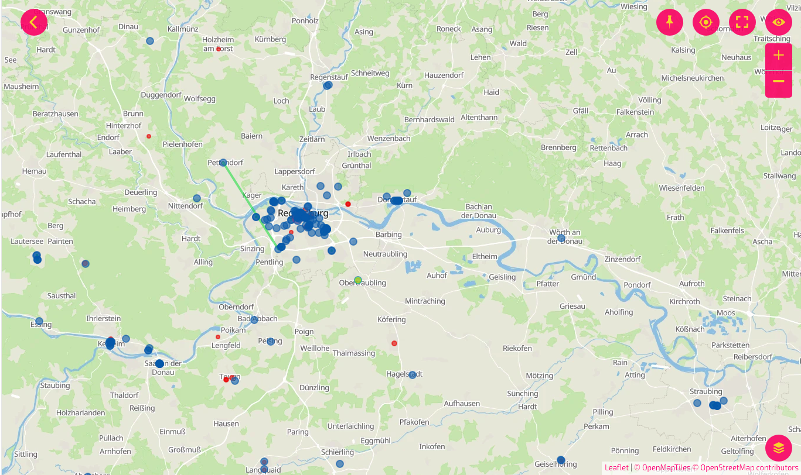
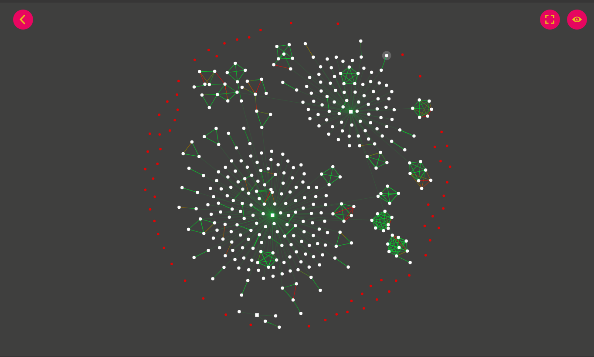

GSoC Project Ideas 2021
=======================

.. Tip:: Do you want to apply with us?

  We have a page that describes how to increase your chances of success.
  **Please read it carefully.**

  :doc:`Read our Google Summer of Code guidelines
  <../developer/google-summer-of-code>`.

.. contents:: **Table of Contents**:
   :backlinks: none
   :depth: 3

General suggestions and warnings
--------------------------------

- **Project ideas describe the goals we want to achieve
  but may miss details that have to be defined during the project**:
  we expect students to do their own research, propose solutions and be
  ready to deal with uncertainty and solve challenges that
  will come up during the project

- **Code and prototypes are preferred over detailed
  documents and unreliable estimates**:
  rather than using your time to write a very long
  application document, we suggest to invest in writing a prototype
  (which means the code may be thrown out entirely) which will help you
  understand the challenges of the project you want to work on; your
  application should refer to the prototype or other Github contributions
  you made to OpenWISP that show you have the capability to succeed in the
  project idea you are applying for.

- **Students who have either shown to have or have shown to be
  fast learners for the required hard and soft skills by
  contributing to OpenWISP have a lot more chances of being accepted**:
  in order to get started contributing refer to the
  :doc:`OpenWISP Contributing Guidelines <../developer/contributing>`

- **Get trained in the projects you want to apply for**: once
  applicants have completed some basic training by
  :doc:`contributing to OpenWISP <../developer/contributing>`
  we highly suggest to start working on
  some aspects of the project they are
  interested in applying: all projects
  listed this year are improvements
  of existing modules so these modules
  already have a list of open issues
  which can be solved as part of your advanced training.
  It will also be possible to complete some of the tasks listed in
  the project idea right now before GSoC starts.
  We will list some easy tasks in the project idea for this purpose.

Project Ideas
-------------

Improve resiliency and packaging of OpenWISP Monitoring on OpenWRT
~~~~~~~~~~~~~~~~~~~~~~~~~~~~~~~~~~~~~~~~~~~~~~~~~~~~~~~~~~~~~~~~~~

.. Important::

  Languages and technologies used:
  Mostly **Lua**, **OpenWRT**, **Makefile** but also a bit of
  **Python** and **Django**.

  **Mentors**: Federico Capoano.

`OpenWISP Monitoring <https://github.com/openwisp/openwisp-monitoring#openwisp-monitoring>`_
depends on specific lua code to be deployed on the OpenWRT
devices, this code collects monitoring information and sends it to the
OpenWISP server in `NetJSON format <https://netjson.org/>`_ (see
`Monitoring Scripts <https://github.com/openwisp/openwisp-monitoring#monitoring-scripts>`_).

At the moment, this code is deployed using a
:doc:`configuration template <../user/templates>` which is created with
a `database migration <https://github.com/openwisp/openwisp-monitoring/blob/ee2271be25649c4c262e8eaf76b6fdc5d5d002ca/openwisp_monitoring/device/migrations/0002_create_template.py>`_
when the monitoring module is installed,
but we need to convert this existing code
in a new OpenWRT package, well tested,
documented and with a key improvement regarding its resiliency.

**Pre-requisites to work on this project**:

The student should be familiar with
:doc:`OpenWISP Templates <../user/templates>`,
`OpenWRT <https://openwrt.org>`_,
`OpenWISP Monitoring <https://github.com/openwisp/openwisp-monitoring#openwisp-monitoring>`__
and should have a basic knowledge of
`NetJSON format <https://netjson.org/>`_.

**Measurable outcomes**:

- Convert `lua-monitoring <https://github.com/openwisp/lua-monitoring>`_ into
  two OpenWRT packages:

    1. One package for the netjson-monitoring utility,
       which aims to simply return NetJSON DeviceMonitoring output
    2. One package which provides the OpenWISP Monitoring deamon,
       which depends on
       netjson-monitoring and
       `openwisp-config <https://github.com/openwisp/openwisp-config>`_
       (it takes the server information from the openwisp config file)

- The ``netjson-monitoring.lua`` file is becoming too big,ç
  we have to split it over multiple files
- Each lua function used in the package shall be unit tested,
  the main cases should be covered,
  mocks should be used to simulate the different cases
- Achieve at least 93% test coverage
- The deamon shall ran by default every 5 minutes,
  but this interval shall be configurable
- If for some reason the deamon cannot communicate
  with the server (eg: internet connection is down),
  the daemon shall:

    - check if there's enough RAM available, if not, stop,
      otherwise continue to the next point
    - save the data in a new file stored in a subdirectory of ``/tmp/``
      (which is stored in memory), the file should contain the date/time
      and the data
      (eg: the filename could be the datetime and its contents the data)

- When the daemon sends data to the server,
  if the HTTP request is successful,
  it shall check if any stored data is present,
  if any stored data is present, it shall send it to the server
  (including the datetime when the measurement was taken)
  and if the request is successful it shall delete the stored
  file and proceed with the next file, until every stored
  data file is sent and deleted
- Write a README like the one of
  `openwisp-config <https://github.com/openwisp/openwisp-config>`_
  which explains the features of the module,
  how to install it/compile it
- The `OpenWISP Monitoring <https://github.com/openwisp/openwisp-monitoring#openwisp-monitoring>`_
  module needs to be patched to allow the device metrics API
  to receive measurements that
  were taken while a device was offline. By default the server will
  keep assuming implicitly that the
  datetime of new measurements is the current time, but it will
  allow the datetime to be passed explicitly

New General Navigation Menu and UX improvements
~~~~~~~~~~~~~~~~~~~~~~~~~~~~~~~~~~~~~~~~~~~~~~~

.. Important::

  Languages and technologies used:
  Mostly **HTML**, **CSS** and **Javascript**, but also a bit of
  **Python** and **Django**.

  **Mentors**: Ajay Tripathi, Federico Capoano.

The OpenWISP Admin site has become the most important web interface
of OpenWISP, but its usability has not improved much in the
last versions, in this project we aim to fix this.

**Pre-requisites to work on this project**:

The student should have installed a full OpenWISP
instance running different modules (controller, monitoring and radius)
and should be familiar with
`openwisp-utils <https://github.com/openwisp/openwisp-utils>`_.

**Measurable outcomes**:

- Create a navigation menu with one level nesting which allows
  to navigate the whole OpenWISP administration site easily and quickly:

    - the menu should look good on major browsers and mobile devices
      (Chrome/Chromium, Firefox, Microsoft Edge, Safari,
      Android default browser, IOS default browser)
    - the menu should be responsive and look good on mobile phones
    - on wide screens, the menu will be always visible and
      on the left side
    - on narrow screens, the menu will appear only when the menu button
      is clicked, the second levels will also be expanded

- Add the possibility to register menu groups, as well as to
  specify the order at which the level should be added and
  an optional icon (needs also tests and documentation)
- Add the possibilty to register menu items in levels/groups and
  specify their order
  (needs also tests and documentation)
- Ensure the old
  `register_menu_items <https://github.com/openwisp/openwisp-utils#openwisp-utils-utils-register-menu-items>`_
  function keeps working in a backward
  compatible way: we could add all the items on their own level and
  log a warning message in the python code which encourages developers
  to upgrade
- Register the menu items of all the django modules of OpenWISP, by
  opening a pull request in each respective module:

    - `Controller <https://github.com/openwisp/openwisp-controller>`_
    - `Monitoring <https://github.com/openwisp/openwisp-monitoring>`_
    - `RADIUS <https://github.com/openwisp/openwisp-radius>`_
    - `Network Topology <https://github.com/openwisp/openwisp-network-topology>`_
    - `Firmware Upgrader <https://github.com/openwisp/openwisp-firmware-upgrader>`_
    - `IPAM <https://github.com/openwisp/openwisp-ipam>`_

- Improve the general theme of the OpenWISP application to be more similar
  to `openwisp.org <https://openwisp.org>`_, we should use a lighter
  color for, the header, a bigger font, more spacing between elements
  and we should use bigger buttons and more similar in style to the
  ones used in the website
- Restyle filters in the django admin list pages:
  on wide screens, find a way to show filters on top instead
  of showing them in the lateral sidebars
- Add basic frontend tests with selenium:
    - Log in to the admin and ensure the menu is visible
    - Click on an element of the menu
    - Go to a list page and check the filters

OpenWISP REST API
~~~~~~~~~~~~~~~~~

.. Important::

  Languages and technologies used:
  **Python**, **Django**, **Django REST Framework**.

  **Mentors**: Ajay Tripahi, Noumbissi Valere, Federico Capoano.

The goal of this project is to add the much needed missing
REST API endpoints for some of the django models of the oldest
OpenWISP modules which do not ship a complete REST API.

**Pre-requisites to work on this project**:

The student should have installed a full OpenWISP
instance running different modules (controller, network topology)
and should be familiar with
`openwisp-controller <https://github.com/openwisp/openwisp-controller>`_,
`openwisp-users <https://github.com/openwisp/openwisp-users>`_ and
`openwisp-network-topology <https://github.com/openwisp/openwisp-network-topology>`_.

**Measurable outcomes**:

- Create API endpoints for openwisp-controller:

  - `REST API for main controller features <https://github.com/openwisp/openwisp-controller/issues/379>`_
  - pki app models CRUD operations
  - geo app models CRUD operations
  - connection app models CRUD operations

- Create API endpoints for openwisp-users:

  - users (include possibility of changing/updating
    permissions, groups, organization-users)
  - endpoint to manage email addresses
    (eg: add/remove/change email address, make/unmake primary)
  - organizations CRUD

- Create API endpoints for network-topology:
  CRUD of all models (Topology, Node, Link)

- Each list endpoint shall be paginated
- Each endpoint should be available only to authenticated users who must
  either be organization managers and/or superusers,
  please read the entire **Django REST Framework Permission Classes**
  section and its subsections Mixins in the
  `openwisp-users documentation <https://github.com/openwisp/openwisp-users#django-rest-framework-permission-classes>`_
- Each endpoint which is writable and generates a form in the
  Django REST Framework browsable API shall respect
  multi-tenancy when showing objects that are related to organizations,
  please see `Multi-tenant serializers for the browsable web UI
  <https://github.com/openwisp/openwisp-users#multi-tenant-serializers-for-the-browsable-web-ui>`_
  in the openwisp-users documentation
- Include basic tests for each endpoint, test coverage must not decrease
- Add a basic REST API documentation like the one we have in
  `firmware-upgrader <https://github.com/openwisp/openwisp-firmware-upgrader#rest-api>`_
- Ensure the package DRF YASG is included in the test/dev
  environment of each module touched in this project,
  as in the `Firmware Upgrader <https://github.com/openwisp/openwisp-firmware-upgrader>`_
  and `RADIUS <https://github.com/openwisp/openwisp-radius>`_ modules

Revamp Netengine and add its SNMP capability to OpenWISP Monitoring
~~~~~~~~~~~~~~~~~~~~~~~~~~~~~~~~~~~~~~~~~~~~~~~~~~~~~~~~~~~~~~~~~~~

.. Important::

  Languages and technologies used:
  **Python**, **Django**.

  **Mentors**: Gagan Deep, Federico Capoano.

The goal of this project is to add support for SNMP
(Simple Network Management Protocol) to OpenWISP Monitoring
by using `netengine <https://github.com/openwisp/netengine>`_ a python
library which aims to make easy to access monitoring information via
different protocols.

We do not need to maintain backward compatibility at this stage,
we have the freedom to change the library how we think is best.

**Pre-requisites to work on this project**:

The student should be familiar with
`OpenWISP Monitoring <https://github.com/openwisp/openwisp-monitoring#openwisp-monitoring>`__
and should have a basic knowledge of
`NetJSON format <https://netjson.org/>`_ and SNMP.

**Measurable outcomes**:

- Revamp the OpenWRT backend of `netengine <https://github.com/openwisp/netengine>`__,
  making it compliant with `NetJSON DeviceMonitoring specification <https://netjson.org/rfc.html#rfc.section.6>`_
- Revamp the backend for Ubiquiti making it compliant with
  *NetJSON DeviceMonitoring* as well
  (we will either buy one hardware model for the student or leave one
  connected to a VPN)
- Update the unit tests to reflect the changes, ensure all tests pass
- Change tests to use mocks (``unittest.mock``): the tests right now
  require the physical devices to be run, this is bad: we need to create
  mocks that allow us to run the tests without the physical devices
- Port code to python >= 3.7
- Create a test build on github actions
- Update docs to reflect the changes introduced in this project
- Remove any code not being used anymore by the new implementation
- Ensure the test coverage stays above 95%
- Modify `OpenWISP Controller <https://github.com/openwisp/openwisp-controller>`__
  to allow setting the management IP from the web UI
- Add an SNMP check in
  `OpenWISP Monitoring <https://github.com/openwisp/openwisp-monitoring>`__
  that pulls the monitoring information and creates
  the device status and charts

Bring professional efficiency to OpenWISP WiFi Login Pages
~~~~~~~~~~~~~~~~~~~~~~~~~~~~~~~~~~~~~~~~~~~~~~~~~~~~~~~~~~

.. Important::

  Languages and technologies used:
  **Javascript**, **React JS**, **NodeJS**, **HTML**, **CSS**.

  **Mentors**: Noumbissi Valere, Federico Capoano.

The goal of this project is to improve
`OpenWISP WiFi Login Pages <https://github.com/openwisp/openwisp-wifi-login-pages>`__
by reducing boilerplate code, reduce the amount of configuration lines
in the configuration files, improve test coverage and make the code
more robust.

**Pre-requisites to work on this project**:

The student should be familiar with
`OpenWISP WiFi Login Pages <https://github.com/openwisp/openwisp-wifi-login-pages>`__,
`OpenWISP RADIUS <https://github.com/openwisp/openwisp-radius>`__
and should be proficient with Javascript, React JS, NodeJS, HTML and CSS.

**Measurable outcomes**:

- Implement gettext like translations: right now translations have to be
  defined in the configuration file of each organization, repeating
  the same text over and over, we should avoid this and store the
  translations in a central place;

  However, being able to customize the text for each organization is
  a great feature and should still be possible if needed
- Avoid having to repeat the whole configuration options:
  right now the configuration of each organization contains a lot of
  boilerplate. We shall introduce default configurations and ensure
  the application works also when the configuration file of a specific
  organization misses a piece of configuration.

  When the ability of removing specific sections or fields is needed,
  right now we resorted to deleting the specific part of the
  configuration, but once we introduce this change we will have to ensure
  the configuration options that would have been removed can be set
  to ``null`` to obtain the same result
- Rename the directory ``org-configurations`` to ``config``,
  rename ``{slug}-configuration.yml`` to ``{slug}.yml``,
  ensure backward compatibility is maintained
- Implement `server side logging <https://github.com/openwisp/openwisp-wifi-login-pages/issues/82>`_
  with a standard logger
- Implement `reusable token validation logic <https://github.com/openwisp/openwisp-wifi-login-pages/issues/100>`_
- Increase test coverage to 95%
- Implement basic browser testing with selenium
  for the following features:

   - signup success
   - signup failure (validation error)
   - login success
   - login failure
   - status

Improve netjsongraph.js for its new release
~~~~~~~~~~~~~~~~~~~~~~~~~~~~~~~~~~~~~~~~~~~

.. Important::

  Languages and technologies used:
  **Javascript**, **NodeJS**, **HTML**, **CSS**

  **Mentors**: Federico Capoano

The goal of this project is to improve the new version of the
netjsongraph.js visualization library, which is has not been released yet
and is available in the `gsoc2019 branch of netjsongraph.js on github
<https://github.com/openwisp/netjsongraph.js/tree/gsoc2019>`_.

**Pre-requisites to work on this project**:

The student should be familiar with
`OpenWISP Network Topology <https://github.com/openwisp/openwisp-network-topology>`__
and should be proficient with Javascript, React JS, NodeJS, HTML and CSS.

**Measurable outcomes**:

- We want to make the geographic map feature
  and the logical map feature more similar to
  `MeshViewer <https://github.com/ffrgb/meshviewer>`_,
  see the screenshots below for reference, you can find
  a demo of this application in the repository just linked.

- Fix zoom animation: when the map is zoomed, there's a delay between the
  zoom of the map and the repositioning of the elements which
  looks pretty weird
- Add a clustering feature to the geographic map: when there are
  multiple overlapping elements group them as one cluster:

   - the cluster shall expand when it's hovered with the mouse
   - the cluster shall expand when the map zoom increases
   - the cluster may behave differently if the nodes have links to other
     nodes, a solution which works well aesthetically should be found

- Test the library on narrow screens and ensure quirks are fixed
- Add support for loading map data using GeoJSON
- Allow loading more than 1000 devices by using pagination,
  load max 10K points by default (eg: ``maxPointsFetched``), make this
  max value configurable
- When more points are present than the configured ``maxPointsFetched``
  value, if the map is zoomed more than a specific level (which shall also
  be configurable and have a good default), load more data from the API
  by specifying geographic extent, implement a mocking server for this
  feature on the server side
- Update `OpenWISP Network Topology <https://github.com/openwisp/openwisp-network-topology>`__
  to use the new version of this library
- Modify `OpenWISP Network Topology <https://github.com/openwisp/openwisp-network-topology>`__
  to provide `real time updates <https://github.com/openwisp/netjsongraph.js/tree/gsoc2019#realtime-update>`_
- Change the code of `OpenWISP Monitoring <https://github.com/openwisp/openwisp-monitoring>`__
  so that the map dashboard is implemented
  using this library instead of using its own custom implementation

Keep in mind the underlying visualization library
can be changed if needed.

Second release of OpenWISP Monitoring
~~~~~~~~~~~~~~~~~~~~~~~~~~~~~~~~~~~~~

.. Important::

  Languages and technologies used:
  **Python**, **Django**.

  **Mentors**: Gagan Deep, Federico Capoano.

The goal of this project is to improve OpenWISP Monitoring
by working on features and changes that have been noted down during the
last year of usage of this module.

**Pre-requisites to work on this project**:

The student should be familiar with
:doc:`OpenWISP Templates <../user/templates>`,
`OpenWRT <https://openwrt.org>`_,
`OpenWISP Monitoring <https://github.com/openwisp/openwisp-monitoring#openwisp-monitoring>`__
and should have a basic knowledge of
`NetJSON format <https://netjson.org/>`_.

**Measurable outcomes**:

See the `OpenWISP Monitoring 0.2 Release Milestone on Github
<https://github.com/openwisp/openwisp-monitoring/milestone/2>`_.
