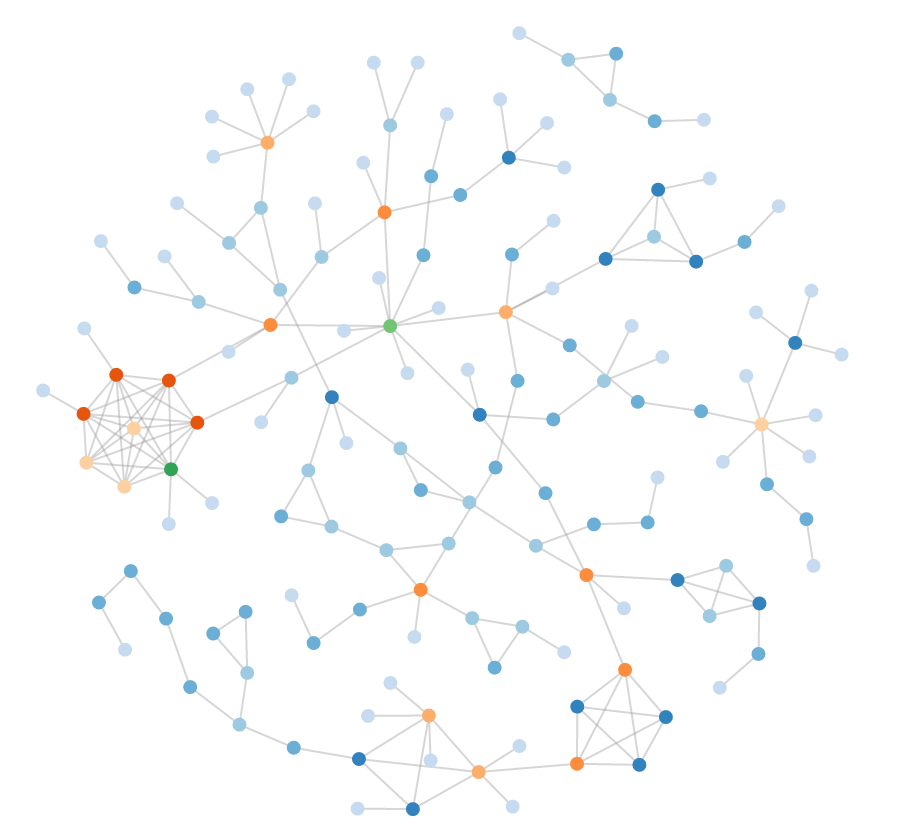
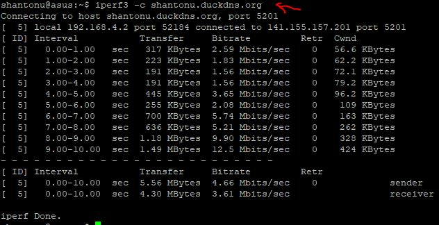
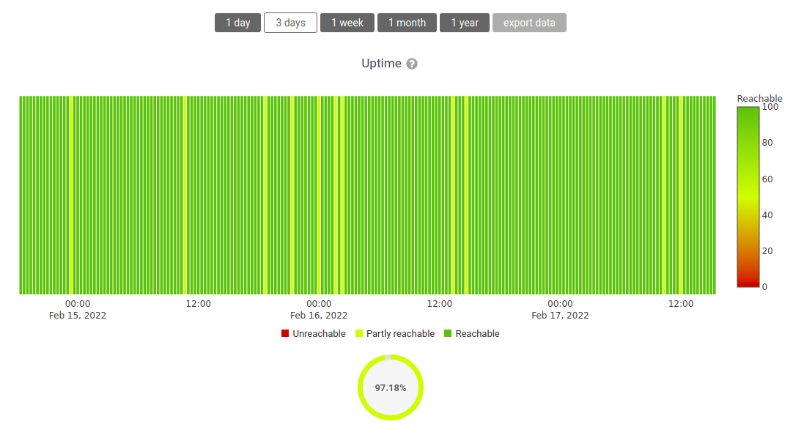

GSoC Project Ideas 2022
=======================

.. tip::

    Do you want to apply with us?

    We have a page that describes how to increase your chances of success.
    **Please read it carefully.**

    :doc:`Read our Google Summer of Code guidelines
    <../developer/google-summer-of-code>`.

.. contents:: **Table of Contents**:
    :backlinks: none
    :depth: 3

General suggestions and warnings
--------------------------------

- **Project ideas describe the goals we want to achieve but may miss
  details that have to be defined during the project**: we expect students
  to do their own research, propose solutions and be ready to deal with
  uncertainty and solve challenges that will come up during the project
- **Code and prototypes are preferred over detailed documents and
  unreliable estimates**: rather than using your time to write a very long
  application document, we suggest to invest in writing a prototype (which
  means the code may be thrown out entirely) which will help you
  understand the challenges of the project you want to work on; your
  application should refer to the prototype or other Github contributions
  you made to OpenWISP that show you have the capability to succeed in the
  project idea you are applying for.
- **Students who have either shown to have or have shown to be fast
  learners for the required hard and soft skills by contributing to
  OpenWISP have a lot more chances of being accepted**: in order to get
  started contributing refer to the :doc:`OpenWISP Contributing Guidelines
  <../developer/contributing>`
- **Get trained in the projects you want to apply for**: once applicants
  have completed some basic training by :doc:`contributing to OpenWISP
  <../developer/contributing>` we highly suggest to start working on some
  aspects of the project they are interested in applying: all projects
  listed this year are improvements of existing modules so these modules
  already have a list of open issues which can be solved as part of your
  advanced training. It will also be possible to complete some of the
  tasks listed in the project idea right now before GSoC starts. We will
  list some easy tasks in the project idea for this purpose.

Project Ideas
-------------

Adding support for automatic management of ZeroTier Tunnels
~~~~~~~~~~~~~~~~~~~~~~~~~~~~~~~~~~~~~~~~~~~~~~~~~~~~~~~~~~~

.. important::

    Languages and technologies used: Mostly **OpenWrt**, **Python**,
    **Django**, **ZeroTier**.

    **Mentors**: *Gagan Deep* (`pandafy <https://github.com/pandafy>`_),
    *Federico Capoano*.

    **Project size**: 350 hours.

    **Difficulty rate**: hard.

`OpenWISP Controller
<https://github.com/openwisp/openwisp-controller#openwisp-controller>`_
already supports configuring **OpenVPN**, **WireGuard** and **VXLAN over
WireGuard** tunnels. The goal of this project is to add support for
another VPN backend: `ZeroTier <https://www.zerotier.com>`_.

Prerequisites to work on this project
+++++++++++++++++++++++++++++++++++++

The contributor must demonstrate good understanding of the following
OpenWISP modules:

- `netjsonconfig <https://netjsonconfig.openwisp.org/en/latest/>`_
- `OpenWISP Controller
  <https://github.com/openwisp/openwisp-controller#openwisp-controller>`_
- `OpenWISP Network Topology
  <https://github.com/openwisp/openwisp-network-topology#openwisp-network-topology>`_

Any merged patches on any of those modules is considered an important plus
point.

The contributor must also demonstrate familiarity with `ZeroTier
<https://www.zerotier.com/>`__, and `OpenWrt <https://openwrt.org>`_,
moreover, they should be willing to increase their experience with these
technologies and show enthusiasm toward learning and implementing IT
network automation.

Expected outcomes
+++++++++++++++++

- Add support for ZeroTier in `netjsonconfig
  <https://netjsonconfig.openwisp.org/en/latest/>`_:

  - Add capability for generating ZeroTier configuration in OpenWrt
    backend.
  - Add a ZeroTier backend that generates network configuration accepted
    by REST API endpoints of the ZeroTier Controller.
  - Write documentation for generating configuration for OpenWrt and
    ZeroTier Controller using netjsonconfig.
  - GitHub Issues:

    - `netjsonconfig #207: [feature] Add support for ZeroTier tunnels to
      OpenWrt backend
      <https://github.com/openwisp/netjsonconfig/issues/207>`_
    - `netjsonconfig #208: [feature] Add ZeroTier backend
      <https://github.com/openwisp/netjsonconfig/issues/208>`_

- Add ZeroTier as a VPN backend in `OpenWISP Controller
  <https://github.com/openwisp/openwisp-controller#openwisp-controller>`_.

  - Add automatic generation of templates for ZeroTier VPN backend similar
    to OpenVPN and WireGuard VPN backends.
  - Integrate `ZeroTier Controller APIs
    <https://docs.zerotier.com/central/v1>`_ in OpenWISP Controller to
    allow managing networks directly from OpenWISP.
  - Write a step by step documentation which explains how to set up and
    use the new ZeroTier VPN backend with a device.
  - GitHub Issues:

    - `openwisp-controller #604 : [feature] Add support for ZeroTier VPN
      backend
      <https://github.com/openwisp/openwisp-controller/issues/604>`_
    - `openwisp-controller #606 : [feature] Authorize member in ZeroTier
      network when a new device is added
      <https://github.com/openwisp/openwisp-controller/issues/606>`_
    - `openwisp-controller #605 : [feature] Allow managing ZeroTier
      networks from OpenWISP
      <https://github.com/openwisp/openwisp-controller/issues/605>`_

- Add a parser in `OpenWISP Network Topology
  <https://github.com/openwisp/openwisp-network-topology#openwisp-network-topology>`_
  that can parse ZeroTier peer information.

  - Write documentation for using this parser to generate topology from
    data received from multiple devices.
  - GitHub Issues:

    - `openwisp-network-topology #135: [feature] Add a parser for ZeroTier
      <https://github.com/openwisp/openwisp-network-topology/issues/135>`_

- Achieve at least 99% test coverage for the code added for this feature.

Improve netjsongraph.js for its new release
~~~~~~~~~~~~~~~~~~~~~~~~~~~~~~~~~~~~~~~~~~~

.. important::

    Languages and technologies used: **Javascript**, **NodeJS**, **HTML**,
    **CSS**

    **Mentors**: *Federico Capoano* (more mentors TBA).

    **Project size**: 350 hours.

    **Difficulty rate**: medium/hard.

The goal of this project is to improve the new version of the
netjsongraph.js visualization library, which is has not been released yet
and is available in the `gsoc2019 branch of netjsongraph.js on github
<https://github.com/openwisp/netjsongraph.js/tree/gsoc2019>`_.

Prerequisites to work on this project
+++++++++++++++++++++++++++++++++++++

The contributor should have a proven track record and experience with
Javascript, React JS, NodeJS, HTML and CSS.

Familiarity with `OpenWISP Network Topology
<https://github.com/openwisp/openwisp-network-topology>`__ and `OpenWISP
Monitoring <https://github.com/openwisp/openwisp-monitoring>`__ is a plus.

Expected outcomes
+++++++++++++++++

- We want to make the geographic map feature and the logical map feature
  more similar to `MeshViewer <https://github.com/ffrgb/meshviewer>`_, see
  the screenshots below for reference, you can find a demo of this
  application in the repository just linked.

.. image:: ../images/gsoc/ideas/mesh-viewer-map-view.png

.. image:: ../images/gsoc/ideas/mesh-viewer-logic-view.png

- Fix zoom animation: when the map is zoomed, there's a delay between the
  zoom of the map and the repositioning of the elements which looks pretty
  weird
- Add a clustering feature to the geographic map: when there are multiple
  overlapping elements group them as one cluster:

      - the cluster shall expand when it's hovered with the mouse
      - the cluster shall expand when the map zoom increases
      - the cluster may behave differently if the nodes have links to
        other nodes, a solution which works well aesthetically should be
        found

- Test the library on narrow screens and ensure quirks are fixed
- Add support for loading map data using GeoJSON
- Allow loading more than 1000 devices by using pagination, load max 10K
  points by default (e.g.: ``maxPointsFetched``), make this max value
  configurable
- When more points are present than the configured ``maxPointsFetched``
  value, if the map is zoomed more than a specific level (which shall also
  be configurable and have a good default), load more data from the API by
  specifying geographic extent, implement a mocking server for this
  feature on the server side
- Update `OpenWISP Network Topology
  <https://github.com/openwisp/openwisp-network-topology>`__ to use the
  new version of this library
- Modify `OpenWISP Network Topology
  <https://github.com/openwisp/openwisp-network-topology>`__ to provide
  `real time updates
  <https://github.com/openwisp/netjsongraph.js/tree/gsoc2019#realtime-update>`_
- Change the code of `OpenWISP Monitoring
  <https://github.com/openwisp/openwisp-monitoring>`__ so that the map
  dashboard is implemented using this library instead of using its own
  custom implementation

Keep in mind the underlying visualization library can be changed if
needed.

Add iperf bandwidth monitoring check to OpenWISP Monitoring
~~~~~~~~~~~~~~~~~~~~~~~~~~~~~~~~~~~~~~~~~~~~~~~~~~~~~~~~~~~

.. important::

    Languages and technologies used: **Python**, **Django**, **iperf3**.

    **Mentors**: *Federico Capoano*, *Gagan Deep* (more mentors TBA).

    **Project size**: 175 hours.

    **Difficulty rate**: easy/medium.

The goal of this project is to add a bandwidth test using ``iperf3``,
using the active check mechanism of `OpenWISP Monitoring
<https://github.com/openwisp/openwisp-monitoring/>`__.

The use case is to perform periodic bandwidth test to measure the max
bandwidth available (TCP test) and jitter (UDP).

On a macro level, the check would work this way:

1. OpenWISP connects to the device (only 1 check per device at time) via
   SSH and launches iperf3 as a client, first in TCP mode, then in UDP
   mode, iperf is launched with the ``-j`` flag to obtain json output
2. The collected data is parsed and stored as a metric (bandwidth
   information and jitter)
3. SSH connection is closed

Prerequisites to work on this project
+++++++++++++++++++++++++++++++++++++

The student must demonstrate good understanding of `OpenWISP Monitoring
<https://github.com/openwisp/openwisp-monitoring#openwisp-monitoring>`__,
and familiarity with Linux and iperf3.

Expected outcomes
+++++++++++++++++

The outcomes we expect from this project are the following:

- Create iperf check class, the check must use the connection module of
  openwisp-controller to connect to devices using SSH
- If a device has no active Connection the check will be skipped and a
  warning logged
- This check should be optional and disabled by default
- We can run it by default every night
- Allow configuring the iperf server globally and by organization with a
  setting, e.g.:

.. code-block:: python

    OPENWISP_MONITORING_IPERF_SERVERS = {
        "": ["<DEFAULT_IPERF_SERVER_HERE>"],
        "<org-pk>": ["<ORG_IPERF_SERVER>"],
    }

- It shall be possible to specify a list of iperf servers, this is
  important because on larger systems 1 server will not be enough
- We have to implement a lock to allow only 1 iperf check per server at
  time that is: for every server available, `only 1 check can be performed
  at any one time
  <https://docs.celeryproject.org/en/latest/tutorials/task-cookbook.html#ensuring-a-task-is-only-executed-one-at-a-time>`_,
  so the lock has to take this account when calculating the cache-key
- SSH into device, launch iperf TCP client, repeat for UDP, collect data
  of both tests in a data structure
- Handle failures, if server is down, we can store 0, which would trigger
  an alert (investigate the alert settings functionality)
- Implement logic which creates the metric, chart and alert settings
  objects
- Save data (tcp max bandwidth, UDP jitter)
- Document how this check works
- Document how to set up and use the check step by step (explain also how
  to set up a new iperf server)
- Achieve at least 99% test coverage for the code added for this feature.

**Github issue**: `[monitoring/checks] Add iperf check
<https://github.com/openwisp/openwisp-monitoring/issues/120>`_.

Improve UX of OpenWISP Monitoring
~~~~~~~~~~~~~~~~~~~~~~~~~~~~~~~~~

.. important::

    Languages and technologies used: **Python**, **Django**.

    **Mentors**: *Ajay Tripathi*, *Federico Capoano*.

    **Project size**: 175 hours.

    **Difficulty rate**: easy.

The goal of this project is to improve OpenWISP Monitoring by working on
features and changes that have been noted down during the last 2 years of
usage of this module and have the aim of improving the user experience in
analyzing the collected monitoring data, as well as the developer user
experience in extracting data from the system.

Prerequisites to work on this project
+++++++++++++++++++++++++++++++++++++

The student must demonstrate good understanding of `OpenWISP Monitoring
<https://github.com/openwisp/openwisp-monitoring#openwisp-monitoring>`__,
and should have a basic knowledge of `NetJSON format
<https://netjson.org/>`_.

Expected outcomes
+++++++++++++++++

- `[change] Reachable bar chart: show different color for barely reachable
  #301 <https://github.com/openwisp/openwisp-monitoring/issues/301>`_
- `[feature] Charts: allow specifying range of dates #26
  <https://github.com/openwisp/openwisp-monitoring/issues/26>`_
- `[ux] Show size in (KB, MB or GB) adaptively in charts #87
  <https://github.com/openwisp/openwisp-monitoring/issues/87>`_
- `[feature] Zooming graphs: reload data in order to provide a detailed
  view #27 <https://github.com/openwisp/openwisp-monitoring/issues/27>`_
- `[feature] Add REST API endpoints for device which include monitoring
  info #290 <https://github.com/openwisp/openwisp-monitoring/issues/290>`_
- `[docs] Add quick start tutorial to README #285
  <https://github.com/openwisp/openwisp-monitoring/issues/285>`_
- `[feature] Add possibility to connect to *InfluxDB* on unix domain
  socket #312
  <https://github.com/openwisp/openwisp-monitoring/issues/312>`_

Add more timeseries database clients to OpenWISP Monitoring
~~~~~~~~~~~~~~~~~~~~~~~~~~~~~~~~~~~~~~~~~~~~~~~~~~~~~~~~~~~

.. image:: ../images/gsoc/ideas/tsdb.png

.. important::

    Languages and technologies used: **Python**, **Django**, **InfluxDB**,
    **Elasticsearch**.

    **Mentors**: *Federico Capoano*, *Gagan Deep* (more mentors TBA).

    **Project size**: 175 hours.

    **Difficulty rate**: medium.

The goal of this project is to add more Time Series DB options to OpenWISP
while keeping good maintainability.

Prerequisites to work on this project
+++++++++++++++++++++++++++++++++++++

The student must demonstrate good understanding of `OpenWISP Monitoring
<https://github.com/openwisp/openwisp-monitoring#openwisp-monitoring>`__,
and demonstrate basic knowledge of `NetJSON format
<https://netjson.org/>`_, **InfluxDB** and **Elasticsearch**.

Expected outcomes
+++++++++++++++++

- Complete the support to `Elasticsearch
  <https://github.com/elastic/elasticsearch>`_. `Support to Elasticsearch
  was added in 2020
  <https://github.com/openwisp/openwisp-monitoring/pull/164>`_ but was not
  completed.

  - The old pull request has to be updated on the current code base
  - The merge conflicts have to be resolved
  - All the tests must pass, new tests for new charts and metrics added to
    *InfluxDB* must be added (see `[feature] Chart mobile
    (LTE/5G/UMTS/GSM) signal strength #270
    <https://github.com/openwisp/openwisp-monitoring/pull/294>`_)
  - The usage shall be documented, we must make sure there's at least one
    dedicated CI build for **Elasticsearch**
  - We must allow to install and use **Elasticsearch** instead of
    **InfluxDB** from `ansible-openwisp2
    <https://github.com/openwisp/ansible-openwisp2>`_ and `docker-openwisp
    <https://github.com/openwisp/docker-openwisp/>`_
  - The requests to Elasticsearch shall be optimized as described in
    `[timeseries] Optimize elasticsearch #168
    <https://github.com/openwisp/openwisp-monitoring/issues/168>`_.

- `Add support for InfluxDB 2.0
  <https://github.com/openwisp/openwisp-monitoring/issues/274>`_ as a new
  timeseries backend, this way we can support both ``InfluxDB <= 1.8`` and
  ``InfluxDB >= 2.0``.

  - All the automated tests for **InfluxDB 1.8** must be replicated and
    must pass
  - The usage and setup shall be documented
  - We must make sure there's at least one dedicated CI build for
    Elasticsearch
  - We must allow choosing between **InfluxDB 1.8** and **InfluxDB 2.0**
    from `ansible-openwisp2
    <https://github.com/openwisp/ansible-openwisp2>`_ and `docker-openwisp
    <https://github.com/openwisp/docker-openwisp/>`_.
