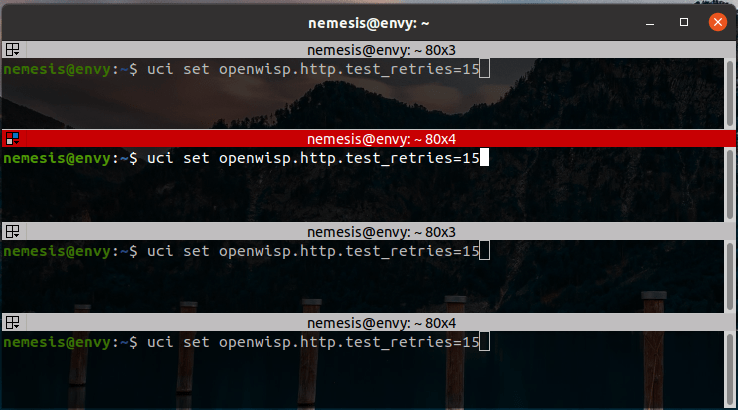
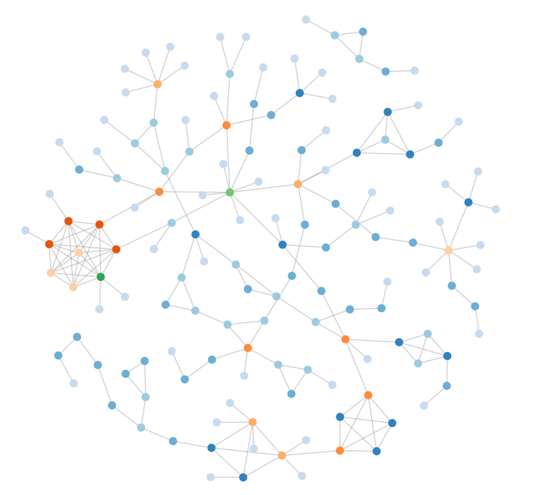

GSoC Project Ideas 2025
=======================

.. tip::

    Do you want to apply with us?

    We have a page that describes how to increase your chances of success.
    **Please read it carefully.**

    :doc:`Read our Google Summer of Code guidelines
    <../developer/google-summer-of-code>`.

.. contents:: **Table of Contents**:
    :backlinks: none
    :depth: 3

General suggestions and warnings
--------------------------------

- **Project ideas describe the goals we want to achieve but may miss
  details that have to be defined during the project**: we expect
  applicants to do their own research, propose solutions and be ready to
  deal with uncertainty and solve challenges that will come up during the
  project
- **Code and prototypes are preferred over detailed documents and
  unreliable estimates**: rather than using your time to write a very long
  application document, we suggest to invest in writing a prototype (which
  means the code may be thrown out entirely) which will help you
  understand the challenges of the project you want to work on; your
  application should refer to the prototype or other Github contributions
  you made to OpenWISP that show you have the capability to succeed in the
  project idea you are applying for.
- **Applicants who have either shown to have or have shown to be fast
  learners for the required hard and soft skills by contributing to
  OpenWISP have a lot more chances of being accepted**: in order to get
  started contributing refer to the :doc:`OpenWISP Contributing Guidelines
  <../developer/contributing>`
- **Get trained in the projects you want to apply for**: once applicants
  have completed some basic training by :doc:`contributing to OpenWISP
  <../developer/contributing>` we highly suggest to start working on some
  aspects of the project they are interested in applying: all projects
  listed this year are improvements of existing modules so these modules
  already have a list of open issues which can be solved as part of your
  advanced training. It will also be possible to complete some of the
  tasks listed in the project idea right now before GSoC starts. We will
  list some easy tasks in the project idea for this purpose.

Project Ideas
-------------

Mass Commands
~~~~~~~~~~~~~

.. important::

    Languages and technologies used: **Python**, **Django**,
    **JavaScript**, **WebSockets**, **REST API**.

    **Mentors**: *Federico Capoano*, *Gagan Deep*, *Purhan Kaushik*.

    **Project size**: 350 hours.

    **Difficulty rate**: medium.

This project idea aims to extend OpenWISP's remote device management
capabilities by enabling users to execute shell commands on multiple
devices simultaneously. Currently, OpenWISP supports executing commands on
a single device at a time. This project will introduce a bulk execution
feature while maintaining the existing security, rules, and limitations of
the single-device command execution feature.

The mass command operation will be accessible from two main entry points:

- An admin action on the device list page, allowing users to select
  multiple devices and send a shell command in bulk.
- A dedicated mass command admin section, where users can initiate bulk
  command execution with various targeting options:

  - All devices in the system (restricted to superusers).
  - All devices within a specific organization.
  - All devices within a specific device group.
  - All devices within a specific geographic location.
  - Specific selected devices.

The UI will guide users step-by-step, dynamically displaying relevant
fields based on the selected target scope. For example, if a user selects
"All devices in a specific organization", an auto-complete list of
organizations will be displayed next.

The system will provide real-time tracking of command execution results.
Inspired by OpenWISP Firmware Upgrader's mass upgrade feature, the UI will
receive live updates via WebSockets, displaying command output as soon as
it is received from the devices. Additionally:

- The device detail page will show executed commands under the "Recent
  Commands" tab.
- Commands that were part of a mass operation will be clearly marked, with
  a link to the corresponding mass command operation page.

To support API-based management, the REST API will be extended with the
following capabilities:

- Create new mass command operations.
- Retrieve mass command operations and their results (with pagination).
- Delete mass command operations.
- Modify the single-shell command API to reference the mass command
  operation ID if applicable.

Prerequisites to work on this project
+++++++++++++++++++++++++++++++++++++

Applicants must demonstrate a solid understanding of Python, Django, HTML,
CSS, JavaScript, WebSockets, and `OpenWISP Controller
<https://github.com/openwisp/openwisp-controller>`__.

Expected outcomes
+++++++++++++++++

- Implementation of mass shell command execution in OpenWISP, replicating
  the rules and limitations of single-device execution.
- Development of an intuitive UI with the Django admin for selecting
  devices and tracking command results in real-time.
- Admin action for device list page.
- Enhancement of the device detail page to reflect mass command history
  for individual devices.
- Extension of the REST API to support mass command operations.
- Comprehensive automated tests covering the new feature.
- Updated documentation, including:

  - Feature description with usage instructions.
  - A short example usage video for YouTube that we can showcase on the
    website.

X.509 Certificate Generator Templates
~~~~~~~~~~~~~~~~~~~~~~~~~~~~~~~~~~~~~

.. image:: ../images/gsoc/ideas/2025/x509-templates.webp

.. important::

    Languages and technologies used: **Python**, **Django**,
    **JavaScript**.

    **Mentors**: *Federico Capoano*, *Aryaman*.

    **Project size**: 90 hours.

    **Difficulty rate**: medium.

This GSoC project aims to enhance OpenWISP's certificate management
capabilities by enabling the generation of x509 certificates for general
use, beyond OpenVPN.

Currently, OpenWISP supports generating x509 certificates exclusively for
OpenVPN clients, where each VPN client template produces a certificate
signed by the CA linked to the corresponding VPN server. However, many
users have requested support for generating certificates for other
purposes, such as securing web servers.

The proposed solution involves introducing a new template type that allows
users to generate certificates using a selected CA. This template should
provide configurable options, including:

- Certificate duration
- Key length
- Digest algorithm

If left unspecified, these options should default to the CA's standard
settings.

Prerequisites to work on this project
+++++++++++++++++++++++++++++++++++++

Applicants must demonstrate a solid understanding of Python, Django,
JavaScript, and `OpenWISP Controller
<https://github.com/openwisp/openwisp-controller>`__.

Expected outcomes
+++++++++++++++++

- Implement a new certificate template type in OpenWISP to support
  general-purpose x509 certificate generation.
- Allow users to select a CA and configure certificate properties.
- Integrate with OpenWISP's configuration management to expose certificate
  details (public key, private key, and UUID) as variables for automated
  deployment.
- Write automated tests to ensure the correctness and reliability of the
  new functionality.
- Update the documentation to explain the new feature and its usage.

WHOIS Information and IP Address-Based Geolocation
~~~~~~~~~~~~~~~~~~~~~~~~~~~~~~~~~~~~~~~~~~~~~~~~~~

.. important::

    Languages and technologies used: **Python**, **Django**, **REST API**.

    **Mentors**: *Federico Capoano*

    **Project size**: 175 hours.

    **Difficulty rate**: Easy/Medium.

This GSoC project aims to enhance OpenWISP’s device management
capabilities by integrating WHOIS data retrieval and automatic fuzzy
geolocation based on public IP addresses.

The project consists of two main features:

**1. WHOIS Information Retrieval**

- When a device reports a ``last_ip`` that is a public IP and differs from
  the previously stored value, OpenWISP should automatically trigger a
  background Celery task to retrieve and store its WHOIS information.
- A summary of key WHOIS details (e.g., organization name, country, ISP)
  will be displayed alongside the ``last_ip`` field on the device detail
  page.
- Users will have the option to expand this section to view additional
  details.
- The REST API should include WHOIS summary information in the device list
  and device detail endpoints.
- An additional API option in the device details endpoint should allow
  retrieving the complete WHOIS data stored in the database.

**2. Fuzzy Geolocation from IP Addresses**

- The system should attempt to determine approximate geographic
  coordinates based on the device’s ``last_ip`` and create a ``Location``
  object with this data, marking it as *Fuzzy* (a different term may be
  considered).
- IP-based geolocation must be processed in a background Celery task to
  avoid slowing down the main processes.
- The UI should clearly indicate that this location is estimated and
  encourage users to manually refine it for greater accuracy.
- A notification can be sent to users suggesting they review or confirm
  the estimated location.
- If the ``Location`` object remains unmodified and marked as fuzzy,
  OpenWISP should detect changes in the device's public IP address and
  reattempt IP-based geolocation, updating the coordinates if they differ.
- The ``Location`` admin list page should include a filter for fuzzy
  locations.
- The Device admin list page should include a filter for devices with
  fuzzy locations (expanding on the existing filter for devices with or
  without geographic locations).
- This feature should be configurable at both the global and organization
  levels, allowing administrators to enable or disable it as needed.
  Existing modules already provide organization settings that default to
  global configuration, see `FallbackBooleanChoiceField
  <https://openwisp.io/docs/stable/utils/developer/custom-fields.html#openwisp-utils-fields-fallbackbooleanchoicefield>`_
  for reference.
- The OpenWISP Controller REST API must be updated to support these
  functionalities:

  - Include the fuzzy field in the ``Location`` list and detail endpoints.
  - Allow filtering fuzzy locations.
  - Allow filtering devices with fuzzy locations.

Prerequisites to Work on This Project
+++++++++++++++++++++++++++++++++++++

Applicants must demonstrate a solid understanding of Python, Django, REST
APIs, HTML, CSS, JavaScript, `OpenWISP Controller
<https://github.com/openwisp/openwisp-controller>`__, and `django-loci
<https://github.com/openwisp/django-loci>`__.

Expected Outcomes
+++++++++++++++++

- Implementation of WHOIS data retrieval as a background operation and
  display within the OpenWISP Controller admin panel.
- Development of fuzzy geolocation based on public IPs, with clear UI
  explanations and manual override options.
- Integration with OpenWISP’s notification system to suggest location
  refinements.
- Admin filters to identify fuzzy locations and devices with fuzzy
  locations.
- Configurable settings to enable or disable the feature globally or per
  organization.
- REST API enhancements to reflect the new functionalities.
- Comprehensive automated tests ensuring feature reliability.
- Updated documentation, including:

  - A feature overview with step-by-step usage instructions on dedicated
    pages.
  - Videos demonstrating WHOIS data retrieval and geolocation results.
  - Configuration details for enabling or disabling these features.

Improve OpenWISP General Map: Indoor, Mobile, Linkable URLs
~~~~~~~~~~~~~~~~~~~~~~~~~~~~~~~~~~~~~~~~~~~~~~~~~~~~~~~~~~~

.. image:: ../images/gsoc/ideas/2024/maps.jpg

.. important::

    Languages and technologies used: **Python**, **Django**,
    **JavaScript**, **Leaflet**, **netjsongraph.js**.

    **Mentors**: *Federico Capoano*.

    **Project size**: 350 hours.

    **Difficulty rate**: medium.

This GSoC project aims to enhance the user experience of the general map
within OpenWISP, a feature introduced in the last stable version.

By developing a dedicated map page, facilitating precise device tracking,
and seamlessly integrating indoor floor plans, the project endeavors to
significantly improve the usability and functionality of the mapping
interface, ensuring a more intuitive and effective user experience.

Prerequisites to work on this project
+++++++++++++++++++++++++++++++++++++

Applicants must demonstrate a solid understanding of Python, Django,
`Leaflet library <https://github.com/makinacorpus/django-leaflet>`_,
JavaScript, `OpenWISP Controller
<https://github.com/openwisp/openwisp-controller#openwisp-controller>`__,
`OpenWISP Monitoring
<https://github.com/openwisp/openwisp-monitoring#openwisp-monitoring>`__.
and `netjsongraph.js
<https://github.com/openwisp/netjsongraph.js?tab=readme-ov-file#netjsongraphjs>`__.

Expected outcomes
+++++++++++++++++

- `Add a dedicated map page
  <https://github.com/openwisp/openwisp-monitoring/issues/561>`_:
  Introduce a dedicated page to display all network devices on a map. This
  view will offer the same functionality as the map in the dashboard, with
  the sole difference being that this page focuses on rendering only the
  map. It will be used for linking specific points on the map within the
  rest of the OpenWISP UI.
- `Allow tracking mobile coordinates
  <https://github.com/openwisp/openwisp-controller/issues/828>`_: OpenWISP
  Controller provides a way for devices to update their co-ordinates, we
  want to make the map able to update in real time as devices send their
  updated coordinates.
- `Integrate indoor floor plan functionality in the map
  <https://github.com/openwisp/openwisp-monitoring/issues/564>`_: The
  netjsongraph.js library allows to render indoor maps, we want to make
  use of this feature to display the indoor location of devices and we
  want this feature to be accessible from the general map. When zooming in
  on a device which is flagged as indoor and has floor plans saved in the
  database, users should see an option to switch to the indoor view. This
  view would show the floor plan of the indoor location and any device
  located on the floor plan, it shall also account for the following use
  cases:

      - An indoor location can have multiple floors. The view should be
        allow users to navigate between different floors.
      - There can be multiple devices on the same floor. The view should
        show all the devices on a floor. This will require developing an
        API endpoint which returns location of devices on the floor plan

- `Make map actions bookmarkable
  <https://github.com/openwisp/netjsongraph.js/issues/238>`_: Update the
  URL when clicking on a node/link to view its details. Visiting this URL
  should automatically focus on the specified node/link and display its
  details, if available. This functionality should also accommodate
  geo-maps using coordinates. Clicking on a node/link to view it's details
  should update the the page's URL. When visiting this URL, the map should
  automatically focus the said node/link. It shall also open the
  node's/link's details if they are available. This should work on
  geographic maps, indoor maps and logical maps.
- `Add button to general map from device detail
  <https://github.com/openwisp/openwisp-monitoring/issues/562>`_:
  Implement a button on the device detail page to allow users to navigate
  from the device detail to the general map and inspect the device's
  location on the map. The map should focus on the specific device in
  question. This feature should also be available for indoor maps,
  providing a button in the floor plan section to open the general map
  with the indoor view focused.

Throughout the code changes, it is imperative to maintain stable test
coverage and keep the README documentation up to date.

.. note::

    The "expected outcomes" mentioned above include links to corresponding
    GitHub issues. However, these issues may not cover all aspects of the
    project and are primarily intended to gather technical details.
    Applicants are encouraged to seek clarification, propose solutions and
    open more issues if needed.

Applicants are also expected to deepen their understanding of the UI
changes required by preparing *wireframes* or *mockups*, which must be
included in their application. Demonstrating a willingness and enthusiasm
to learn about UI/UX development is crucial for the success of this
project.

Improve netjsongraph.js resiliency and visualization
~~~~~~~~~~~~~~~~~~~~~~~~~~~~~~~~~~~~~~~~~~~~~~~~~~~~

.. important::

    Languages and technologies used: **Javascript**, **NodeJS**, **HTML**,
    **CSS**

    **Mentors**: *Nitesh Sinha*, *Federico Capoano*.

    **Project size**: 175 hours.

    **Difficulty rate**: medium.

The goal of this project is to improve the latest version of the
netjsongraph.js visualization library to improve resiliency and
functionality.

Prerequisites to work on this project
+++++++++++++++++++++++++++++++++++++

The contributor should have a proven track record and experience with
Javascript, React JS, NodeJS, HTML and CSS.

Familiarity with `OpenWISP Network Topology
<https://github.com/openwisp/openwisp-network-topology>`__ and `OpenWISP
Monitoring <https://github.com/openwisp/openwisp-monitoring>`__ is a plus.

Expected outcomes
+++++++++++++++++

The applicant must open pull requests for the following issues which must
be merged by the final closing date of the program:

- `Allow showing node names on geo map on high zoom levels
  <https://github.com/openwisp/netjsongraph.js/issues/189>`_: The node
  names should be shown by default on high zoom levels.
- `Map should respect zoom levels of tile providers
  <https://github.com/openwisp/netjsongraph.js/issues/188>`_: We shall
  limit the map zoom levels based on the tile provider. We can make the
  supported zoom levels configurable and provide sensible defaults.
- `Prevent overlapping of clusters
  <https://github.com/openwisp/netjsongraph.js/issues/171>`_: The clusters
  of different categories with the same location are overlapped. Instead,
  we should find a way to prevent this behavior.
- `Add resiliency for invalid data
  <https://github.com/openwisp/netjsongraph.js/issues/164>`_: The library
  should not crash if invalid data is provided, e.g. different nodes with
  same ID. Instead, it should handle such cases gracefully and log the
  errors.
- `Display additional data (connected clients) on nodes
  <https://github.com/openwisp/netjsongraph.js/issues/153>`_: It shall be
  possible to show connected clients on nodes. This feature needs to be
  flexible, such that it can be used to show different kinds of data.
- `Show node labels only after hitting a certain zoom level
  <https://github.com/openwisp/netjsongraph.js/issues/148>`_: At present,
  the node labels become cluttered and unreadable when zoomed out
  excessively. To enhance readability, we need to add a feature in the
  library that allows configuring the zoom level at which node labels
  should start appearing.

Each issue contains the details which the applicant needs to know in order
to complete the project successfully.

At each step of code changing the test coverage must be maintained stable
and the documentation in the README must be kept up to date.

Improve UX and Flexibility of the Firmware Upgrader Module
~~~~~~~~~~~~~~~~~~~~~~~~~~~~~~~~~~~~~~~~~~~~~~~~~~~~~~~~~~

.. image:: ../images/gsoc/ideas/2023/firmware.jpg

.. important::

    Languages and technologies used: **Python**, **Django**, **OpenWrt**.

    **Mentors**: *Oliver Kraitschy*, *Purhan Kaushik*.

    **Project size**: 175 hours.

    **Difficulty rate**: easy/medium.

The goal of this project is to improve the Firmware Upgrader module to
make its mass upgrade operation feature more versatile and to improve the
user experience by showing progress in real time.

Prerequisites to work on this project
+++++++++++++++++++++++++++++++++++++

The applicant must demonstrate good understanding of Python, Django,
Javascript and `OpenWISP Controller
<https://github.com/openwisp/openwisp-controller#openwisp-controller>`__.

They must demonstrate also a basic understanding of `OpenWISP Firmware
Upgrader
<https://github.com/openwisp/openwisp-firmware-upgrader#openwisp-firmware-upgrader>`__,
OpenWrt and UI development.

Prior experience with OpenWrt is not extremely required but welcome.

Expected outcomes
+++++++++++++++++

The applicant must open pull-requests for the following issues which must
be merged by the final closing date of the program:

- `[feature] REST API is missing endpoints for DeviceFirmware
  <https://github.com/openwisp/openwisp-firmware-upgrader/issues/208>`_
- `[feature:UI] Show upgrade progress in real time in the UI
  <https://github.com/openwisp/openwisp-firmware-upgrader/issues/224>`_
- `[feature] Allow to perform mass upgrade of devices by their group
  <https://github.com/openwisp/openwisp-firmware-upgrader/issues/213>`_
- `[feature] Allow to perform mass upgrade of devices by their location
  <https://github.com/openwisp/openwisp-firmware-upgrader/issues/225>`_

Each issue contains the details which the applicant needs to know in order
to complete the project successfully.

At each step of code changing the test coverage must be maintained stable
and the documentation in the README must be kept up to date.

Training Issues
+++++++++++++++

The applicant may warm up in the application phase by working on the
following issues:

- `[bug] FileNotFoundError when trying to delete an image which links a
  non existing file
  <https://github.com/openwisp/openwisp-firmware-upgrader/issues/140>`_
- `[change] Improve endpoints to download firmware images
  <https://github.com/openwisp/openwisp-firmware-upgrader/issues/69>`_
- `[feature] Allow management of UpgradeOperation objects in the admin
  <https://github.com/openwisp/openwisp-firmware-upgrader/issues/145>`_

Add more timeseries database clients to OpenWISP Monitoring
~~~~~~~~~~~~~~~~~~~~~~~~~~~~~~~~~~~~~~~~~~~~~~~~~~~~~~~~~~~

.. image:: ../images/gsoc/ideas/tsdb.png

.. important::

    Languages and technologies used: **Python**, **Django**, **InfluxDB**,
    **Elasticsearch**.

    **Mentors**: *Gagan Deep*, *Aryaman*, *Sankalp*.

    **Project size**: 175 hours.

    **Difficulty rate**: medium.

The goal of this project is to add more Time Series DB options to OpenWISP
while keeping good maintainability.

Prerequisites to work on this project
+++++++++++++++++++++++++++++++++++++

The applicant must demonstrate good understanding of `OpenWISP Monitoring
<https://github.com/openwisp/openwisp-monitoring#openwisp-monitoring>`__,
and demonstrate basic knowledge of `NetJSON format
<https://netjson.org/>`_, **InfluxDB** and **Elasticsearch**.

Expected outcomes
+++++++++++++++++

- Complete the support to `Elasticsearch
  <https://github.com/elastic/elasticsearch>`_. `Support to Elasticsearch
  was added in 2020
  <https://github.com/openwisp/openwisp-monitoring/pull/164>`_ but was not
  completed.

  - The old pull request has to be updated on the current code base
  - The merge conflicts have to be resolved
  - All the tests must pass, new tests for new charts and metrics added to
    *InfluxDB* must be added (see `[feature] Chart mobile
    (LTE/5G/UMTS/GSM) signal strength #270
    <https://github.com/openwisp/openwisp-monitoring/pull/294>`_)
  - The usage shall be documented, we must make sure there's at least one
    dedicated CI build for **Elasticsearch**
  - We must allow to install and use **Elasticsearch** instead of
    **InfluxDB** from `ansible-openwisp2
    <https://github.com/openwisp/ansible-openwisp2>`_ and `docker-openwisp
    <https://github.com/openwisp/docker-openwisp/>`_
  - The requests to Elasticsearch shall be optimized as described in
    `[timeseries] Optimize elasticsearch #168
    <https://github.com/openwisp/openwisp-monitoring/issues/168>`_.

- `Add support for InfluxDB 2.0
  <https://github.com/openwisp/openwisp-monitoring/issues/274>`_ as a new
  timeseries backend, this way we can support both ``InfluxDB <= 1.8`` and
  ``InfluxDB >= 2.0``.

  - All the automated tests for **InfluxDB 1.8** must be replicated and
    must pass
  - The usage and setup shall be documented
  - We must make sure there's at least one dedicated CI build for
    Elasticsearch
  - We must allow choosing between **InfluxDB 1.8** and **InfluxDB 2.0**
    from `ansible-openwisp2
    <https://github.com/openwisp/ansible-openwisp2>`_ and `docker-openwisp
    <https://github.com/openwisp/docker-openwisp/>`_.
