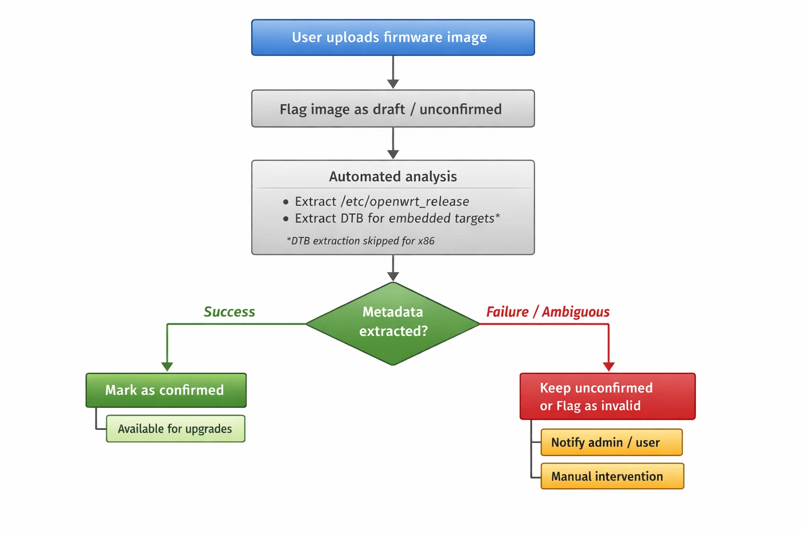

GSoC Project Ideas 2026
=======================

.. tip::

    Do you want to apply with us?

    We have a page that describes how to increase your chances of success.
    **Please read it carefully.**

    :doc:`Read our Google Summer of Code guidelines
    <../developer/google-summer-of-code>`.

.. contents:: **Table of Contents**:
    :backlinks: none
    :depth: 3

General suggestions and warnings
--------------------------------

- **Project ideas describe the goals we want to achieve but may miss
  details that have to be defined during the project**: we expect
  applicants to do their own research, propose solutions and be ready to
  deal with uncertainty and solve challenges that will come up during the
  project
- **Code and prototypes are preferred over detailed documents and
  unreliable estimates**: rather than using your time to write a very long
  application document, we suggest to invest in writing a prototype (which
  means the code may be thrown out entirely) which will help you
  understand the challenges of the project you want to work on; your
  application should refer to the prototype or other Github contributions
  you made to OpenWISP that show you have the capability to succeed in the
  project idea you are applying for.
- **Applicants who have either shown to have or have shown to be fast
  learners for the required hard and soft skills by contributing to
  OpenWISP have a lot more chances of being accepted**: in order to get
  started contributing refer to the :doc:`OpenWISP Contributing Guidelines
  <../developer/contributing>`
- **Get trained in the projects you want to apply for**: once applicants
  have completed some basic training by :doc:`contributing to OpenWISP
  <../developer/contributing>` we highly suggest to start working on some
  aspects of the project they are interested in applying: all projects
  listed this year are improvements of existing modules so these modules
  already have a list of open issues which can be solved as part of your
  advanced training. It will also be possible to complete some of the
  tasks listed in the project idea right now before GSoC starts. We will
  list some easy tasks in the project idea for this purpose.

Project Ideas
-------------

Automatic Extraction of OpenWrt Firmware Image Metadata
~~~~~~~~~~~~~~~~~~~~~~~~~~~~~~~~~~~~~~~~~~~~~~~~~~~~~~~

.. important::

    Languages and technologies used: **Python**, **Django**, **Celery**,
    **OpenWrt**, **REST API**.

    **Mentors**: *Federico Capoano*, *TBA*.

    **Project size**: 350 hours.

    **Difficulty rate**: medium/hard.

This GSoC project aims to improve the user experience of `OpenWISP
Firmware Upgrader
<https://github.com/openwisp/openwisp-firmware-upgrader/issues/378>`__ by
automatically extracting metadata from OpenWrt firmware images at upload
time.

When uploading firmware images to OpenWISP Firmware Upgrader, users are
currently required to manually provide metadata such as the image
identifier, target, and board compatibility. This workflow is error prone,
confusing for less experienced users, and does not scale as the number of
supported images grows.

Recent investigations revealed that most of the information requested from
users is already **present inside the firmware images**, but extracting it
reliably requires understanding the image format, compressed kernels, and
device tree structures.

Expected outcomes
+++++++++++++++++

Introduce logic in OpenWISP Firmware Upgrader to automatically **extract
metadata from OpenWrt firmware images** upon upload, using it to pre-fill
and validate image fields.

1. **Initial upload**

   - Images are flagged as **unconfirmed / draft** immediately after
     upload.
   - Draft status prevents images from being used for upgrades until
     analysis completes successfully.

2. **Automated analysis** (background Celery task)

   - Analysis happens asynchronously in the background using Celery (we
     already use it heavily, so this fits right in).
   - The system attempts to extract metadata:

     - ``/etc/openwrt_release`` → DISTRIB_DESCRIPTION (image identifier),
       DISTRIB_TARGET, architecture.
     - **Embedded, device tree-based targets** (``ramips``, ``ath``,
       ``ath79``, ``mediatek``, ``ipq``, ``rockchip``): extract kernel
       from ``sysupgrade`` images, decompress if needed (gzip, ``lzma``,
       ``xz``, ``zstd`` - whatever OpenWrt uses), locate and extract the
       embedded Device Tree Blob (DTB) using ``binwalk`` or similar
       well-known tools, read the ``compatible`` property; use the first
       compatible string as the authoritative board identifier.
     - **x86 targets**: no board concept exists; rely only on
       ``/etc/openwrt_release``.

   - Images remain **unconfirmed** and invisible for upgrade operations
     while analysis runs.
   - Basic file header validation should reject obviously invalid files
     (JPEGs, PDFs, etc.) early on.

3. **Post-analysis outcomes**

   Images can end up in several states:

   - **Success**: metadata extracted cleanly → mark image as
     **confirmed**, making it available for upgrades.
   - **Analysis in progress**: extraction is running.
   - **Failed - requires manual intervention**: extraction didn't work,
     but user can manually fill in the metadata.
   - **Invalid**: clearly garbage file that can't possibly be a firmware
     image.
   - **Manually confirmed**: user overrode auto-extracted data (we need
     this because sometimes our extraction might be wrong and users will
     be annoyed if they can't fix it).
   - For failures:

     1. File is clearly invalid/garbage → reject immediately if possible
        with a fast validation error. Otherwise, discard in the background
        and notify the user with a ``generic_notification``.
     2. Image format is new or unsupported → notify via
        ``generic_notification`` and allow manual intervention via admin
        UI or REST API (fill metadata or delete/reupload).
     3. Out-of-memory during decompression → notify user, explain they may
        need to increase memory limits and reupload.

   - Gray-area failures (partial extraction, multiple boards detected)
     fall under scenario 2.

.. warning::

    Metadata should be editable until the image is confirmed or paired
    with devices. After that, it becomes read-only - otherwise things
    break and it's too painful to handle all the edge cases.

4. **Other constraints**

   - Test coverage **must not decrease**, tests must follow the specs
     described in the *"Testing strategy"* section below.
   - Documentation needs to be updated to account for this feature,
     including updating any existing screenshots that may change the look
     of the UI after implementation.
   - Once the project is completed, we will need a short example usage
     video for YouTube that we can showcase on the website/documentation.

Build-level status
++++++++++++++++++

Since builds are collections of images, we should add a status field to
builds too:

- A build shouldn't be usable for mass upgrades until **all** its images
  have completed metadata extraction.
- The admin list view should show the status for builds so users know
  what's ready to use.
- **Dynamic status**: If new images are added to a build later (via admin
  or API), the build status should change back to "analyzing".
- **Completion notification**: When analysis completes for a build (all
  images done), send the user a ``generic_notification`` with a link to
  the build page. Clicking the notification should take them straight to
  the updated build so they can see the results and take action if needed.

Safety rules
++++++++++++

- System must prevent using unconfirmed images for single or batch
  upgrades.
- System must prevent launching batch upgrades for builds where metadata
  extraction hasn't completed.
- System must not pair unconfirmed images with devices (existing or new)
  based on OS identifier and hardware model.
- Once an image is confirmed, the existing auto-pairing mechanism kicks
  in.

Implementation notes
++++++++++++++++++++

**Tooling:** We should use ``binwalk`` or similar standard tools for DTB
extraction rather than writing custom parsers. OpenWrt images change all
the time and our resources are limited - better to rely on tools that
handle this stuff already. If ``binwalk`` isn't available or fails, notify
users and fallback to manual extraction mode.

**Memory management:** Decompression can be memory-hungry (``lzma``/``xz``
can need 10-100MB+). We should:

- Make memory limits configurable with reasonable defaults for typical
  OpenWrt images.
- Detect when an image would exceed memory thresholds.
- Handle out of memory gracefully via ``generic_notification`` (since we
  can't validate during Django model save - compression ratios vary).
- Consider limiting decompression output size to prevent zip bomb-style
  attacks.

**Timeouts:** Use the same task timeouts we already use for firmware
upgrades.

**Retries:** Probably not worth auto-retrying failed extractions - if it
fails once, it'll likely fail again. Users can just upload again if it was
a transient issue.

**Task crashes:** Treat as failure, notify user, fallback to manual
intervention.

**Extensibility**: the mechanism for extracting metadata varies across
operating systems.

Although OpenWISP currently focuses exclusively on OpenWrt, it also
manages devices running OpenWrt derivatives which can have varying degrees
of difference with the standard OpenWrt source code.

To handle these differences, this module uses the concept of an **Upgrader
Class**. Therefore, the logic described here should be implemented in a
similar object-oriented structure, allowing for customization, extension,
or complete override if needed. Each upgrader class must have a related
meta-data extraction class.

Benefits
++++++++

- Users cannot accidentally upgrade devices with invalid images.
- Partial or malformed uploads are quarantined safely.
- Metadata extraction improves incrementally without impacting system
  safety.
- Eliminates the need to maintain a hard-coded list of supported devices
  (``hardware.py``).
- Simplifies end-user experience significantly.

Testing strategy
++++++++++++++++

We need to test this with real firmware images, but we can't bloat the
repo:

- Test one firmware image for each supported type.
- Store images on ``downloads.openwisp.io`` (public HTTP access) with
  checksums stored in the repo for security.
- Integration tests download and cache images; only re-download if
  checksum changes.
- Directory structure is an open question - anything reasonable works.
- We can use official OpenWrt builds for testing; maintainers will upload
  them to ``downloads.openwisp.io``.

Additional context and research findings
++++++++++++++++++++++++++++++++++++++++

- ``/etc/board.json`` and ``/tmp/sysinfo/*`` are runtime generated and not
  present in firmware images.
- For embedded targets, the **only authoritative board identity**
  pre-installation is the DTB in the kernel.
- DTB extraction is feasible but non-trivial: kernels may be compressed
  and DTBs at variable offsets.
- x86 is a fundamental exception: no board concept exists, images are
  target wide.
- ``Rootfs`` images (``*-squashfs-rootfs.img``) are **not suitable for
  upgrades** and should not be treated as fully valid.
- A draft/unconfirmed workflow ensures the system remains safe while
  extraction runs or fails.
- The issue containing design and implementation notes is available at:
  `#378
  <https://github.com/openwisp/openwisp-firmware-upgrader/issues/378>`__.

Downsides and challenges
++++++++++++++++++++++++

- Complexity in handling all existing firmware image types across
  supported OSes.
- Requires robust handling of compressed kernels, DTB extraction, and
  image format edge cases.
- Out of scope for small projects; needs dedicated effort and assistance
  from an OpenWrt expert.
- Security: while only network admins can upload images currently (so we
  trust the user), we should add basic protections like file header
  validation and decompression limits.

Open questions for contributors
+++++++++++++++++++++++++++++++

1. **DTB extraction details**: How exactly should ``binwalk`` (or your
   proposed tool) locate and extract DTBs across different target
   families? What are the failure modes and how do we handle them?
2. **Manual override workflow**: Design the complete admin UI flow for
   when extraction fails. What does the user see? How do they enter
   metadata manually? How do we validate their input?
3. **Cross-version compatibility**: OpenWrt versions from 18.06 to 24.10
   may have different formats. How do we handle this? Should we detect the
   version and adjust extraction logic?
4. **Downloading fw images for testing**: Best practices for downloading
   test images: part of test setup or separate command? How to handle
   caching efficiently?
5. **Decompression limits**: What's a reasonable default for maximum
   decompressed size? How do we detect compression bombs early?
6. **Status UI**: What should the admin interface look like for showing
   analysis status? Status badges? Progress indicators? How do we
   communicate "this image is being analyzed" vs "this needs your
   attention"?
7. **Error granularity**: How detailed should failure messages be?
   Technical details for admins vs. user-friendly summaries?

Prerequisites to work on this project
+++++++++++++++++++++++++++++++++++++

Applicants must demonstrate a solid understanding of:

- **Python**, **Django**, and **JavaScript**.
- REST APIs and background task processing (Celery).
- OpenWrt image formats and basic Linux tooling.
- Experience with `OpenWISP Firmware Upgrader
  <https://github.com/openwisp/openwisp-firmware-upgrader>`__ is
  essential. Contributions or resolved issues in this repository are
  considered strong evidence of the required proficiency.

WiFi Login Pages Modernization
~~~~~~~~~~~~~~~~~~~~~~~~~~~~~~

.. important::

    Languages and technologies used: **JavaScript**, **Node.js**,
    **React**.

    **Mentors**: *Federico Capoano*, *Gagan Deep*.

    **Project size**: 175 hours (medium).

    **Difficulty rate**: medium.

This project aims to modernize the `OpenWISP WiFi Login Pages
<https://github.com/openwisp/openwisp-wifi-login-pages>`__ application,
which provides splash page functionality for WiFi hotspot networks. The
focus is on codebase improvements, architectural refactoring, dependency
upgrades, and new features to enhance maintainability and user experience.

All refactoring work should maintain backward compatibility, since users
interact with the application through their browsers, these internal code
changes should be transparent to them.

Key Objectives
++++++++++++++

Code Refactoring and Architecture Improvements
^^^^^^^^^^^^^^^^^^^^^^^^^^^^^^^^^^^^^^^^^^^^^^

The following structural improvements will enhance code maintainability
and reduce technical debt:

1. **Refactor status component to simplify logic and improve
   maintainability** (`#918
   <https://github.com/openwisp/openwisp-wifi-login-pages/issues/918>`__)

   The status component in ``client/components/status/status.js`` has
   grown to handle multiple responsibilities including authentication,
   verification, payment, session management, captive portal logic, and UI
   rendering. This makes the codebase difficult to understand and
   maintain, increases the risk of bugs, and makes testing more difficult.
   The component should be refactored to separate concerns and improve
   maintainability.

2. **Move redirect logic from OrganizationWrapper to each component**
   (`#272
   <https://github.com/openwisp/openwisp-wifi-login-pages/issues/272>`__)

   Currently, redirection logic is defined in the OrganizationWrapper
   component, which is re-rendered every time ``setLoading()`` is called.
   This causes multiple unnecessary HTTP requests and potential issues
   with external redirects (e.g., payment gateways). The redirect logic
   should be moved to individual components where it belongs, making
   OrganizationWrapper leaner.

3. **Eliminate redundancy of header HTML** (`#314
   <https://github.com/openwisp/openwisp-wifi-login-pages/issues/314>`__)

   The header HTML is duplicated with separate desktop and mobile
   versions. This redundancy makes customization painful as it requires
   double the work. The header should be refactored to use a single HTML
   structure with responsive CSS to handle different screen sizes.

4. **Add support for captive-portal API** (`#947
   <https://github.com/openwisp/openwisp-wifi-login-pages/issues/947>`__)

   Modern captive portals support `RFC 8908 Captive Portal API
   <https://datatracker.ietf.org/doc/html/rfc8908>`__. This feature should
   be implemented as an optional feature (turned off by default) that adds
   support for:

   - Checking if captive portal login is required
   - Detecting "internet-mode" status
   - Configurable timeout (default 2 seconds) per organization
   - Configurable API URL per organization via YAML configuration
   - Proper documentation of the feature
   - Fallback to existing internet mode feature for browsers/devices
     without Captive Portal API support

5. **Upgrade to latest version of React** (`#870
   <https://github.com/openwisp/openwisp-wifi-login-pages/issues/870>`__)

   Upgrade the application from its current React version to React 19.
   Contributors should research whether to perform the upgrade before or
   in parallel with refactoring tasks, considering that upgrading first
   may enable modern patterns but could introduce breaking changes. The
   upgrade involves:

   - Upgrading to React 18.3 first to identify deprecation warnings
   - Running official React 19 codemods for automated refactoring
   - Updating all React-related dependencies (react-dom, react-router,
     react-redux, etc.)
   - Migrating away from Enzyme (deprecated) to React Testing Library
     (RTL). Contributors should propose a migration strategy that balances
     thoroughness with contributor workload, whether to migrate all tests
     at once or incrementally alongside the React upgrade.
   - Ensuring all dependencies are compatible with React 19
   - Comprehensive testing to catch regressions

Prerequisites to work on this project
+++++++++++++++++++++++++++++++++++++

Applicants must demonstrate a solid understanding of:

- **JavaScript** (ES6+) and modern frontend development practices.
- **React** components, hooks, state management, and testing.
- **Node.js** and npm/yarn package management.
- Experience with `OpenWISP WiFi Login Pages
  <https://github.com/openwisp/openwisp-wifi-login-pages>`__ is essential.
  Contributions or resolved issues in this repository are considered
  strong evidence of the required proficiency.

Implementation Approach
+++++++++++++++++++++++

Each task should be delivered as a separate pull request (one PR per
task), following standard OpenWISP practices. This enables incremental
review and reduces risk.

Testing Strategy
^^^^^^^^^^^^^^^^

Testing should follow these guidelines:

- TDD (Test-Driven Development) is recommended but not mandatory, use
  judgment based on the specific task.
- Test coverage levels for refactored components should not decrease from
  current levels.
- For the captive-portal API feature, mocked tests are acceptable.
- Browser support follows the existing ``browserslist`` npm package
  configuration covering major browsers.

Expected Outcomes
+++++++++++++++++

- A refactored, more maintainable status component with clear separation
  of concerns.
- Redirect logic moved from OrganizationWrapper to individual components.
- A unified header component using responsive CSS instead of duplicated
  HTML.
- Implementation of RFC 8908 Captive Portal API support as an optional,
  configurable feature per organization (via YAML configuration).
- Successfully upgraded React to version 19 with all dependencies updated
  and Enzyme replaced by React Testing Library.
- Comprehensive automated tests covering refactored components and new
  features. Test coverage should be maintained at current levels.
- Updated documentation, including:

  - Migration guide for the React upgrade.
  - Usage instructions for the new captive-portal API feature.
  - A short example usage video for YouTube that we can showcase on the
    website.

Mass Commands
~~~~~~~~~~~~~

.. image:: ../images/gsoc/ideas/2025/mass-commands.png

.. important::

    Languages and technologies used: **Python**, **Django**,
    **JavaScript**, **WebSockets**, **REST API**.

    **Mentors**: *Gagan Deep*, *Purhan Kaushik*, *Kapil Bansal*.

    **Project size**: 350 hours.

    **Difficulty rate**: medium.

This project idea aims to extend OpenWISP's remote device management
capabilities by enabling users to execute shell commands on multiple
devices simultaneously. Currently, OpenWISP supports executing commands on
a single device at a time. This project will introduce a bulk execution
feature while maintaining the existing security, rules, and limitations of
the single-device command execution feature.

The mass command operation will be accessible from two main entry points:

- An admin action on the device list page, allowing users to select
  multiple devices and send a shell command in bulk.
- A dedicated mass command admin section, where users can initiate bulk
  command execution with various targeting options:

  - All devices in the system (restricted to superusers).
  - All devices within a specific organization.
  - All devices within a specific device group.
  - All devices within a specific geographic location.
  - Specific selected devices.

The UI will guide users step-by-step, dynamically displaying relevant
fields based on the selected target scope. For example, if a user selects
"All devices in a specific organization", an auto-complete list of
organizations will be displayed next.

The system will provide real-time tracking of command execution results.
Inspired by OpenWISP Firmware Upgrader's mass upgrade feature, the UI will
receive live updates via WebSockets, displaying command output as soon as
it is received from the devices. Additionally:

- The device detail page will show executed commands under the "Recent
  Commands" tab.
- Commands that were part of a mass operation will be clearly marked, with
  a link to the corresponding mass command operation page.

To support API-based management, the REST API will be extended with the
following capabilities:

- Create new mass command operations.
- Retrieve mass command operations and their results (with pagination).
- Delete mass command operations.
- Modify the single-shell command API to reference the mass command
  operation ID if applicable.

Prerequisites to work on this project
+++++++++++++++++++++++++++++++++++++

Applicants must demonstrate a solid understanding of Python, Django, HTML,
CSS, JavaScript, WebSockets, and `OpenWISP Controller
<https://github.com/openwisp/openwisp-controller>`__.

Expected outcomes
+++++++++++++++++

- Implementation of mass shell command execution in OpenWISP, replicating
  the rules and limitations of single-device execution.
- Development of an intuitive UI with the Django admin for selecting
  devices and tracking command results in real-time.
- Admin action for device list page.
- Enhancement of the device detail page to reflect mass command history
  for individual devices.
- Extension of the REST API to support mass command operations.
- Comprehensive automated tests covering the new feature.
- Updated documentation, including:

  - Feature description with usage instructions.
  - A short example usage video for YouTube that we can showcase on the
    website.

.. _gsoc-2026-x509-templates:

X.509 Certificate Generator Templates
~~~~~~~~~~~~~~~~~~~~~~~~~~~~~~~~~~~~~

.. image:: ../images/gsoc/ideas/2025/x509-templates.webp

.. important::

    Languages and technologies used: **Python**, **Django**,
    **JavaScript**.

    **Mentors**: *Federico Capoano*, *Aryaman*, *Nitesh Sinha*.

    **Project size**: 175 hours.

    **Difficulty rate**: medium.

This GSoC project aims to enhance OpenWISP's certificate management
capabilities by enabling the generation of x509 certificates for
general-purpose use, beyond OpenVPN.

Currently, OpenWISP supports generating x509 certificates exclusively for
OpenVPN clients, where each VPN client template produces a certificate
signed by the CA linked to the corresponding VPN server. However, many
users require x509 certificates for other purposes, such as securing web
services, internal APIs, or device authentication outside of VPN usage.

The proposed solution introduces a new certificate template type that
allows users to generate x509 certificates using a selected Certificate
Authority (CA), while fully reusing the existing certificate
infrastructure provided by ``django-x509``.

Certificate template model and scope
++++++++++++++++++++++++++++++++++++

The new template type will reference an existing x509 certificate object,
which acts as a reusable blueprint for certificate generation.

The relation to the certificate object is optional:

- If a certificate template is specified, its non-unique properties are
  copied when generating per-device certificates
- If no certificate template is specified, certificate properties default
  to the selected CA's standard settings

The referenced certificate object is never issued or assigned to devices
directly and is used exclusively as a template.

No custom certificate profile system will be introduced. Only fields
already supported by ``django-x509`` may be used.

Device property integration
+++++++++++++++++++++++++++

Certificates generated from templates shall include device specific
properties resolved at generation time.

Supported device properties include:

- Device hostname
- Device MAC address
- Device UUID

These values may be included in:

- Standard subject fields supported by ``django-x509``, the hostname in
  particular shall be used as common name
- Custom x509 extensions stored in the existing ``extensions`` JSON field,
  using private OIDs

Device properties are resolved only when a template is assigned to a
device.

Certificates are automatically regenerated if the device's hostname or MAC
address fields are modified. This behavior must be explicitly stated in
the documentation; additionally, a UI notification of type
``generic_message`` must be triggered once the regeneration process is
complete.

Certificate lifecycle and ownership
+++++++++++++++++++++++++++++++++++

Certificates are generated when a certificate template is assigned to a
device, following the same lifecycle semantics as existing OpenVPN client
certificates.

- Assignment generates a new certificate
- Unassignment deletes the certificate
- Renewal regenerates the certificate
- No standalone certificates are generated without device assignment

Certificates are always associated with a CA, and revocation is handled
through the CA's existing Certificate Revocation List (CRL) mechanism. No
additional revocation logic will be introduced.

Storage, access, and security model
+++++++++++++++++++++++++++++++++++

Private keys and certificates are stored and protected using the existing
``django-x509`` mechanisms.

This project will not introduce:

- New encryption schemes
- New private key download endpoints
- New permission models

Existing OpenWISP access controls and organization scoping rules apply.

Configuration management integration
++++++++++++++++++++++++++++++++++++

Certificate details will be exposed to OpenWISP's configuration management
system as template variables, including:

- Certificate (PEM)
- Private key (PEM)
- Certificate UUID

Variable names will follow a UUID-based namespace to ensure uniqueness and
avoid conflicts with existing OpenWISP variables.

Certificate renewal triggers cache invalidation and configuration updates
to affected devices. No configuration updates are triggered unless a
certificate is renewed or regenerated.

API and admin interface
+++++++++++++++++++++++

The new certificate template type will be available through:

- Django admin
- Existing REST API template endpoints

No new API endpoints will be introduced. Existing RBAC and organization
scoping rules will apply.

Testing and documentation
+++++++++++++++++++++++++

The project requires:

- Automated tests covering certificate generation and lifecycle behavior
- Admin UI integration tests
- API tests
- Selenium browser tests
- Short video demonstration

Documentation updates include:

- A dedicated documentation page describing certificate templates
- Step-by-step usage instructions
- Clear explanation of supported options and limitations

Out of scope
++++++++++++

The following items are explicitly out of scope for this project:

- Subject Alternative Name (SAN) support
- OCSP integration
- Automated public CA issuance (e.g. Let's Encrypt)
- Custom cryptographic policy engines
- Changes to existing OpenVPN certificate behavior

Prerequisites to work on this project
+++++++++++++++++++++++++++++++++++++

Applicants must demonstrate a solid understanding of Python, Django, and
JavaScript.

Experience with `OpenWISP Controller
<https://github.com/openwisp/openwisp-controller>`__ and `django-x509
<https://github.com/openwisp/django-x509>`__ is essential. Contributions
or resolved issues in these repositories are considered strong evidence of
the required proficiency.

Add more timeseries database clients to OpenWISP Monitoring
~~~~~~~~~~~~~~~~~~~~~~~~~~~~~~~~~~~~~~~~~~~~~~~~~~~~~~~~~~~

.. image:: ../images/gsoc/ideas/tsdb.png

.. important::

    Languages and technologies used: **Python**, **Django**, **InfluxDB**,
    **Elasticsearch**.

    **Mentors**: *Gagan Deep*, *Aryaman*, *Sankalp*.

    **Project size**: 350 hours.

    **Difficulty rate**: medium.

The goal of this project is to add more Time Series DB options to OpenWISP
while keeping good maintainability.

Prerequisites to work on this project
+++++++++++++++++++++++++++++++++++++

The applicant must demonstrate good understanding of `OpenWISP Monitoring
<https://github.com/openwisp/openwisp-monitoring#openwisp-monitoring>`__,
and demonstrate basic knowledge of `NetJSON format
<https://netjson.org/>`_, **InfluxDB** and **Elasticsearch**.

Expected outcomes
+++++++++++++++++

- Complete the support to `Elasticsearch
  <https://github.com/elastic/elasticsearch>`_. `Support to Elasticsearch
  was added in 2020
  <https://github.com/openwisp/openwisp-monitoring/pull/164>`_ but was not
  completed.

  - The old pull request has to be updated on the current code base
  - The merge conflicts have to be resolved
  - All the tests must pass, new tests for new charts and metrics added to
    *InfluxDB* must be added (see `[feature] Chart mobile
    (LTE/5G/UMTS/GSM) signal strength #270
    <https://github.com/openwisp/openwisp-monitoring/pull/294>`_)
  - The usage shall be documented, we must make sure there's at least one
    dedicated CI build for **Elasticsearch**
  - We must allow to install and use **Elasticsearch** instead of
    **InfluxDB** from `ansible-openwisp2
    <https://github.com/openwisp/ansible-openwisp2>`_ and `docker-openwisp
    <https://github.com/openwisp/docker-openwisp/>`_
  - The requests to Elasticsearch shall be optimized as described in
    `[timeseries] Optimize elasticsearch #168
    <https://github.com/openwisp/openwisp-monitoring/issues/168>`_.

- `Add support for InfluxDB 2.0
  <https://github.com/openwisp/openwisp-monitoring/issues/274>`_ as a new
  timeseries backend, this way we can support both ``InfluxDB <= 1.8`` and
  ``InfluxDB >= 2.0``.

  - All the automated tests for **InfluxDB 1.8** must be replicated and
    must pass
  - The usage and setup shall be documented
  - We must make sure there's at least one dedicated CI build for
    Elasticsearch
  - We must allow choosing between **InfluxDB 1.8** and **InfluxDB 2.0**
    from `ansible-openwisp2
    <https://github.com/openwisp/ansible-openwisp2>`_ and `docker-openwisp
    <https://github.com/openwisp/docker-openwisp/>`_.

.. _gsoc-2026-vpn-deployer:

OpenWISP VPN Deployer Linux Package
~~~~~~~~~~~~~~~~~~~~~~~~~~~~~~~~~~~

.. image:: ../images/gsoc/ideas/2025/vpn-sync.webp

.. important::

    Languages and technologies used: **Linux**, **Python**, **Django**,
    **WebSockets**, **OpenVPN**, **WireGuard**, **WireGuard over VXLAN**,
    **ZeroTier**.

    **Mentors:** *Federico Capoano*, *Gagan Deep*, *Oliver Kraitschy*.

    **Project size:** 350 hours.

    **Difficulty level:** medium/hard.

This GSoC project aims to simplify the deployment and management of VPN
servers integrated with OpenWISP.

The goal is to develop an easy-to-install program that automates the
deployment of VPN servers synchronized with OpenWISP in real time. This
reduces manual intervention and ensures configuration consistency between
the VPN server objects in the OpenWISP database and the deployed VPN
instances.

Key Features
++++++++++++

The program will run on Linux-based servers and will:

- Be implemented in **Python** to ensure maintainability and
  extensibility, it should be a Python package installable via ``pip``.
- Use a **Makefile** to generate installation packages for major Linux
  distributions:

  - **DEB** (for Debian, Ubuntu, and related distributions)
  - **RPM** (for Red Hat, Fedora, and similar systems)

- Provide **Docker support** to run the VPN deployer as a containerized
  service, enabling easy deployment alongside docker-openwisp. We suggest
  running the deployer and VPN server(s) within the same container to keep
  the architecture simple, using host networking mode. Configuration
  management could be achieved via a configuration file (YAML is
  recommended for readability) mountable into the container. Contributors
  should verify these suggestions through research and propose the most
  suitable approach for their implementation.
- Establish a **WebSocket connection** with OpenWISP to listen for changes
  in VPN server configurations and synchronize local settings accordingly.
  The connection should handle reconnection automatically. We suggest
  retrying WebSocket connections indefinitely and using exponential
  backoff for HTTP requests, but contributors should propose a robust
  reconnection strategy.
- Keep the local list of peers updated whenever VPN clients are added,
  removed, or modified.
- Receive **real-time updates** via WebSocket when certificate revocation
  occurs, ensuring the **Certificate Revocation List (CRL)** is always
  current. The deployer needs to handle OpenVPN server reload when CRL
  updates are received. Initial research indicates that OpenVPN does not
  automatically reload CRL files when they change, and that sending a
  ``SIGUSR1`` signal to the OpenVPN process may reload the CRL without
  disconnecting existing clients. Contributors must verify this approach
  and propose the best solution based on their findings.
- Support the following VPN tunneling technologies (in order of
  implementation priority):

  1. **OpenVPN** (most complex due to CRL requirements)
  2. **WireGuard**
  3. **ZeroTier**
  4. **WireGuard over VXLAN** (VXLAN part is tricky)

- Provide a **command-line utility** to simplify the initial setup. This
  utility will:

  - Guide users step by step, making it accessible even to those with
    limited experience.
  - Support **non-interactive/scripted mode** for automation and Docker
    deployments (minimal implementation).
  - Allow users to select the VPN technology to be deployed.
  - Verify that the necessary system packages are installed and provide
    clear warnings if dependencies are missing. We suggest maintaining a
    mapping of required packages per distribution and VPN technology, as
    package names vary between Linux distributions (e.g., Debian
    ``openvpn`` vs. RHEL ``openvpn``), but contributors should propose
    their approach.
  - Store configuration in a YAML configuration file (mountable in Docker
    environments). Other formats may be considered if justified.
  - Assist in securely connecting and synchronizing with OpenWISP.

    .. note::

        The command-line utility must apply all necessary changes in the
        OpenWISP database via the **REST API**. If any required
        modifications cannot be performed with the current API, the
        contributor will be responsible for implementing the missing
        functionality.

    - To facilitate authentication, the utility will `guide users in
      retrieving their OpenWISP REST API token
      <https://github.com/openwisp/openwisp-users/issues/240>`_. A
      proposed approach is to provide a link to the OpenWISP admin
      interface, where users can generate and copy their API token easily.
      The WebSocket connection should authenticate using this API token.

- Support running **multiple instances**, where each instance manages a
  separate VPN server independently. Each instance could be identified by
  a dedicated configuration file or other suitable mechanism.
- Implement **structured logging** with dedicated log files for each
  instance, adhering to Linux logging best practices and supporting log
  rotation.
- Provide **comprehensive documentation** in ReStructuredText format,
  following OpenWISP conventions:

  - Documentation will be stored in a ``/docs`` directory, with a clear
    separation between user guides and developer documentation.
  - A **video demonstration** will be included, which can be published on
    YouTube to increase project visibility.

- Update the **OpenWISP documentation** to cover installation,
  configuration, and best practices.
- To support this project, **OpenWISP Controller** will need to be updated
  as follows:

  - Expose a **WebSocket endpoint** to allow the VPN synchronization
    program to receive real-time configuration updates.
  - **Automatically include the Certificate Revocation List (CRL)** in
    generated OpenVPN server configurations. The CRL content should be
    provided as a configuration variable (e.g., ``crl_content``, similar
    to x509 certificates), eliminating the need for manual CRL file
    management. The CRL file path should be determined as part of the
    implementation. When certificates are revoked, the system must trigger
    WebSocket notifications to connected VPN deployer instances to ensure
    immediate CRL updates. Additionally, the deployer should periodically
    poll the CRL checksum via HTTP API as a redundancy measure.
  - Define a **permission model** for the VPN deployer: the deployer
    requires a dedicated user account with organization manager role and
    permissions to add/change VPN servers within that organization.

Prerequisites to work on this project
+++++++++++++++++++++++++++++++++++++

Applicants should have a solid understanding of:

- **Python** and **Django**.
- **WebSockets**.
- Experience with `OpenWISP Controller
  <https://github.com/openwisp/openwisp-controller>`__ is essential.
  Experience with `django-x509
  <https://github.com/openwisp/django-x509>`__ `netjsonconfig
  <https://github.com/openwisp/netjsonconfig>`__ is considered as a strong
  favorable point. Contributions in these repositories are considered
  strong evidence of the required proficiency.
- At least one of the supported VPN technologies (**OpenVPN, WireGuard,
  WireGuard over VXLAN, ZeroTier**).
- **System administration and Linux packaging** (preferred but not
  required).

Expected Outcomes
+++++++++++++++++

- A Python-based VPN synchronization tool.
- A command-line setup utility for easy first-time configuration.
- WebSocket-based synchronization between VPN servers and OpenWISP.
- Automated packaging for major Linux distributions (**DEB** and **RPM**).
- **Docker support** for running the VPN deployer as a containerized
  service, including integration with docker-openwisp.
- Structured logging with proper log rotation.
- Enhancements to **OpenWISP Controller**:

  - Support for WebSocket-based synchronization.
  - Automatic inclusion of **Certificate Revocation List (CRL)** in
    OpenVPN server configurations with variable-based CRL content.
  - WebSocket notifications triggered when certificates are revoked.
  - Any required REST API modifications.

- Automated tests to ensure reliability and stability:

  - **Unit tests** with mocks for both openwisp-controller and VPN server
    interactions to enable fast development and testing of individual
    components.
  - **Integration tests** using real openwisp-controller and VPN server
    instances to test core functionality: installation, configuration
    synchronization, and basic VPN server health checks. While initially
    minimal, these provide reliability and establish a foundation for
    expanded integration testing as the project matures and sees wider
    adoption.

- Comprehensive **documentation**, including setup guides and best
  practices.
- A **short tutorial video** demonstrating installation and usage.
