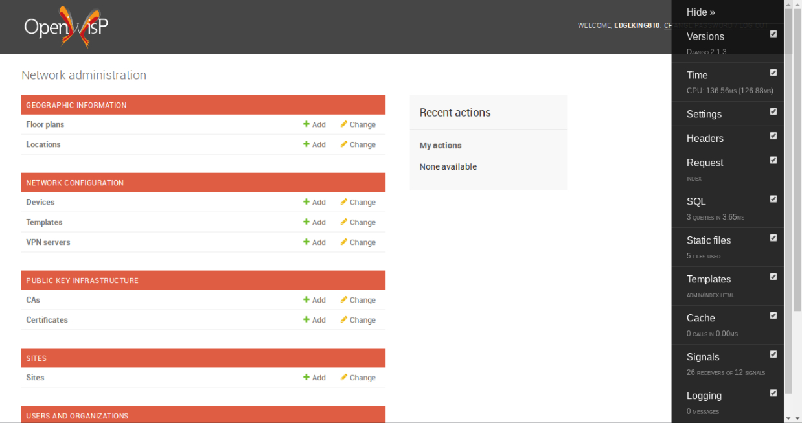

Hacking OpenWISP: Python and Django
===================================

In this page we aim to help users and contributors who want to work on the
internal code of OpenWISP in the following ways:

1. By explaining **why OpenWISP uses Python and Django** as its main
   technologies for the backend application
2. By introducing some Python tools and Django extensions which are
   **extremely useful during development and debugging**.

Why Python?
-----------

`Python <https://www.python.org>`_ is an interpreted high-level
programming language for general-purpose programming which emphasizes
productivity, fast prototyping and high readability.

It is very widely used these days, to the point where even famous
organizations like Google, Mozilla and Dropbox make extensive use of it
for their systems.

**Here are the main reasons why OpenWISP is written in Python:**

- it is widely used in the networking and configuration management
  world, famous libraries such as
  `networkx <https://networkx.github.io>`_,
  `ansible <https://www.ansible.com>`_,
  `salt <https://docs.saltstack.com/en/latest/topics/>`_,
  `paramiko <http://www.paramiko.org>`_ and
  `fabric <http://www.fabfile.org>`_ are written in Python, this allows
  our users to work with a programming language which they are
  already familiar with
- finding developers who know Python is very easy and allows the community
  to grow and help to improve the OpenWISP software ecosystem over time
- Python allows great flexibility and extensibility, this in turns allows
  OpenWISP to be hackable and highly customizable, which is one of the
  goals of OpenWISP 2, the major rewrite of the project

**Resources for learning Python**:

- `LearnPython.org <https://www.learnpython.org>`_
- `SoloLearn <https://www.sololearn.com>`_ (a detailed beginner course)

.. note::
  The first version of OpenWISP was written in Ruby.

  OpenWISP 2 was rewritten in Python because Ruby
  developers are more scarce and this caused the project to stagnate.
  The fact that Python is widely used in the networking world was also
  an important factor in the decision.

Why Django?
-----------

`Django <https://www.djangoproject.com/start/>`_ is a high-level Python
Web framework which encourages rapid development and clean, pragmatic
design.

**In OpenWISP we chose Django mainly for these reasons:**

- It has a rich ecosystem and pluggable apps which allow us to get a lot
  done very fast
- It has been battle tested over many years by a high amount of people and
  high profile companies
- Security vulnerabilities are usually privately disclosed to the
  developers and quickly fixed
- Being popular, it's easy to find Python developers who have
  experience with Django and can get up to speed very fast in
  contributing to OpenWISP
- Django projects are easily customizable by editing a ``settings.py``
  file, this allows OpenWISP to design its modules so that these can be
  imported into larger, more complex and customized applications,
  allowing to create customized network management solutions;
  **this makes OpenWISP similar to a framework**: users can use the
  default installation but if they need a solution that is more tailored
  to their needs they can use it as a base to avoid re-developing a lot
  of code from scratch

**Resources for learning Django**:

- `Official Basic Django Tutorial <https://www.djangoproject.com/start/>`_
- `DjangoGirls Tutorial <https://tutorial.djangogirls.org/en/>`_
  (excellent for absolute beginners!)

PS: if you are wondering why the second tutorial mentions the word
"Girls", we suggest taking a look at
`djangogirls.org <https://djangogirls.org/>`_.

Why Django REST framework?
--------------------------

`Django REST framework <https://www.django-rest-framework.org>`_
is a powerful and flexible toolkit for building Web APIs and it's used
and trusted by internationally recognised companies including Mozilla,
Red Hat, Heroku, and Eventbrite.

Here are some reasons why OpenWISP uses Django REST framework:

- Simplicity, flexibility, quality, and test coverage of source code
- Powerful serialization engine compatible with both ORM and non-ORM
  data sources
- Clean, simple, views for Resources, using Django's new class based
  views
- HTTP response handling, content type negotiation using HTTP Accept
  headers
- Publishing of metadata along with querysets

**Resources for learning Django REST Framework**:

- `Django REST Framework Official Tutorial
  <http://www.django-rest-framework.org/tutorial/quickstart/>`_

Useful Development Tools
------------------------

IPython and ipdb
~~~~~~~~~~~~~~~~

`IPython <https://ipython.org>`_ (Interactive Python) is a command shell
for interactive computing in multiple programming languages, originally
developed for the Python programming language, which offers introspection,
rich media, shell syntax, tab completion, and history.

It provides:

- A powerful interactive shell with syntax highlighting
- A browser-based notebook interface with support for code, text,
  mathematical expressions, inline plots and other media.
- Support for interactive data visualization and use of GUI toolkits.
- Flexible, embeddable interpreters to load into one's own projects
- Tools for parallel computing

More details including installation and updates can be found on the
`official webite <https://ipython.org>`_.

As for `ipdb <https://github.com/gotcha/ipdb>`_, it allows to use the
``ipython`` shell when using the python debugger (known as ``pdb``).

Try to drop this line in a Django project (or an OpenWISP module),
for example in a ``settings.py`` file:

.. code-block:: python

    import ipdb; ipdb.set_trace()

Now load the Django development server and have fun while learning how
to do debug Python code!

Django Extensions
~~~~~~~~~~~~~~~~~

`Django Extensions <https://django-extensions.readthedocs.io/>`_ is a
collection of extensions for the Django Framework. These include
management commands, additional database fields, admin extensions and
much more. We will focus on three of them for now, namely
``shell_plus``, ``runserver_plus``, ``show_urls``.

Django Extensions can be installed with:

.. code-block:: bash

    pip install django-extensions

`shell_plus
<https://django-extensions.readthedocs.io/en/latest/shell_plus.html>`_:
Django shell with autoloading of the apps database models and subclasses
of user-defined classes.

`runserver_plus
<https://django-extensions.readthedocs.io/en/latest/runserver_plus.html>`_:
typical runserver with Werkzeug debugger baked in.

``show_urls``: shows the registered URLs of a Django project.

Django Debug Toolbar
~~~~~~~~~~~~~~~~~~~~

The `Django Debug Toolbar <https://django-debug-toolbar.readthedocs.io/>`_
is a configurable set of panels which display various debug information
about the current HTTP request/response and, when clicked, display more
details about the panel’s content.

It can be installed with:

.. code-block:: bash

    pip install django-debug-toolbar

More information can be found in the `django-debug-toolbar documentation
<https://django-debug-toolbar.readthedocs.io/en/latest/>`_.

Using these tools in OpenWISP
~~~~~~~~~~~~~~~~~~~~~~~~~~~~~

These tools can be added to an OpenWISP development environment and
significantly improve the efficiency and experience while developing.
Let's do a walkthrough of how to use them in `OpenWISP Controller
<https://github.com/openwisp/openwisp-controller>`_ as an example. In the
``tests/`` folder, ``local_settings.example.py`` must be copied and
renamed to ``local_settings.py`` which we will use for customization.
This technique can be used in other OpenWISP development environments too.

.. code-block:: bash

  cd tests/
  cp local_settings_example.py local_settings.py

To start, the `steps <https://github.com/openwisp/openwisp-controller>`_
for installing OpenWISP Controller must be followed. The command
``pipenv install --dev`` then the commands
``pipenv run ./manage.py migrate`` and
``pipenv run ./manage.py createsuperuser`` must be run and
``SPATIALITE_LIBRARY_PATH`` should be specified in the
``local_settings.py`` file.

To start the development server, run ``python manage.py runserver_plus``
which will provide more debugging information.

Also, ``ipython`` can be used alongside ``shell_plus`` by running the
command ``./manage.py shell_plus --ipython`` in the terminal. This will
provide an interactive shell for running code in Python.

To debug the code, ``ipdb`` can be used. Commands similar to
``ipdb mymodule.py`` may be used to carry out that process. A
list of lines where errors have been found or lines which can be further
optimized will be returned.

Lastly, ``django-debug-toolbar`` may be used to display information
about processes occuring on the website. To achieve that, some code needs
to be added to our current module, i.e ``openwisp-controller``. To begin,
the lines ``'debug_toolbar'`` and
``'debug_toolbar.middleware.DebugToolbarMiddleware'`` need to be added
to the ``INSTALLED_APPS`` and to the ``MIDDLEWARE`` settings respectively
and the line ``INTERNAL_IPS = ['127.0.0.1']`` should be added too,
otherwise the django debug toolbar won't be displayed. We also need to
import ``django_extensions`` and add it to our ``INSTALLED_APPS`` setting
but this is already done in ``settings.py``. Here's what
``local_settings.py`` will roughly look like at the end:

.. code-block:: python

    from django.conf import settings

    settings.INSTALLED_APPS += [
        'debug_toolbar',
        'django_extensions'
    ]

    settings.MIDDLEWARE += [
        'debug_toolbar.middleware.DebugToolbarMiddleware'
    ]

    INTERNAL_IPS = ['127.0.0.1']

To complete the process, the Debug Toolbar’s URL needs to be added
to the URLconf of ``openwisp-controller`` as shown in `this
<https://django-debug-toolbar.readthedocs.io/en/latest/installation.html>`_
tutorial but this is already present in the last lines of ``urls.py``:

.. code-block:: python

    from django.conf import settings

    if settings.DEBUG and 'debug_toolbar' in settings.INSTALLED_APPS:
        import debug_toolbar
        urlpatterns.append(
            url(r'^__debug__/', include(debug_toolbar.urls))
        )

When you open ``http://127.0.0.1:8000`` in the browser now and enter the
credentials we created earlier, you should see something like the
following screenshot:

Now that you know some basics, you can experiment and try to use these
tricks on some other OpenWISP module.
