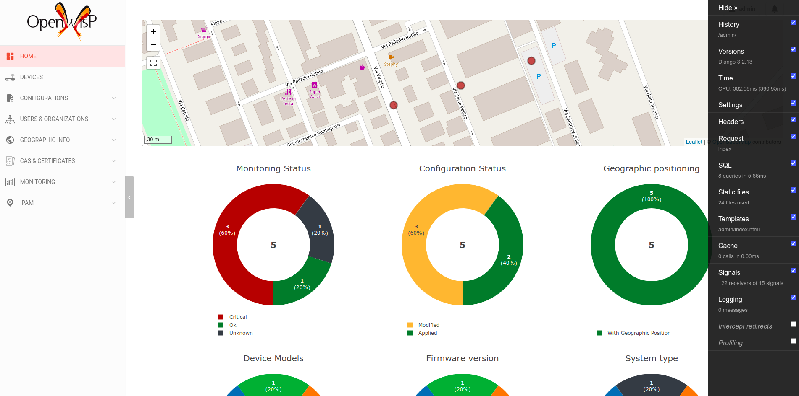

Useful Python & Django Tools for OpenWISP Development
=====================================================

In this page we aim to help users and contributors who want to work on the
internal code of OpenWISP in the following ways:

1. By explaining **why OpenWISP uses Python and Django** as its main
   technologies for the backend application
2. By introducing some Python tools and Django extensions which are
   **extremely useful during development and debugging**.

**Table of Contents:**

.. contents::
    :depth: 2
    :local:

.. _why_python:

Why Python?
-----------

.. note::

    The first version of OpenWISP was written in Ruby.

    OpenWISP 2 was rewritten in Python because Ruby developers were
    becoming scarce, which led to stagnation. The widespread use of Python
    in the networking world also played a significant role in this
    decision.

`Python <https://www.python.org>`_ is an interpreted, high-level
programming language designed for general-purpose programming, emphasizing
productivity, fast prototyping, and high readability.

Python is widely used today, with major organizations like Google,
Mozilla, and Dropbox extensively employing it in their systems.

**Here are the main reasons why OpenWISP is written in Python:**

- It is widely used in the networking and configuration management world.
  Famous libraries such as `networkx <https://networkx.org/>`_, `ansible
  <https://www.ansible.com>`_, `salt
  <https://docs.saltstack.com/en/latest/topics/>`_, `paramiko
  <http://www.paramiko.org>`_, and `fabric <http://www.fabfile.org>`_ are
  written in Python. This allows our users to work with a familiar
  programming language.
- Finding developers who know Python is not a hard task, which helps the
  community grow and contributes to the improvement of the OpenWISP
  software ecosystem over time.
- Python allows great flexibility and extensibility, making OpenWISP
  hackable and highly customizable. This aligns with our emphasis on
  software reusability, which is one of the :doc:`core values of our
  project </general/values>`.

**Resources for learning Python**:

- `LearnPython.org <https://www.learnpython.org>`_.
- `SoloLearn <https://www.sololearn.com>`_ (a detailed beginner course).

.. _why_django:

Why Django?
-----------

`Django <https://www.djangoproject.com/start/>`_ is a high-level Python
web framework that encourages rapid development and clean, pragmatic
design.

**In OpenWISP we chose Django mainly for these reasons:**

- It has a rich ecosystem and pluggable apps that allow us to accomplish a
  lot very quickly.
- It has been battle-tested over many years by a large number of users and
  high-profile companies.
- Security vulnerabilities are usually privately disclosed to the
  developers and quickly fixed.
- Being popular, it's easy to find Python developers with experience in
  Django who can quickly start contributing to OpenWISP.
- Django projects are easily customizable by editing a ``settings.py``
  file. This allows OpenWISP to design its modules so they can be imported
  into larger, more complex, and customized applications, enabling the
  creation of tailored network management solutions. **This makes OpenWISP
  similar to a framework**: users can use the default installation, but if
  they need a more tailored solution, they can use it as a base, avoiding
  the need to redevelop a lot of code from scratch.

**Resources for learning Django**:

- `Official Basic Django Tutorial <https://www.djangoproject.com/start/>`_
- `DjangoGirls Tutorial <https://tutorial.djangogirls.org/en/>`_
  (excellent for absolute beginners!)

PS: If you are wondering why the second tutorial mentions the word
"Girls," we suggest taking a look at `djangogirls.org
<https://djangogirls.org/>`_.

.. _why_drf:

Why Django REST Framework?
--------------------------

`Django REST framework <https://www.django-rest-framework.org>`_ is a
powerful and flexible toolkit for building Web APIs, used and trusted by
internationally recognized companies including Mozilla, Red Hat, Heroku,
and Eventbrite.

Here are some reasons why OpenWISP uses Django REST framework:

- Simplicity, flexibility, quality, and extensive test coverage of the
  source code.
- Powerful serialization engine compatible with both ORM and non-ORM data
  sources.
- Clean, simple views for resources, using Django's class-based views.
- Efficient HTTP response handling and content type negotiation using HTTP
  Accept headers.
- Easy publishing of metadata along with querysets.

**Resources for learning Django REST Framework**:

- `Django REST Framework Official Tutorial
  <http://www.django-rest-framework.org/tutorial/quickstart/>`_

Useful Development Tools
------------------------

IPython and ipdb
~~~~~~~~~~~~~~~~

`IPython <https://ipython.org>`_ (Interactive Python) is a command shell
for interactive computing in multiple programming languages, originally
developed for Python. It offers introspection, rich media, shell syntax,
tab completion, and history.

It provides:

- A powerful interactive shell with syntax highlighting
- A browser-based notebook interface with support for code, text,
  mathematical expressions, inline plots, and other media
- Support for interactive data visualization and use of GUI toolkits
- Flexible, embeddable interpreters to load into one's own projects
- Tools for parallel computing

More details, including installation and updates, can be found on the
`official website <https://ipython.org>`_.

As for `ipdb <https://github.com/gotcha/ipdb>`_, it allows the use of the
``ipython`` shell when using the Python debugger (``pdb``).

Try adding this line in a Django project (or an OpenWISP module), for
example in a ``settings.py`` file:

.. code-block:: python

    import ipdb

    ipdb.set_trace()

Now load the Django development server and have fun while learning how to
debug Python code!

Django Extensions
~~~~~~~~~~~~~~~~~

`Django Extensions <https://django-extensions.readthedocs.io/>`_ is a
collection of extensions for the Django framework. These include
management commands, additional database fields, admin extensions, and
much more. We will focus on three of them for now: ``shell_plus``,
``runserver_plus``, and ``show_urls``.

Django Extensions can be installed with:

.. code-block:: bash

    pip install django-extensions

`shell_plus
<https://django-extensions.readthedocs.io/en/latest/shell_plus.html>`_:
Django shell which automatically imports the project settings and the
django models defined in the settings.

`runserver_plus
<https://django-extensions.readthedocs.io/en/latest/runserver_plus.html>`_:
the typical ``runserver`` with the Werkzeug debugger baked in.

``show_urls``: displays the registered URLs of a Django project.

Django Debug Toolbar
~~~~~~~~~~~~~~~~~~~~

The `Django Debug Toolbar <https://django-debug-toolbar.readthedocs.io/>`_
is a configurable set of panels that display various debug information
about the current HTTP request/response and, when clicked, provide more
details about the panel's content.

It can be installed with:

.. code-block:: bash

    pip install django-debug-toolbar

More information can be found in the `django-debug-toolbar documentation
<https://django-debug-toolbar.readthedocs.io/en/latest/>`_.

Using these Tools in OpenWISP
~~~~~~~~~~~~~~~~~~~~~~~~~~~~~

These tools can be added to an OpenWISP development environment to
significantly improve the efficiency and experience of development. Here's
a guide on how to use them in :doc:`OpenWISP Controller
</controller/index>`.

In the ``tests/`` folder, ``local_settings.example.py`` should be copied
and renamed to ``local_settings.py`` for customization. This technique can
be used in other OpenWISP development environments too.

.. code-block:: bash

    cd tests/
    cp local_settings_example.py local_settings.py

Follow the :doc:`installation steps
<../controller/developer/installation>` for OpenWISP Controller. Run the
command ``pipenv install --dev``, then run ``pipenv run ./manage.py
migrate`` and ``pipenv run ./manage.py createsuperuser``. Ensure
``SPATIALITE_LIBRARY_PATH`` is specified in the ``local_settings.py``
file.

To start the development server with more debugging information, run:

.. code-block:: bash

    python manage.py runserver_plus

For an interactive shell, use ``ipython`` alongside ``shell_plus`` by
running:

.. code-block:: bash

    ./manage.py shell_plus --ipython

To debug the code, use ``ipdb``. For example:

.. code-block:: bash

    ipdb mymodule.py

This command will provide a list of lines where errors have been found or
lines that can be further optimized.

To use ``django-debug-toolbar`` for displaying information about processes
occurring on the website, some configuration is required. Add the
following lines to your ``local_settings.py``:

.. code-block:: python

    from django.conf import settings

    settings.INSTALLED_APPS += ["debug_toolbar", "django_extensions"]
    settings.MIDDLEWARE += ["debug_toolbar.middleware.DebugToolbarMiddleware"]
    INTERNAL_IPS = ["127.0.0.1"]

This ensures that the Django Debug Toolbar is displayed. Note that
`django_extensions` is already included in ``settings.py``.

Finally, add the Debug Toolbar's URL to the URLconf of
``openwisp-controller`` as shown in the `installation tutorial
<https://django-debug-toolbar.readthedocs.io/en/latest/installation.html>`_,
though this should already be present in the last lines of ``urls.py``:

.. code-block:: python

    from django.conf import settings

    if settings.DEBUG and "debug_toolbar" in settings.INSTALLED_APPS:
        import debug_toolbar

        urlpatterns.append(url(r"^__debug__/", include(debug_toolbar.urls)))

When you open ``http://127.0.0.1:8000`` in the browser and log in with the
credentials created earlier, you should see something like this:

Now that you know the basics, you can experiment and apply these
techniques to other OpenWISP modules.
