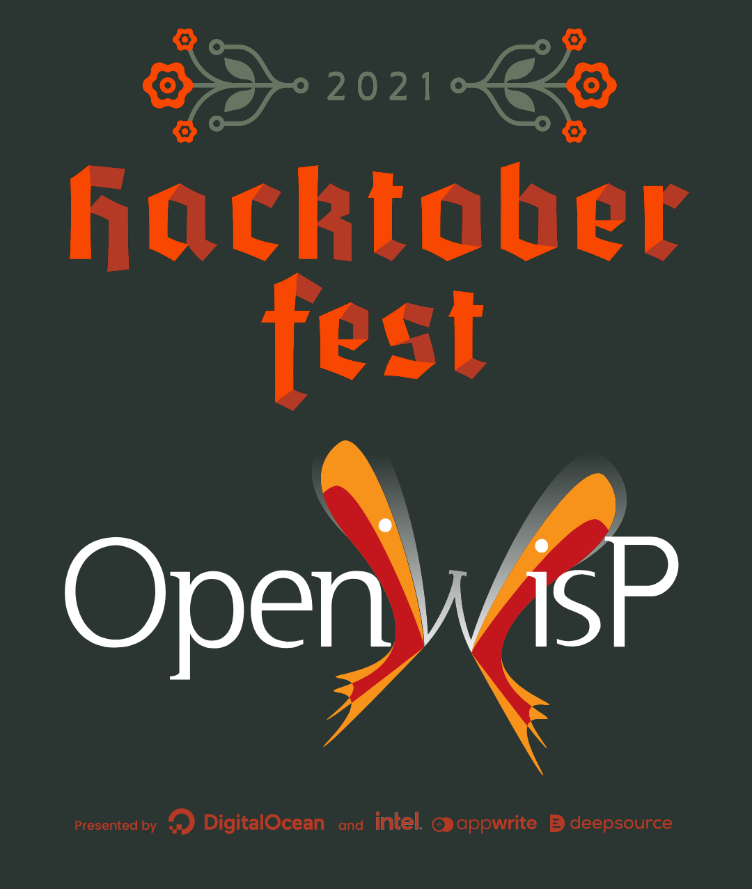

Hacktoberfest
=============

.. image:: ../images/hacktoberfest/hacktoberfest-openwisp.png
     :align: center

.. note::
  OpenWISP participates in `Hacktoberfest 2021
  <https://hacktoberfest.digitalocean.com/>`_!

If you are reading this page you are probably considering OpenWISP
as a possible organization to contribute for `Hacktoberfest
<https://hacktoberfest.digitalocean.com/>`_, welcome!

If you are looking for a **friendly community** where **your contribution
will have a very tangible positive effect from the first day of your
participation** and where **you can grow your tech skills at 360°**,
then **CONGRATULATIONS!** OpenWISP is the right organization for you.

How to get started
------------------

1. Read the contributing guidelines
~~~~~~~~~~~~~~~~~~~~~~~~~~~~~~~~~~~

Avoid common pitfalls by reading our
:doc:`Contributing guidelines <../developer/contributing>`.

This will result in **your pull requests being merged faster**
and less overhead for maintainers.

2. Project Board
~~~~~~~~~~~~~~~~

Look for issues labeled **hacktoberfest** in the
`OpenWISP Hacktoberfest Contributor's Board <https://github.com/orgs/openwisp/projects/3?card_filter_query=label%3Ahacktoberfest>`_..

Feel free to ask question regarding points which are not clear, but
please **ensure your questions are specific**.

3. Announce you're working on something
~~~~~~~~~~~~~~~~~~~~~~~~~~~~~~~~~~~~~~~

When you are working on an issue you think you are going to solve,
please **let everyone know** by leaving a comment on the Github issue
so we can **avoid wasted efforts** from multiple contributors working
on the same patch.

However, **if you stop working on it, please also let us know**.

If you find somebody else has announced they're working on an issue you
would like to do, you may want to double check they're still working on
it by leaving a comment on the issue.

4. Join the general chat
~~~~~~~~~~~~~~~~~~~~~~~~

Join our `general chat <https://openwisp.org/support.html>`_ to better
coordinate with the community.

5. Help us to grow
~~~~~~~~~~~~~~~~~~

Caring for Open Source also means helping its communities grow.

Growing is important because it will allow us to have more mentors in the
future so **we will able to help out more contributors to
advance their skills**.

**Hint**: try to do some of the easiest actions described in :doc:`Help
us to grow <../general/help-us>`.

Main Rules
----------

1. Stay on topic
~~~~~~~~~~~~~~~~

The aim of this program is to help participants learn to contribute to
open source meaningfully, which for us means contributing to our mission
and end goals. Since new contributors are not suited to work on critical
tasks due to their inherent complexity, we prepared a list of easier and
well defined issues that can be used to get started, please refer to our
`OpenWISP Hacktoberfest Contributor's Board <https://github.com/orgs/openwisp/projects/3?card_filter_query=label%3Ahacktoberfest>`_.

2. Spammy pull requests won't be accepted
~~~~~~~~~~~~~~~~~~~~~~~~~~~~~~~~~~~~~~~~~

Spammy pull requests containing minor changes (fixing typos, grammars,
etc.) that are aimed simply at increasing your Hacktoberfest score will
be flagged as invalid.

This behavior is not compatible with the spirit of the program, if you
are doing this you are missing the point of Hacktoberfest, Open Source
and you are just wasting everyone's time (including yours, because you
could be learning something new instead of trying to naively trick the
system).

3. Be constructive
~~~~~~~~~~~~~~~~~~

Please try to be constructive and patient when interacting with
maintainers and contributors.

If you feel you're not treated fairly, please refer to the
instructions for reporting unacceptable behavior in our
:doc:`Code of Conduct <../general/code-of-conduct>`.

