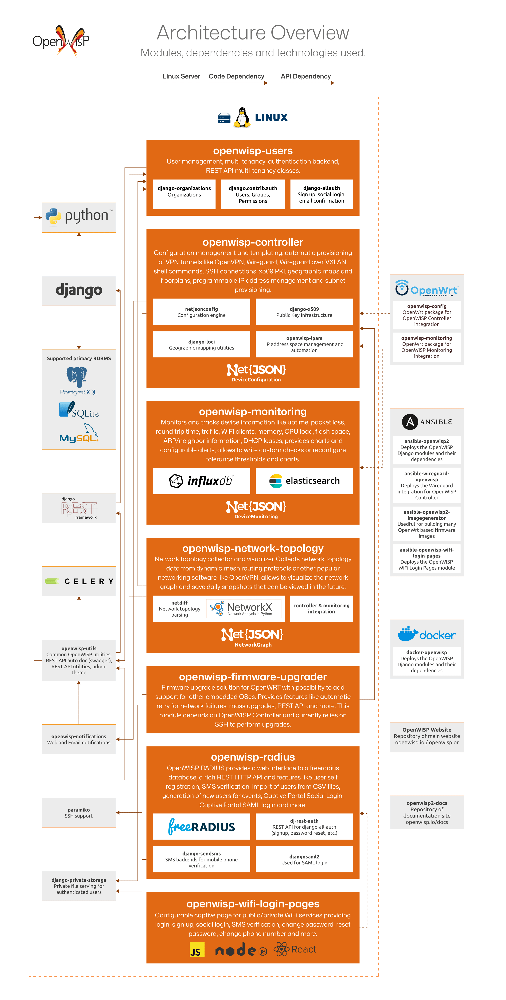

Architecture, Modules, Technologies
===================================

The diagram above provides an overview of the OpenWISP architecture. It
highlights the key technologies used, the structure of the OpenWISP
modules, their major dependencies, and their interactions.

.. important::

    For an enhanced viewing experience, open the image in a new browser
    tab.

**Table of Contents:**

.. contents::
    :depth: 2
    :local:

OpenWISP Modules
----------------

.. note::

    For more insights into the motivations and philosophy behind the
    modular architecture of OpenWISP, refer to `Applying the Unix
    Philosophy to Django projects: a report from the real world
    <https://www.slideshare.net/FedericoCapoano/applying-the-unix-philosophy-to-django-projects-a-report-from-the-real-world>`__.

Deployment
~~~~~~~~~~

- :doc:`Ansible OpenWISP2 </ansible/index>`: Recommended method to deploy
  OpenWISP on virtual machines.
- :doc:`Docker OpenWISP </docker/index>`: Enables deployment of OpenWISP
  on Dockerized cloud infrastructure. While still under active
  development, the basic features of OpenWISP are functional.
- `Ansible OpenWISP WiFi Login Pages
  <https://github.com/openwisp/ansible-openwisp-wifi-login-pages>`_:
  Ansible role for deploying the :doc:`WiFi Login Pages
  </wifi-login-pages/index>` module.
- `Ansible OpenWISP2 Image Generator
  <https://github.com/openwisp/ansible-openwisp2-imagegenerator>`_: Useful
  for generating multiple OpenWrt firmware images for different
  organizations with the OpenWISP packages preinstalled.
- `Ansible Wireguard OpenWISP
  <https://github.com/openwisp/ansible-wireguard-openwisp>`_: Ansible role
  that enables deployment of :doc:`Wireguard integration for OpenWISP
  Controller </controller/user/wireguard>`.

Server Side
~~~~~~~~~~~

- :doc:`OpenWISP Users </users/index>`: Manages user authentication,
  multi-tenancy, and provides REST API utilities and classes for
  implementing multi-tenancy.
- :doc:`OpenWISP Controller </controller/index>`: Handles configuration
  management, VPN provisioning (OpenVPN, Wireguard, Wireguard over VXLAN),
  shell commands, SSH connections, x509 PKI management, geographic maps,
  floor plans, programmable IP address management, and subnet
  provisioning.

  This module depends on several Django apps and Python libraries
  developed or maintained by OpenWISP:

  - `netjsonconfig <https://github.com/openwisp/netjsonconfig>`__: For
    configuration generation, validation, and parsing.
  - `django-x509 <https://github.com/openwisp/django-x509>`__: Manages
    Public Key Infrastructure (certification authorities and x509
    certificates).
  - `django-loci <https://github.com/openwisp/django-loci>`__: Provides
    geographic and indoor mapping features.
  - :doc:`openwisp-ipam </ipam/index>`: Administers IP and subnet
    management.
  - `django-rest-framework-gis
    <https://github.com/openwisp/django-rest-framework-gis>`__: Adds GIS
    capabilities to Django REST Framework.

- :doc:`OpenWISP Monitoring </monitoring/index>`: Monitors and tracks
  device metrics like ping success rate, packet loss, round trip time,
  traffic, WiFi clients, memory, CPU load, flash space, ARP/neighbor
  information, DHCP leases, and provides charts and configurable alerts.
  It also allows custom checks and tolerance threshold configurations.
- :doc:`OpenWISP Network Topology </network-topology/index>`: Collects and
  visualizes network topology data from dynamic mesh routing protocols and
  other popular networking software like OpenVPN. It can visualize network
  graphs and save daily snapshots for future viewing.

  This module relies on two libraries developed and maintained by
  OpenWISP:

  - `netdiff <https://github.com/openwisp/netdiff>`__: Parses network
    topology.
  - `netjsongraph.js <https://github.com/openwisp/netjsongraph.js>`__: A
    JavaScript library for visualizing network graphs.

- :doc:`OpenWISP Firmware Upgrader </firmware-upgrader/index>`: Provides a
  firmware upgrade solution for OpenWrt and potentially other embedded
  OSes. Features include automatic retry for network failures, mass
  upgrades, a REST API, and more.
- :doc:`OpenWISP RADIUS </radius/index>`: Offers a web interface to a
  FreeRADIUS database, a rich REST HTTP API, and features like user
  self-registration, SMS verification, user import from CSV files,
  event-based user generation, Captive Portal Social Login, and Captive
  Portal SAML login.
- :doc:`OpenWISP Notifications </notifications/index>`: Provides email and
  web notifications for OpenWISP, enabling modules to notify users about
  significant events in their network.
- :doc:`OpenWISP Utils </utils/index>`: Common utilities and classes
  shared by all OpenWISP Python modules. Includes many utilities for QA
  checks and automated testing, heavily used in continuous integration
  builds of most OpenWISP GitHub repositories.
- :doc:`OpenWISP WiFi Login Pages </wifi-login-pages/index>`: A
  configurable login page and self registration app for WiFi Hotspot
  services, offering features like login, sign up, social login, SMS
  verification, password reset and more. It is a frontend for the OpenWISP
  RADIUS REST API, designed for end users of a WiFi Hotspot service.

Network Device Side
~~~~~~~~~~~~~~~~~~~

- :doc:`OpenWISP OpenWrt Config Agent </openwrt-config-agent/index>`: An
  OpenWrt package that integrates with :doc:`OpenWISP Controller
  </controller/index>`.
- :doc:`OpenWISP OpenWrt Monitoring Agent
  </openwrt-monitoring-agent/index>`: An OpenWrt package that integrates
  with :doc:`OpenWISP Monitoring </monitoring/index>`.

Website and Documentation
~~~~~~~~~~~~~~~~~~~~~~~~~

- `openwisp-docs <https://github.com/openwisp/openwisp-docs>`_: Repository
  for the OpenWISP documentation, hosted on `openwisp.io/docs
  <https://openwisp.io/docs/>`_.
- `OpenWISP-Website <https://github.com/openwisp/OpenWISP-Website>`_:
  Repository for the OpenWISP website, hosted on `openwisp.org
  <https://openwisp.org/>`_.

Main Technologies Used
----------------------

Python
~~~~~~

`Python <https://www.python.org/>`_ is the primary programming language
used for the server-side application (web admin, API, controller,
workers).

Originally, OpenWISP was built on Ruby On Rails, but we later switched to
Python due to its suitability for networking and a larger pool of
potential contributors.

Find out more on :ref:`why OpenWISP chose Python as its main language
<why_python>`.

Django
~~~~~~

`Django <https://www.djangoproject.com/>`_ is one of the most popular web
frameworks for Python.

It is used extensively in our modules, allowing rapid development and
access to a rich ecosystem.

It's the base framework used in most of the server-side modules of
OpenWISP.

Find out more on :ref:`why OpenWISP chose Django as its main web framework
<why_django>`.

Django REST Framework
~~~~~~~~~~~~~~~~~~~~~

`Django REST framework <https://www.django-rest-framework.org>`_ is a
powerful and flexible toolkit for building Web APIs based on Django,
widely used in most of the Django and web-based OpenWISP modules.

Find out more on :ref:`why OpenWISP chose Django REST Framework to build
its REST API <why_DRF>`.

Celery
~~~~~~

`Celery <https://docs.celeryq.dev/en/stable/index.html>`_ is a Python
implementation of a distributed task queue. It is heavily used in OpenWISP
to execute background tasks, perform network operations like monitoring
checks, configuration updates, firmware upgrades, and more.

OpenWrt
~~~~~~~

`OpenWrt <https://openwrt.org/>`_ is a Linux distribution designed for
embedded systems, routers, and networking in general.

It has a very skilled community and is used as a base by many hardware
vendors (Technicolor, Ubiquiti Networks, Linksys, Teltonika, and many
others).

Lua
~~~

`Lua <https://www.lua.org/>`_ is a lightweight, multi-paradigm programming
language designed primarily for embedded systems and clients.

Lua is cross-platform, since the interpreter is written in ANSI C, and has
a relatively simple C API.

It is the official scripting language of OpenWrt and is used heavily in
the OpenWrt packages of OpenWISP: :doc:`openwisp-config
</openwrt-config-agent/index>` and :doc:`openwisp-monitoring
</openwrt-monitoring-agent/index>`.

Node.js and React JS
~~~~~~~~~~~~~~~~~~~~

`NodeJS <https://nodejs.org/en/>`_ is a JavaScript runtime for building
JS-based applications.

In OpenWISP, it's used as a base for frontend applications along with
`React <https://reactjs.org/>`_, like the :doc:`WiFi Login Pages module
</wifi-login-pages/index>`.

Ansible
~~~~~~~

`Ansible <https://www.ansible.com/>`_ is a popular software automation
tool written in Python, generally used for automating software
provisioning, configuration management, and application deployment.

We use `Ansible <https://www.ansible.com/>`_ to provide automated
procedures to :doc:`deploy OpenWISP </ansible/user/quickstart>`, to
`compile custom OpenWrt images for different organizations
<https://github.com/openwisp/ansible-openwisp2-imagegenerator>`__, to
`deploy OpenWISP WiFi Login Pages
<https://github.com/openwisp/ansible-openwisp-wifi-login-pages>`__, and to
deploy the :doc:`Wireguard integration for OpenWISP Controller
</controller/user/wireguard>`.

Docker
~~~~~~

We use Docker in :doc:`docker-openwisp </docker/index>`, which aims to
ease the deployment of OpenWISP in a containerized infrastructure.

NetJSON
~~~~~~~

`NetJSON <http://netjson.org/>`_ is a data interchange format based on
`JSON <http://json.org/>`_ designed to ease the development of software
tools for computer networks.

RADIUS
~~~~~~

`RADIUS <https://en.wikipedia.org/wiki/RADIUS/>`_ (Remote Authentication
Dial-In User Service) is a networking protocol used for centralized
Authentication, Authorization, and Accounting management of network
services.

FreeRADIUS
~~~~~~~~~~

`FreeRADIUS <https://freeradius.org/>`_ is the most popular open-source
implementation of the RADIUS protocol and is extensively relied upon in
:doc:`OpenWISP RADIUS </radius/index>`.

Mesh Networking
~~~~~~~~~~~~~~~

A `mesh network <https://en.wikipedia.org/wiki/Mesh_networking/>`_ is a
local network topology where infrastructure nodes connect directly,
dynamically, and non-hierarchically to as many other nodes as possible.
They cooperate to efficiently route data to and from clients.

OpenWrt supports the standard mesh mode (802.11s), which OpenWISP supports
out of the box. Additionally, OpenWrt can support other popular dynamic
open-source routing protocols such as OLSRd2, BATMAN-advanced, Babel, BMX,
etc.

For more information on how to set up a mesh network with OpenWISP, refer
to: :doc:`/tutorials/mesh`.

InfluxDB
~~~~~~~~

`InfluxDB <https://www.influxdata.com/>`_ is the default open-source
time-series database used in :doc:`OpenWISP Monitoring
</monitoring/index>`.

Elasticsearch
~~~~~~~~~~~~~

`Elasticsearch <https://www.elastic.co/>`_ is an alternative option that
can be used in :doc:`OpenWISP Monitoring </monitoring/index>` as a
time-series database. It excels in storing and retrieving data quickly and
efficiently.

Networkx
~~~~~~~~

`Networkx <https://networkx.org/>`_ is a network graph analysis library
written in Python and used under the hood by :doc:`netdiff
</network-topology/index>` and the :doc:`OpenWISP Network Topology module
</network-topology/index>`.

Relational Databases
~~~~~~~~~~~~~~~~~~~~

`Django supports several Relational Database Management Systems
<https://docs.djangoproject.com/en/4.0/ref/databases/>`_.

The most notable ones are:

- `PostgreSQL <https://www.postgresql.org/>`_
- `MySQL <https://www.mysql.com/>`_
- `SQLite <https://www.sqlite.org/>`_

**For production usage, we recommend PostgreSQL.**

For development, we recommend SQLite for its simplicity.

Other Notable Dependencies
~~~~~~~~~~~~~~~~~~~~~~~~~~

- `Paramiko <https://www.paramiko.org/>`_ (used in OpenWISP Controller and
  Firmware Upgrader).
- `Django-allauth <https://github.com/pennersr/django-allauth>`_ (used in
  OpenWISP Users).
- `Django-organizations
  <https://github.com/bennylope/django-organizations>`_ (used in OpenWISP
  Users).
- `Django-swappable-models
  <https://github.com/openwisp/django-swappable-models>`_ (used in all
  major Django modules).
- `Django-private-storage
  <https://github.com/edoburu/django-private-storage>`_ (used in OpenWISP
  RADIUS and Firmware Upgrader).
- `Dj-rest-auth <https://github.com/iMerica/dj-rest-auth>`_ (used in
  OpenWISP RADIUS).
- `Django-sendsms <https://github.com/stefanfoulis/django-sendsms>`_ (used
  in OpenWISP RADIUS).
- `Django-saml2 <https://github.com/IdentityPython/djangosaml2>`_ (used in
  OpenWISP RADIUS).
