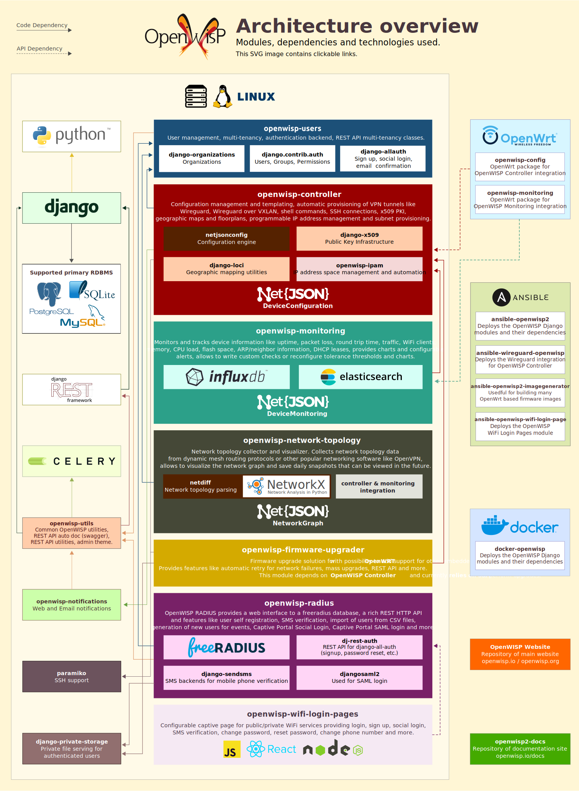

===================================
Architecture, Modules, Technologies
===================================

Architecture Overview
---------------------

The following SVG image summarizes the architecture of OpenWISP, the main
technologies used, the structure of the OpenWISP modules and their
most important dependencies and the way they interact with one another.

.. note::
    For the best experience it is recommended to open the image in a new
    tab of your browser, from there you can also click on the different
    elements to open the README or website of each module or technology
    used.

    :download:`The Inkscape source file of the architecture diagram is
    also available for download
    </assets/design/architecture-diagram-inkscape.svg>`.

    `Inkscape <https://inkscape.org/>`__ is an open source
    vector editing software which has been used to produce this diagram.

OpenWISP Modules
----------------

.. note::
    If you want to know more about the motivations and philosophy
    that have shaped the modular architecture of OpenWISP,
    please see `Applying the Unix Philosophy to Django projects:
    a report from the real world
    <https://www.slideshare.net/FedericoCapoano/applying-the-unix-philosophy-to-django-projects-a-report-from-the-real-world>`__.

Deployment
~~~~~~~~~~

- `Ansible OpenWISP2 <https://github.com/openwisp/ansible-openwisp2>`_:
  Recommended way to deploy OpenWISP on virtual machines.
- `Docker OpenWISP <https://github.com/openwisp/docker-openwisp>`_
  (alpha): allows to deploy OpenWISP on dockerized cloud infrastructure.
  It's still being improved but the basic features of OpenWISP
  are working.
- `Ansible OpenWISP WiFi Login Pages
  <https://github.com/openwisp/ansible-openwisp-wifi-login-pages>`_:
  ansible role that allows to deploy `OpenWISP WiFi Login Pages
  <https://github.com/openwisp/openwisp-wifi-login-pages>`_.
- `Ansible OpenWISP2 Image Generator
  <https://github.com/openwisp/ansible-openwisp2-imagegenerator>`_:
  useful to generate many OpenWrt firmware images for different
  organizations with the OpenWISP packages preinstalled.
- `Ansible Wireguard OpenWISP.
  <https://github.com/openwisp/ansible-wireguard-openwisp>`_:
  ansible role that allows to deploy the `Wireguard integration
  for OpenWISP Controller
  <https://github.com/openwisp/openwisp-controller/#how-to-setup-vxlan-over-wireguard-tunnels>`_.

Server Side
~~~~~~~~~~~

- `OpenWISP Users <https://github.com/openwisp/openwisp-users>`_:
  User management, multi-tenancy, authentication backend,
  REST API utilities and classes to implement multi-tenancy.

- `OpenWISP Controller <https://github.com/openwisp/openwisp-controller>`_:
  Configuration management and templating,
  automatic provisioning of VPN tunnels like OpenVPN, Wireguard,
  Wireguard over VXLAN, shell commands,
  SSH connections, x509 PKI management, geographic maps and floorplans,
  programmable IP address management and subnet provisioning.

  This module depends on several django apps or python libraries developed
  or maintained by OpenWISP:

  - `netjsonconfig <https://github.com/openwisp/netjsonconfig>`__:
    configuration generation, validation and parsing.
  - `django-x509 <https://github.com/openwisp/django-x509>`__:
    Public Key Infrastructure (management of
    certification authorities and x509 certificates).
  - `django-loci <https://github.com/openwisp/django-loci>`__:
    Geographic and indoor mapping features.
  - `openwisp-ipam <https://github.com/openwisp/openwisp-ipam>`__:
    IP and Subnet administration.
  - `django-rest-framework-gis <https://github.com/openwisp/django-rest-framework-gis>`__:
    GIS addons for Django REST Framework.

- `OpenWISP Monitoring
  <https://github.com/openwisp/openwisp-monitoring>`__:
  Monitors and tracks device information like uptime, packet loss,
  round trip time, traffic, WiFi clients,memory, CPU load, flash space,
  ARP/neighbor information, DHCP leases, provides charts and
  configurable alerts, allows to write custom checks or reconfigure
  tolerance thresholds and charts.

- `OpenWISP Network Topology
  <https://github.com/openwisp/openwisp-network-topology>`_:
  Network topology collector and visualizer.
  Collects network topology datafrom dynamic mesh routing protocols or
  other popular networking software like OpenVPN, allows to visualize the
  network graph and save daily snapshots that can be viewed in the future.

  This module depends on a couple of libraries developed
  and maintained by OpenWISP:

  - `netdiff <https://github.com/openwisp/netdiff>`__:
    network topology parsing.
  - `netjsongraph.js <https://github.com/openwisp/netjsongraph.js>`__:
    Javascript library for network graph visualization.

- `OpenWISP Firmware Upgrader
  <https://github.com/openwisp/openwisp-firmware-upgrader>`_:
  Firmware upgrade solution for OpenWRT with possibility to add support
  for other embedded OSes.
  Provides features like automatic retry for network failures,
  mass upgrades, REST API and more.

- `OpenWISP RADIUS <https://github.com/openwisp/openwisp-radius>`_:
  provides a web interface to a freeradius database,
  a rich REST HTTP API and features like user self registration,
  SMS verification, import of users from CSV files, generation of
  new users for events, Captive Portal Social Login,
  Captive Portal SAML login and more.

- `OpenWISP Notifications
  <https://github.com/openwisp/openwisp-notifications>`_:
  provides email and web notifications to OpenWISP.
  Its main goal is to allow any OpenWISP module to notify users
  about meaningful events that happen in their network.

- `OpenWISP Utils
  <https://github.com/openwisp/openwisp-utils>`_:
  common utilities and classes shared by all the OpenWISP python
  modules, it includes a lot of utilities for QA checks and
  automated testing which are heavily used in the continous integration
  builds of most if not all the OpenWISP github repositories.

- `OpenWISP WiFi Login Pages
  <https://github.com/openwisp/openwisp-wifi-login-pages>`_:
  Configurable captive page for public/private WiFi services providing
  login, sign up, social login, SMS verification, change password,
  reset password, change phone number and more.
  It is a frontend of the OpenWISP RADIUS REST API and it's designed to
  be used by end users of a public WiFi network.

Network Device Side
~~~~~~~~~~~~~~~~~~~

- `OpenWISP Config <https://github.com/openwisp/openwisp-config>`_:
  OpenWrt package which integrates with OpenWISP Controller.
- `OpenWISP Monitoring
  <https://github.com/openwisp/openwrt-openwisp-monitoring>`__:
  OpenWrt package which integrates with OpenWISP Monitoring.

Website and Documentation
~~~~~~~~~~~~~~~~~~~~~~~~~

- `openwisp2-docs <https://github.com/openwisp/openwisp2-docs>`_:
  repository for the documentation of OpenWISP,
  hosted on `openwisp.io/docs <https://openwisp.io/docs/>`_.
- `OpenWISP-Website <https://github.com/openwisp/OpenWISP-Website>`_:
  repository of the OpenWISP website, hosted on
  `openwisp.org <https://openwisp.org/>`_.

Main Technologies Used
----------------------

Python
~~~~~~

`Python <https://www.python.org/>`_ it's the main programming language
used by the server side application (web admin, API, controller, workers).

In the past OpenWISP was built in Ruby On Rails, but we later switched
to Python because it's much more suited to networking and it has a wider
pool of potential contributors.

Find out more on :ref:`why OpenWISP chose Python
as its main language <why_python>`.

Django
~~~~~~

`Django <https://www.djangoproject.com/>`_ is one of the most popular
web frameworks for Python language.

It is used extensively in our modules. Django allows rapid development
and has a very rich ecosystem.

It's the base framework used in most of the server side
modules of OpenWISP.

Find out more on :ref:`why OpenWISP chose Django
as its main web framework <why_django>`.

Django REST Framework
~~~~~~~~~~~~~~~~~~~~~

`Django REST framework <https://www.django-rest-framework.org>`_
is a powerful and flexible toolkit for building Web APIs based on Django
and it's widely used in most of the Django and web based based OpenWISP
modules.

Find out more on :ref:`why OpenWISP chose Django
REST Framework to build its REST API <why_DRF>`.

Celery
~~~~~~

`Celery <https://docs.celeryq.dev/en/stable/index.html>`_ is a python
implementation of a distributed task queue and is heavily used in
OpenWISP to execute background tasks, perform network operations
like monitoring checks, configuration updates, firmware upgrades
and so on.

OpenWrt
~~~~~~~

`OpenWrt <https://openwrt.org/>`_ is an linux distribution designed for
embedded systems, routers and networking in general.

It has a very skilled community and it is used as a base by many
hardware vendors (Technicolor, Ubiquiti Networks, Linksys, Teltonika
and many others).

Lua
~~~

`Lua <https://www.lua.org/>`_ is a lightweight, multi-paradigm programming
language designed primarily for embedded systems and clients.

Lua is cross-platform, since the interpreter is written in ANSI C,
and has a relatively simple C API.

It is the official scripting language of OpenWRT and it's used heavily
in the OpenWrt packages of OpenWISP:
`openwisp-config <https://github.com/openwisp/openwisp-config>`__
and `openwisp-monitoring
<https://github.com/openwisp/openwrt-openwisp-monitoring>`_.

Node.js and React JS
~~~~~~~~~~~~~~~~~~~~

`NodeJS <https://nodejs.org/en/>`_ is javascript runtime to build
JS based applications.

In OpenWISP it's used as a base for frontend applications
along with `React <https://reactjs.org/>`_, like
`openwisp-wifi-login-pages
<https://github.com/openwisp/openwisp-wifi-login-pages/>`__.

Ansible
~~~~~~~

`Ansible <https://www.ansible.com/>`_ is a very popular software
automation tool written in python that is generally used for automating
software provisioning, configuration management and application
deployment.

We use `Ansible <https://www.ansible.com/>`_ to provide automated
procedures to `deploy OpenWISP
<https://github.com/openwisp/ansible-openwisp2>`__,
to `compile custom OpenWRT images for different
organizations <https://github.com/openwisp/ansible-openwisp2-imagegenerator>`__,
to `deploy OpenWISP WiFi Login Pages
<https://github.com/openwisp/openwisp-wifi-login-pages>`__
and to deploy the `Wireguard integration for OpenWISP Controller
<https://github.com/openwisp/ansible-wireguard-openwisp>`__.

Docker
~~~~~~

We use docker in
`docker-openwisp <https://github.com/openwisp/docker-openwisp>`_,
which aims to ease the deployment of OpenWISP in a
containerized infrastructure.

NetJSON
~~~~~~~

`NetJSON <http://netjson.org/>`_ is a data interchange format based on
`JSON <http://json.org/>`_ designed to ease the development of software
tools for computer networks.

RADIUS
~~~~~~

`RADIUS <https://en.wikipedia.org/wiki/RADIUS/>`_ (Remote Authentication
Dial-In User Service) is a networking protocol that used for centralized
Authentication, Authorization, and Accounting management of
network services.

Freeradius
~~~~~~~~~~

`Freeradius <https://freeradius.org/>`_ is the most popular open source
implementation of the RADIUS protocol and is heavily relied on in
`OpenWISP RADIUS <https://github.com/openwisp/openwisp-radius>`_.

Mesh Networking
~~~~~~~~~~~~~~~

A `mesh nework <https://en.wikipedia.org/wiki/Mesh_networking/>`_ is a
local network topology in which the infrastructure nodes connect directly,
dynamically and non-hierarchically to as many other nodes as possible
and cooperate with one another to efficiently route data from/to clients.

OpenWrt supports the standard mesh mode (802.11s) and OpenWISP supports
this mode out of the box.

It is also possible to support other popular dynamic  open source
routing protocols available on OpenWrt like OLSRd2, BATMAN-advanced,
Babel, BMX, etc.

InfluxDB
~~~~~~~~

`InfluxDB <https://www.influxdata.com/>`_ is the deafult open source
timeseries DB used in OpenWISP Monitoring.

Elasticsearch
~~~~~~~~~~~~~

`Elasticsearch <https://www.elastic.co/>`_ is an alternative option which
can be used in OpenWISP Monitoring as timeseries DB, although it was
designed with different purposes related to storing and retrieving data in
a fast and efficient way.

Networkx
~~~~~~~~

`Networkx <https://networkx.org/>`_ is a network graph analysis library
written in Python and used under the hood by `netdiff
<https://github.com/openwisp/openwisp-network-topology>`_
and the `OpenWISP Network Topology module
<https://github.com/openwisp/openwisp-network-topology>`__.

Relational Databases
~~~~~~~~~~~~~~~~~~~~

`Django supports several Relational Database Management Systems
<https://docs.djangoproject.com/en/4.0/ref/databases/>`_.

The most notable ones are:

- `PostgreSQL <https://www.postgresql.org/>`_
- `MySQL <https://www.mysql.com/>`_
- `SQLite <https://www.sqlite.org/>`_

**For production usage we recommend PostgreSQL.**

For development we recommend SQLite for it simplicity.

Other notable dependencies
~~~~~~~~~~~~~~~~~~~~~~~~~~

- `paramiko <https://www.paramiko.org/>`_ (used in OpenWISP Controller
  and Firmware Upgrader)
- `django-allauth <https://github.com/pennersr/django-allauth>`_
  (used in OpenWISP Users)
- `django-organizations <https://github.com/bennylope/django-organizations>`_
  (used in OpenWISP Users)
- `django-swappable-models <https://github.com/openwisp/django-swappable-models>`_
  (used in all the major Django modules)
- `django-private-storage <https://github.com/edoburu/django-private-storage>`_
  (used in OpenWISP RADIUS and Firmware Upgrader)
- `dj-rest-auth <https://github.com/iMerica/dj-rest-auth>`_
  (used in OpenWISP RADIUS)
- `django-sendsms <https://github.com/stefanfoulis/django-sendsms>`_
  (used in OpenWISP RADIUS)
- `django-saml2 <https://github.com/IdentityPython/djangosaml2>`_
  (used in OpenWISP RADIUS)
