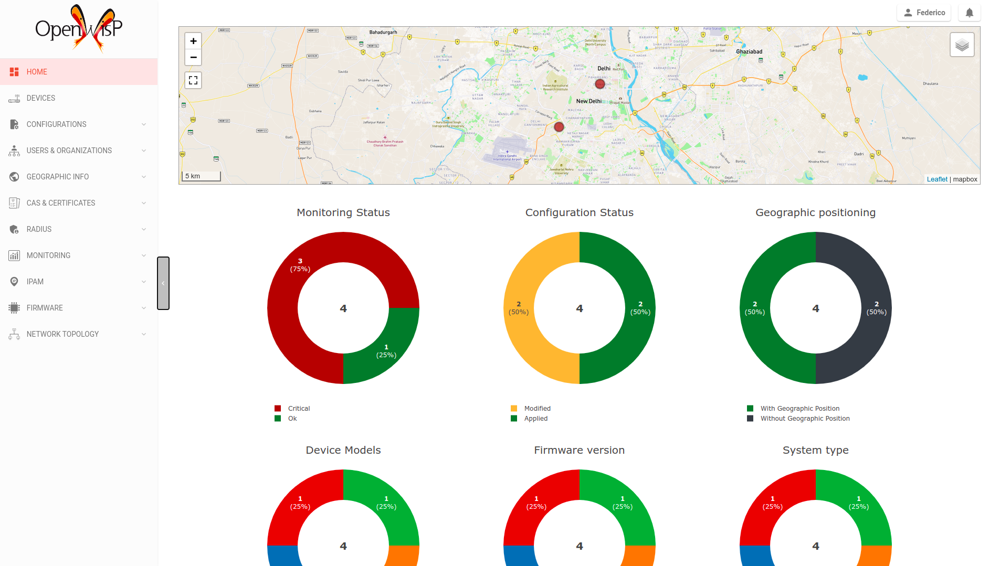
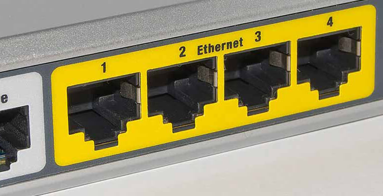
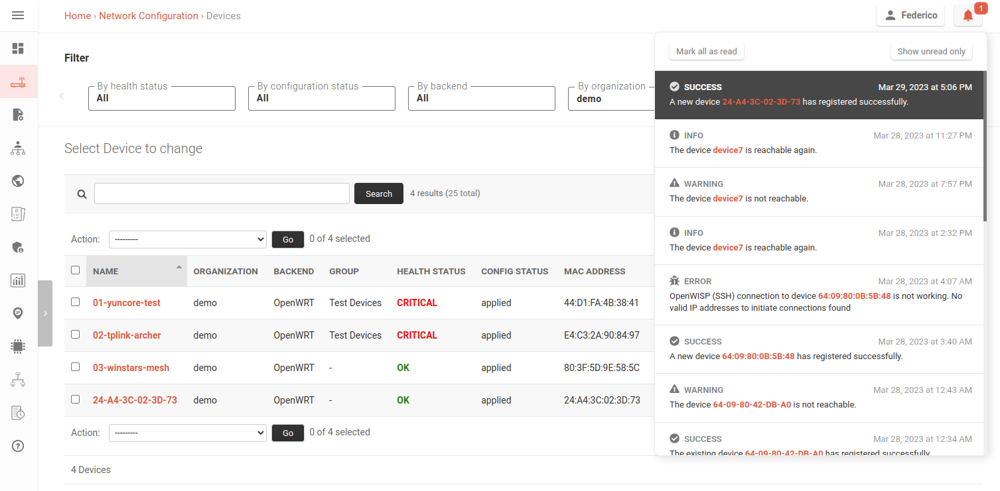

OpenWISP Demo
=============

   Screenshot of OpenWISP web UI dashboard

.. contents:: **Table of Contents**:
   :backlinks: none
   :depth: 3

.. _accessing_the_demo_system:

Accessing the demo system
-------------------------

- **URL**: `demo.openwisp.io <https://demo.openwisp.io/>`_
- **Username**: demo
- **Password**: tester123

The content of the demo organization is reset every day
at 1:00 AM UTC, and the demo user's password is reset every minute.

To ensure the safety and integrity of our managed OpenWISP system,
certain features are disabled for the demo user, including:

* Deleting existing devices
* Sending custom shell commands to devices
* Sending password change commands to devices
* Uploading new firmware builds
* Launching firmware upgrade operations
* Creating new users or modifying the details of the demo organization
* Changing the details of RADIUS groups

If you would like to test any of these features, we offer a free 30-day
trial period. You can access the request form for the free trial by
using the demo system, or by
:ref:`contacting our support <get_help>`.

.. _demo_firmware:

Firmware instructions (flashing OpenWISP Firmware)
--------------------------------------------------

We offer an OpenWrt-based firmware that includes all the packages
typically used in OpenWISP installations.

This firmware can help you quickly get started and test
the core features of OpenWISP Cloud.

If you prefer to use your existing firmware,
please refer to the :ref:`the alternative firmware instructions
<alternative_firmware_instructions>`.

1. Downloading the firmware
~~~~~~~~~~~~~~~~~~~~~~~~~~~

To download the OpenWISP firmware for your device, visit
`downloads.openwisp.io <http://downloads.openwisp.io/?prefix=firmware/22.03/ath79/>`_
and select the appropriate target architecture and image.

At present, we are generating firmware only for ath79, but we plan to add
support for more targets in the future.

If your device is not currently supported, please let us know through our
`support channels <https://openwisp.org/support.html>`__
and/or follow our :ref:`alternative firmware instructions
<alternative_firmware_instructions>` below.

2. Flashing the firmware
~~~~~~~~~~~~~~~~~~~~~~~~

You can `Flash the firmware via web UI
<https://openwrt.org/docs/guide-user/installation/generic.sysupgrade>`_,
or via `other means available on OpenWrt
<https://openwrt.org/docs/guide-user/installation/generic.flashing>`_.

Make sure not to keep settings: supply the `-n` command line option to
`sysupgrade`. If you're using the OpenWrt web UI, there is a specific
checkbox labeled "Keep settings and retain the current configuration"
which appears just before confirming the upgrade and needs to be
unchecked.

.. _alternative_firmware_instructions:

Alternative firmware instructions
---------------------------------

If your device is missing from our list of available firmware images
or if you have a custom firmware you do not want to lose, you can
get the basic features working by downloading and installing the
following packages on your device:

- openvpn (management tunnel, needed for
  active checks and push operations)
- openwisp-config
- openwisp-monitoring (and its dependency netjson-monitoring)

The easiest thing is to use the following commands:

.. code-block::

    opkg update
    # install OpenVPN
    opkg install openvpn-wolfssl
    # install OpenWISP agents
    opkg install openwisp-config
    opkg install openwisp-monitoring

If you want to install more recent versions of the OpenWISP packages,
you can download them onto your device from
`downloads.openwisp.io <http://downloads.openwisp.io/>`__ and then
install them, eg:

.. code-block::

    opkg update
    # install OpenVPN anyway
    opkg install openvpn-wolfssl
    cd /tmp

    # WARNING: the URL may change overtime, so verify the right URL
    # from downloads.openwisp.io

    wget https://downloads.openwisp.io/openwisp-config/latest/openwisp-config_1.1.0a-1_all.ipk
    wget https://downloads.openwisp.io/openwisp-monitoring/latest/netjson-monitoring_0.1.1-1_all.ipk
    wget https://downloads.openwisp.io/openwisp-monitoring/latest/openwisp-monitoring_0.1.1-1_all.ipk
    opkg install openwisp-config_1.1.0a-1_all.ipk
    opkg install netjson-monitoring_0.1.1-1_all.ipk
    opkg install netjson-monitoring_0.1.1-1_all.ipk
    opkg install openwisp-monitoring_0.1.1-1_all.ipk

.. note::
  If ``wget`` doesn't work (eg: SSL issues), you can use ``curl``,
  or alternatively you can download the packages onto your machine
  and from there upload them to your device via ``scp``.

Once the packages are installed, copy the following contents to
``/etc/config/openwisp``:

.. code-block::

  config controller 'http'
      option url 'https://cloud.openwisp.io'
      # the following shared secret is for the demo organization
      option shared_secret 'nzXTd7qpXKPNdrWZDsYoMxbGpOrEVjeD'
      option management_interface 'tun0'

Once the configuration has been changed, you will need to restart
the agent:

.. code-block::

    service openwisp_config restart

Connecting your device to OpenWISP
----------------------------------

Once your device is flashed, connect an Ethernet cable from your LAN into
one of the LAN ports.

DHCP client mode
~~~~~~~~~~~~~~~~

Assuming your LAN is equipped with a DHCP server (usually your main
ISP router), after booting up, the device will be assigned an IP
address from the LAN DHCP server. At this point, the device should
be able to reach the internet and register to the
OpenWISP demo system.

Static address mode
~~~~~~~~~~~~~~~~~~~

If your LAN does not have a DHCP server, you will need to configure
a static IP address and gateway address for the LAN interface.

Registration
~~~~~~~~~~~~

If the above steps have been completed correctly, and the device is
connected to the internet, then it will automatically register and appear
in the list of available devices for the demo organization.
You will then be able to  locate the device  by its MAC address,
as shown in the screenshot above, or by its name if you have changed
it from "OpenWrt" to something else.

At this point, the device should have already downloaded and applied
the configuration. After a few minutes the management tunnel will be
set up  and the device will start collecting monitoring information.

Monitoring charts and status
----------------------------

Once the OpenWISP Monitoring package has been installed and launched,
it will start collecting metrics from your device.
You will be able to see this information displayed in the UI,
which will be similar to the screenshots shown below.

Health status
~~~~~~~~~~~~~

.. image:: ../images/demo/health-status.png
    :target: ../_images/health-status.png

Device Status
~~~~~~~~~~~~~

.. image:: https://raw.githubusercontent.com/openwisp/openwisp-monitoring/docs/docs/device-status-1.png
    :target: https://raw.githubusercontent.com/openwisp/openwisp-monitoring/docs/docs/device-status-1.png

.. image:: https://raw.githubusercontent.com/openwisp/openwisp-monitoring/docs/docs/device-status-2.png
   :target: https://raw.githubusercontent.com/openwisp/openwisp-monitoring/docs/docs/device-status-2.png

.. image:: https://raw.githubusercontent.com/openwisp/openwisp-monitoring/docs/docs/device-status-3.png
   :target: https://raw.githubusercontent.com/openwisp/openwisp-monitoring/docs/docs/device-status-3.png

.. image:: https://raw.githubusercontent.com/openwisp/openwisp-monitoring/docs/docs/device-status-4.png
   :target: https://raw.githubusercontent.com/openwisp/openwisp-monitoring/docs/docs/device-status-4.png

Charts
~~~~~~

.. image:: https://raw.githubusercontent.com/openwisp/openwisp-monitoring/docs/docs/uptime.png
   :target: https://raw.githubusercontent.com/openwisp/openwisp-monitoring/docs/docs/uptime.png

.. image:: https://raw.githubusercontent.com/openwisp/openwisp-monitoring/docs/docs/packet-loss.png
   :target: https://raw.githubusercontent.com/openwisp/openwisp-monitoring/docs/docs/packet-loss.png

.. image:: https://raw.githubusercontent.com/openwisp/openwisp-monitoring/docs/docs/rtt.png
   :target: https://raw.githubusercontent.com/openwisp/openwisp-monitoring/docs/docs/rtt.png

.. image:: https://raw.githubusercontent.com/openwisp/openwisp-monitoring/docs/docs/traffic.png
   :target: https://raw.githubusercontent.com/openwisp/openwisp-monitoring/docs/docs/traffic.png

.. image:: https://raw.githubusercontent.com/openwisp/openwisp-monitoring/docs/docs/wifi-clients.png
   :target: https://raw.githubusercontent.com/openwisp/openwisp-monitoring/docs/docs/wifi-clients.png

.. image:: https://raw.githubusercontent.com/openwisp/openwisp-monitoring/docs/docs/cpu-load.png
   :target: https://raw.githubusercontent.com/openwisp/openwisp-monitoring/docs/docs/cpu-load.png

The following charts are displayed only for devices
with mobile connections (eg: 3G, LTE).

.. image:: https://raw.githubusercontent.com/openwisp/openwisp-monitoring/docs/docs/access-technology.png
   :target: https://raw.githubusercontent.com/openwisp/openwisp-monitoring/docs/docs/access-technology.png

.. image:: https://raw.githubusercontent.com/openwisp/openwisp-monitoring/docs/docs/signal-strength.png
   :target: https://raw.githubusercontent.com/openwisp/openwisp-monitoring/docs/docs/signal-strength.png

.. image:: https://raw.githubusercontent.com/openwisp/openwisp-monitoring/docs/docs/signal-quality.png
   :target: https://raw.githubusercontent.com/openwisp/openwisp-monitoring/docs/docs/signal-quality.png

Find out more information about the
:doc:`Monitoring module of OpenWISP <../user/monitoring>`.

.. _get_help:

Get help
--------

If you need help or want to request a free 30-day trial of the
full feature set, you can write to us via the
`support channels <https://openwisp.org/support.html>`__ or just click
on the tab *Contact support* as indicated in the screenshot below.

.. image:: ../images/demo/contact-support.png
    :target: ../_images/contact-support.png

Next steps
----------

- :doc:`Open and/or WPA protected WiFi Access Point SSID
  <./wifi-access-point>`
- :doc:`WiFi Hotspot, Captive Portal (Public WiFi), Social Login
  <./hotspot>`
- :doc:`How to Set Up a Wireless Mesh Network
  <./mesh>`
- :doc:`How to Set Up WPA Enterprise (EAP-TTLS-PAP) authentication
  <./wpa-enterprise-eap-ttls-pap>`
