WiFi Hotspot & Captive Portal
=============================

OpenWISP is widely used as an **open source software** solution
for **WiFi Hotspot Management** in **Public Wi-Fi** settings.

In this tutorial, we'll explain the technical details of the most
common **WiFi Hotspot** deployments and how to test the most
important functionalities
of this use case on the :doc:`OpenWISP Demo System <./demo>`.

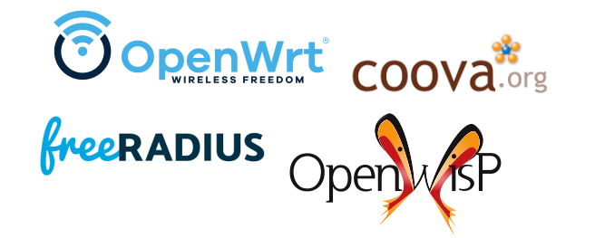

The **OpenWrt** firmware image for the
:doc:`OpenWISP Demo System<./demo>` includes a *captive portal* package
called `Coova-Chilli <https://coova.github.io/CoovaChilli/>`_.
This supports the
`RADIUS protocol <https://networkradius.com/doc/current/introduction/RADIUS.html>`_,
a standard security protocol used in  Accounting, Authorization and
Authentication (AAA), a way of authenticating, authorizing, and
rate-limiting network usage supported by networking hardware and software.

.. warning::

   Unfortunately, at the moment, installing Coova-Chilli
   from the OpenWrt packages will not work because the
   default configuration of the Coova-Chilli OpenWrt package
   does not enable the ``chilli-redir`` feature, nor has SSL support
   enabled, which will not allow the captive portal to redirect
   the user to the captive page and will not support HTTPs requests.

The OpenVPN package is also required and included in
the :ref:`firmware instructions for the
OpenWISP Demo System <demo_firmware>`,
as it's needed to facilitate secure communication between the
Coova-Chilli captive portal and FreeRADIUS over the
Management VPN tunnel.
This setup prevents the routing of unencrypted RADIUS packets
through the public internet, ensuring security, privacy, and
mitigating potential legal risks associated with exposing
users' personal information to malicious actors.

Enable Captive Portal Template
------------------------------

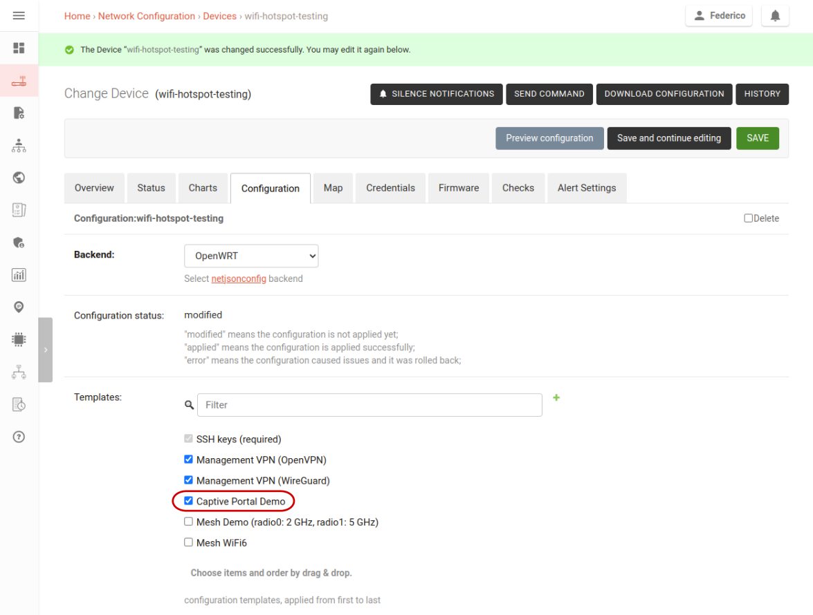

If you flashed the *OpenWrt* based firmware and registered your device
as explained in the :doc:`OpenWISP Demo Page <./demo>`, proceed
to assign the captive portal template to your device:

- Go to the device list.
- Open the device details.
- Click on the configuration tab.
- Select the "Captive Portal Demo" template.
- Hit "Save".

Then, make sure the *OpenVPN management tunnel* is working otherwise
the captive portal software will not be able to talk to the demo
`FreeRADIUS <https://freeradius.org/>`_ server instance.

Shortly after the configuration is applied successfully,
the Public WiFi SSID will be broadcasted by the *access point*.

Accessing the Public WiFI Hotspot
---------------------------------

Connect your laptop or phone to the SSID "OpenWISP Public WiFi Demo".
If everything is working correctly, your operating system should
open a browser window showing the captive page as shown in
the screenshot above.

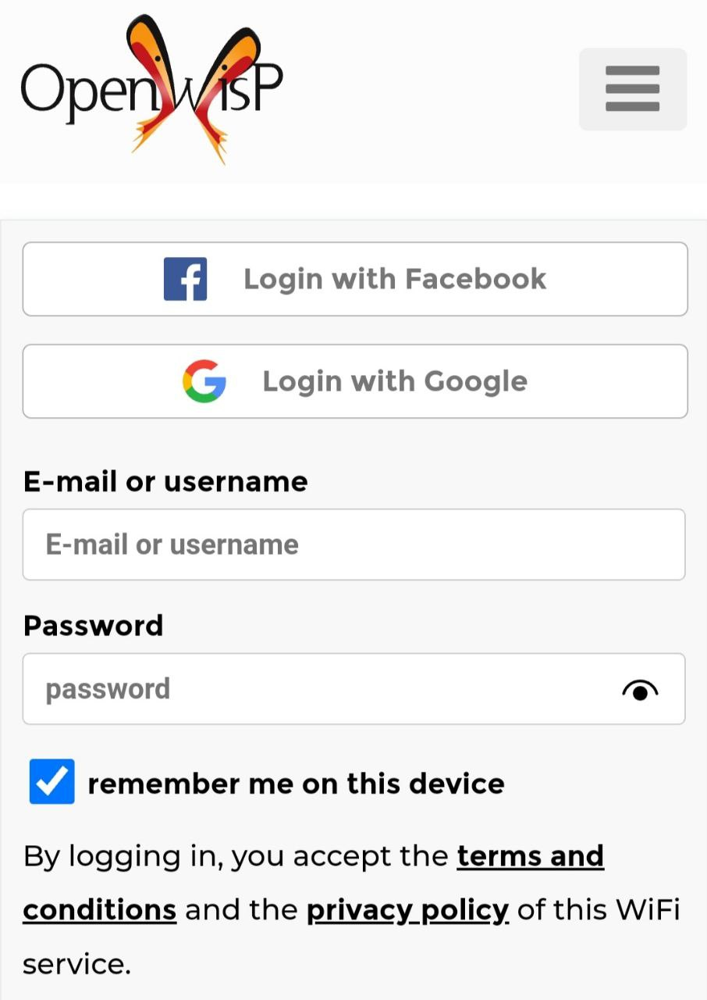

At this point, sign in using the same credentials
you used to access the demo system (``demo``/``tester123``).

.. note::
  Trying to surf the internet without authenticating will not work.

Once you've logged in, you'll see a status page as shown in the
following screenshot:

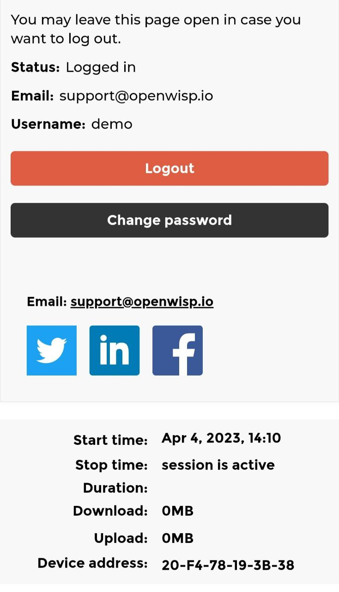

This page communicates that the user can now use the internet
provided by the hotspot, it also provides the following features:

- It shows a list of the user's sessions, including the start time,
  stop time, duration, traffic consumed (download and upload),
  and the MAC address of the device that accessed the WiFi service.
- It allows the account password and phone number (if SMS verification is
  enabled, which is not the case for the demo system) to be changed.
- It allows users to close their session and log out
  (more on why this is useful below).

On some mobile operating systems, the mini-browser automatically closes
when switching windows, for example, when opening the real browser
to surf the internet. This  can be problematic if the user needs
to use one of the features of the status page listed above.

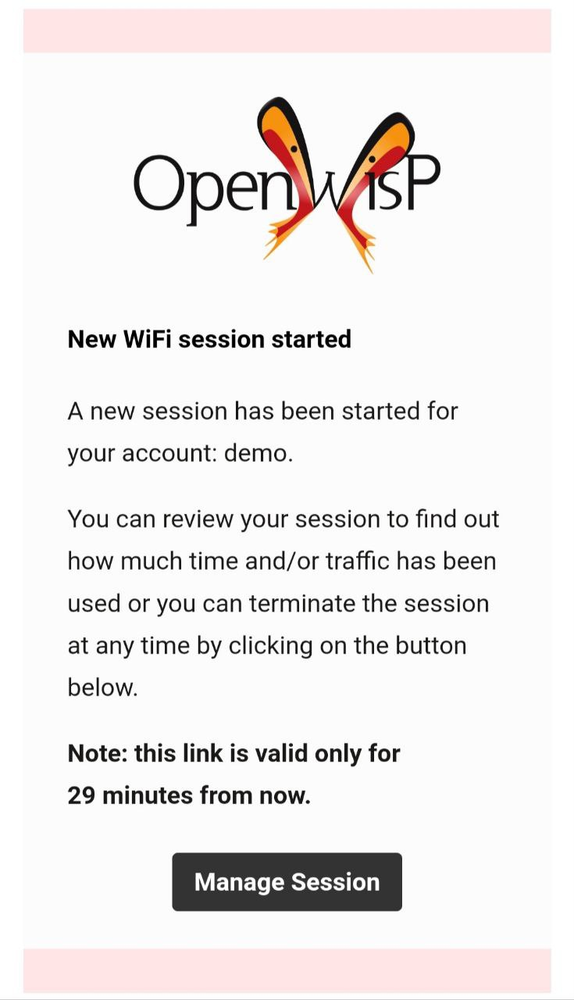

To resolve this, OpenWISP will send an email to the user with a magic
link. This will allow the user access to the status page of
:doc:`WiFi Login Pages </wifi-login-pages/index>` without entering their
credentials again, as shown in the image above.

.. note::

  For more technical information and implementation details
  about the magic link feature, consult the
  `openwisp-users documentation <https://github.com/openwisp/openwisp-users#2-openwisp_usersapiauthenticationsesameauthentication>`_.
  Here you will find  more information about the underlying
  open source library used to implement this feature.

If you are using the demo account, the email will be sent to the email
address linked to the demo account. Therefore, if you want to try this
feature, you will  have to sign up for your own account or use the social
login feature. Please see more information on this below.

Logging Out
-----------

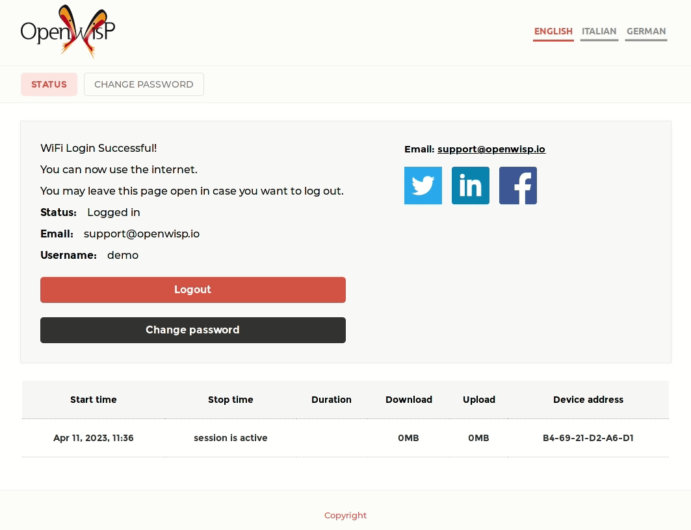

Most WiFi hotspot services have limitations in place that do not allow
users to browse indefinitely.

Some services only allow surfing for a limited amount of time per day,
while others limit the amount of data you can consume. Some services use
a combination of both methods and when either the daily time or data limit
is reached, the session is closed.

Therefore, users who plan to use the service again later on the same day,
should log out to avoid consuming their daily time and/or data.

Session Limits
--------------

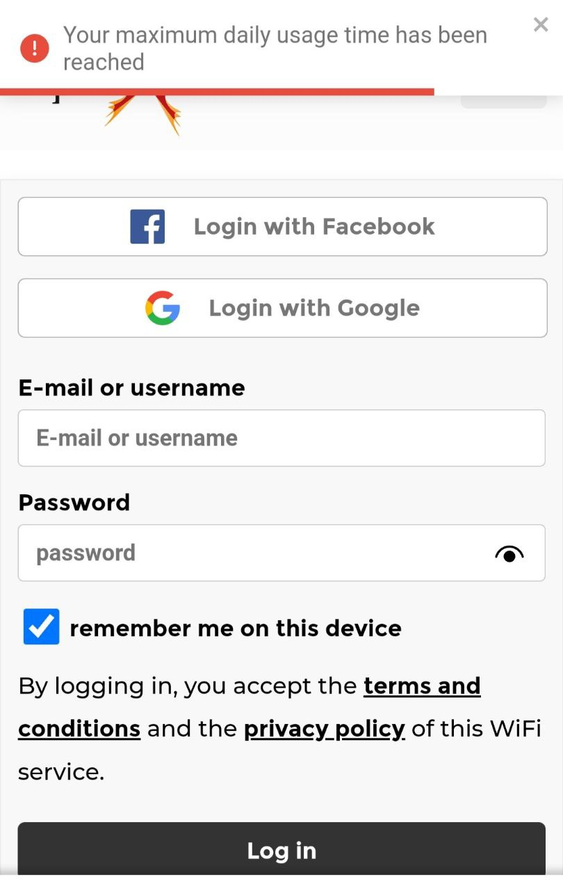

The default session limits in the **OpenWISP RADIUS** configuration
are 300 MB of daily traffic or three hours of daily surfing.

.. note::
    To find out more technical information about this topic please read:
    `OpenWISP RADIUS - Enforcing session limits
    <https://openwisp-radius.readthedocs.io/en/stable/user/enforcing_limits.html>`_.

.. _automatic_captive_portal_login:

Automatic Captive Portal Login
------------------------------

The :doc:`WiFi Login Pages application </wifi-login-pages/index>`.
allows users who have logged in previously, and who use a
browser which supports cookies
(not all mini-browsers that are used for captive portal logins do),
to automatically log in without entering their credentials again.

The video below demonstrates this feature:

.. raw:: html

    

        <iframe
          width="100%"
          height="820"
          src="https://www.youtube.com/embed/wUTFte2at7o"
          title="WiFi Captive Portal Auto Login Feature of OpenWISP"
          frameborder="0"
          allow="accelerometer; autoplay; clipboard-write; encrypted-media; gyroscope; picture-in-picture; web-share"
          allowfullscreen>
        </iframe>
    

Sign Up
-------

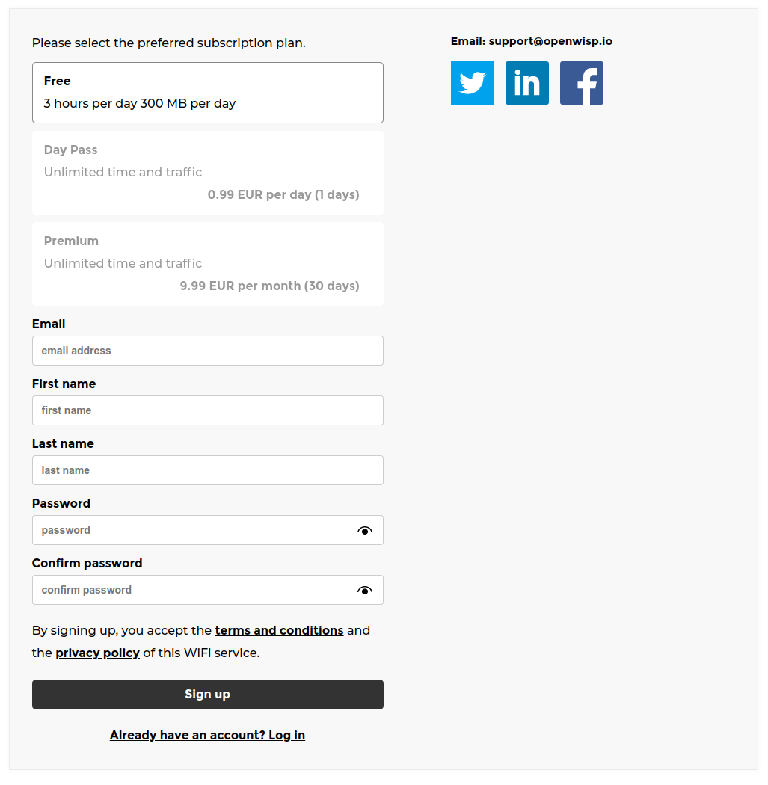

To sign up for the *WiFi hotspot demo*, select the free plan and enter
dummy data (this data is deleted every day).
However, it is recommended that you enter a real email address so that
you can test features that require receiving emails,
such as email confirmation, password reset,
and the "WiFi session started" notification.

.. note::
  The sign up process uses the
  `OpenWISP RADIUS REST API
  <https://openwisp-radius.readthedocs.io/en/stable/user/api.html#user-registration>`_
  under the hood.

Social Login
------------

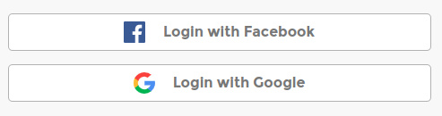

Another way to sign up for a free WiFi hotspot account is to use social
login. Simply click on one of the social login buttons
to initiate the process.

Please note that your personal data is stored
for less than 24 hours, as the demo system is reset every day.

.. note::
  For more technical information about social login, please read
  `OpenWISP RADIUS - Social Login
  <https://openwisp-radius.readthedocs.io/en/stable/user/social_login.html>`_

Paid WiFi Hotspot Subscription Plans
------------------------------------

.. raw:: html

    

        <iframe
          width="100%"
          height="820"
          src="https://www.youtube.com/embed/8zf-rDG0UjU"
          title="OpenWISP Paid WiFi Subscription Plans"
          frameborder="0"
          allow="accelerometer; autoplay; clipboard-write; encrypted-media; gyroscope; picture-in-picture; web-share"
          allowfullscreen>
        </iframe>
    

Testing the **WiFi hotspot paid subscription plans** is easy,
the demo system is configured to use the Paypal Sandbox, a test version
of Paypal with unlimited fake money, which allows users to test the
feature at any time without incurring any costs.

Follow these steps to try the *paid WiFi subscription* feature:

- Sign up for one of the non-free plans.
- Enter your real email address and dummy personal information.
- Click "Proceed with the payment."
- Enter the following paypal credentials:
  ``support@openwisp.io`` / ``tester123`` and click on
  "start session".
- Choose to pay with Paypal balance and click "Continue to Review Order."

After following the steps above you will be logged in to the WiFi service
and redirected to the status page, from then on you can surf the
web.

You should also receive a test invoice via email as in the
screenshots below.

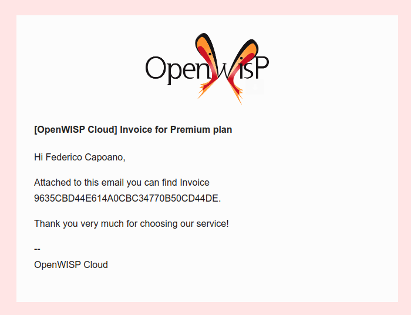

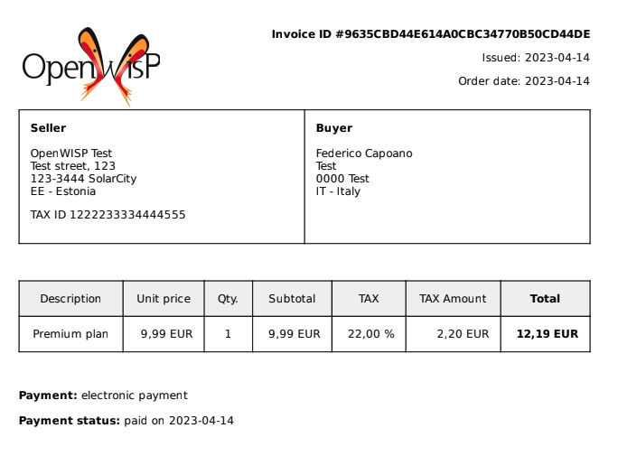
