How to Set Up a Wireless Mesh Network
=====================================

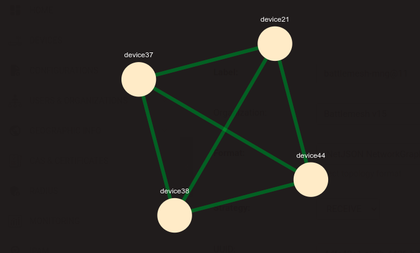

A **mesh network** is a **decentralized network architecture** where each
node not only communicates with its immediate neighbors but also relays
data for other mesh nodes.

The word "mesh" primarily describes the interconnected topology of the
network, while **wireless mesh networks** specifically refer to mesh
networks deployed using standard WiFi bands (2.4 GHz / 5 GHz) as the
physical connection medium.

The advantages of this network architecture include:

- **Resilience**: Due to its interconnected topology, there's no single
  point of failure, so the dynamic routing protocols used to route traffic
  are able to implement self-healing behavior, rerouting traffic along
  alternative paths when a link fails.

- **Flexibility**: Deploying new nodes or relocating existing ones is
  straightforward due to consistent configurations across all nodes.

These advantages make mesh networks particularly valuable for expanding
WiFi coverage while controlling deployment and maintenance costs.

In this tutorial, we'll guide you through the process of setting up
a *wireless mesh network* using the
`802.11s mesh mode <https://en.wikipedia.org/wiki/IEEE_802.11s>`_
on `OpenWrt <https://openwrt.org/>`_ through OpenWISP.
Additionally, we'll provide valuable tips on monitoring
and maintaining the mesh network.

Firmware Requirements for Mesh
------------------------------

In order to use mesh mode with wireless encryption, your firmware needs
to be equipped with a version of the ``wpad`` package which supports mesh
encryption.

Please refer to the
`OpenWrt 802.11s documentation
<https://openwrt.org/docs/guide-user/network/wifi/mesh/80211s#config>`_
for more information.

.. note::

  The **OpenWrt** firmware image provided
  for the :doc:`OpenWISP Demo System <./demo>` includes
  the full ``wpad`` package by default.

General Assumptions
-------------------

In this tutorial we make a few assumptions and choices which
are explained below.

At Least 2 Devices
~~~~~~~~~~~~~~~~~~

We assume you are already managing and monitoring at least two devices
through your OpenWISP instance.

One Radio Available
~~~~~~~~~~~~~~~~~~~

We require at least one radio named ``radio0`` to be available
and enabled for the successful execution of this tutorial.

For simplicity, we will focus on a single radio, but it's important to
note that the mesh functionality can be extended
to multiple radios if necessary.

Alternatively, you have the option of running the mesh on one radio
while the access points operate on another radio to avoid interference.

However, these additional scenarios are not explained in this
tutorial and are left as an exercise for the reader.

Existing DHCP server on the LAN
~~~~~~~~~~~~~~~~~~~~~~~~~~~~~~~

WiFi in mesh mode (802.11s) operates at the layer 2 protocol,
enabling us to bridge the mesh interface with the LAN interface,
effectively creating a wireless extension of the LAN network.

This configuration assumes that the mesh devices will function
as wireless extenders for an existing LAN, already equipped with
a DHCP server.

Consequently, we will define a ``br-lan`` interface in DHCP client mode,
with the spanning tree protocol enabled.

This helps prevent loops in case of accidental Ethernet cable connections
to another mesh extender within the LAN.

Additionally, we will disable the default DHCP server on the
LAN interface, which comes preconfigured in OpenWrt.

Creating the Template
---------------------

.. note::

  This template is also available in our :doc:`Demo System <./demo>` as
  `Mesh Demo
  <https://demo.openwisp.io/admin/config/template/ae564575-f251-4f78-aaaf-7821e7a06ad3/change/>`_,
  **feel free to try it out!**

From the OpenWISP navigation menu, go to ``Configurations``
and then ``Templates``, from here click on the ``Add template``.

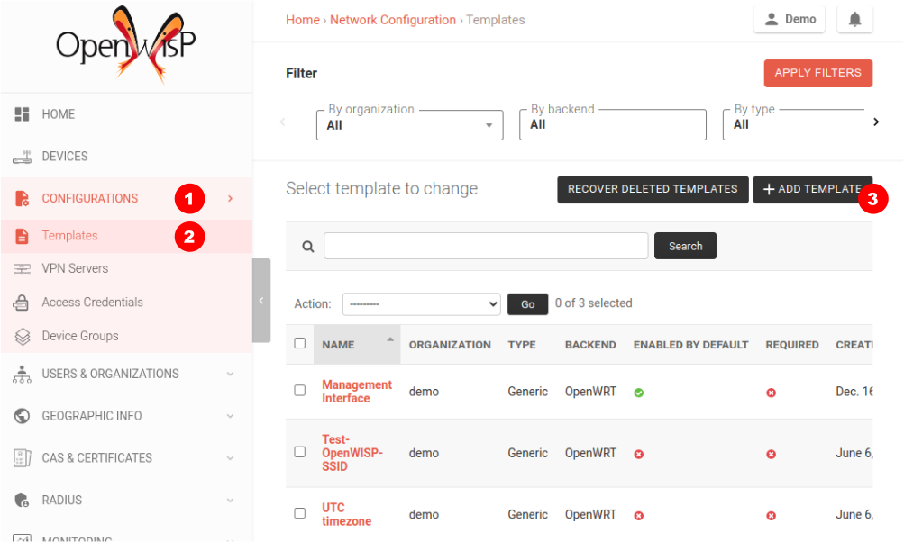

Fill in name, organization, leave type set to "Generic", backend
set to "OpenWrt", scroll down to the Configuration section, then
click on "Advanced mode (raw JSON)".

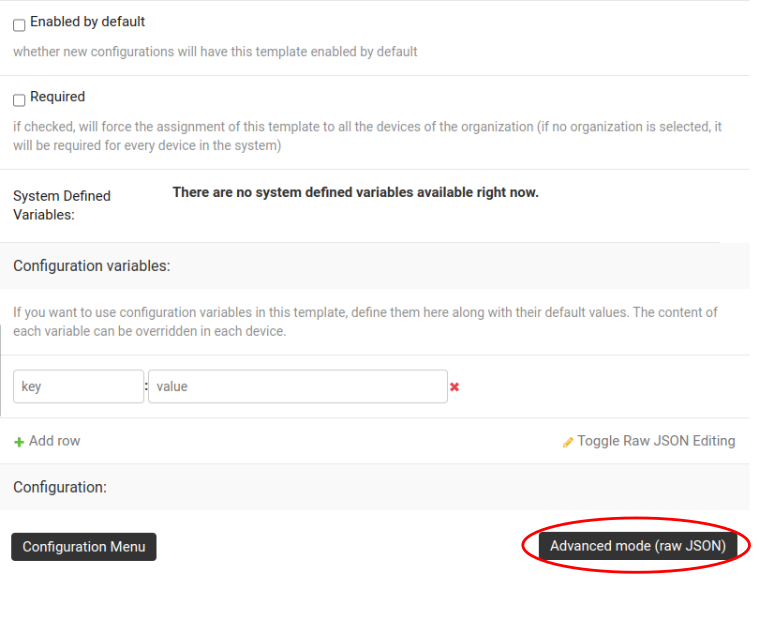

Once the advanced mode editor is open you can paste the following NetJSON:

.. code-block:: json

    {
        "interfaces": [
            {
                "name": "lan",
                "type": "bridge",
                "mtu": 1500,
                "disabled": false,
                "stp": true,
                "igmp_snooping": false,
                "bridge_members": [
                    "lan",
                    "mesh0",
                    "wlan0"
                ],
                "addresses": [
                    {
                        "proto": "dhcp",
                        "family": "ipv4"
                    }
                ]
            },
            {
                "type": "wireless",
                "name": "mesh0",
                "mtu": 1500,
                "disabled": false,
                "wireless": {
                    "mode": "802.11s",
                    "radio": "radio0",
                    "ack_distance": 0,
                    "rts_threshold": 0,
                    "frag_threshold": 0,
                    "mesh_id": "mesh0",
                    "encryption": {
                        "protocol": "wpa2_personal",
                        "key": "0penW1SP0987654321",
                        "disabled": false,
                        "cipher": "auto",
                        "ieee80211w": "0"
                    },
                    "network": [
                        "lan"
                    ]
                }
            },
            {
                "type": "wireless",
                "name": "wlan0",
                "mtu": 1500,
                "disabled": false,
                "wireless": {
                    "mode": "access_point",
                    "radio": "radio0",
                    "ssid": "Mesh AP",
                    "hidden": false,
                    "wds": false,
                    "wmm": true,
                    "isolate": false,
                    "ieee80211r": true,
                    "reassociation_deadline": 1000,
                    "ft_psk_generate_local": false,
                    "ft_over_ds": true,
                    "rsn_preauth": false,
                    "macfilter": "disable",
                    "maclist": [],
                    "encryption": {
                        "protocol": "wpa2_personal_mixed",
                        "key": "meshApTesting1234",
                        "disabled": false,
                        "cipher": "ccmp",
                        "ieee80211w": "1"
                    },
                    "network": [
                        "lan"
                    ]
                }
            }
        ],
        "files": [
            {
                "path": "/etc/openwisp/pre-reload-hook",
                "mode": "0700",
                "contents": "#!/bin/sh\n\n# delete any br-lan definition to avoid conflicts\nuci delete network.device1\n\n# make sure radio is enabled and on the same channel\nband=$(uci get wireless.radio0.band)\nhwmode=$(uci get wireless.radio0.hwmode)\nif [ \"$band\" = \"2g\" ] || [ \"$hwmode\" = \"11g\" ]; then\n  channel=1\nelif [ \"$band\" = \"5g\" ] || [ \"$hwmode\" = \"11a\" ]; then\n  channel=36\nfi\nuci set wireless.radio0.channel=\"$channel\"\nuci set wireless.radio0.disabled='0'\nuci set wireless.radio0.country='US'  # feel free to customize the country code\nuci commit wireless\n\n# ensure DHCP server on the lan is disabled\nuci set dhcp.lan.ignore='1'\nuci set dhcp.lan.dhcpv6='disabled'\nuci set dhcp.lan.ra='disabled'\nuci commit dhcp\n\n# increase retries of the config test to account for\n# temporary network failures caused by the reloading of the wifi stack\nuci set openwisp.http.test_retries=8\nuci commit openwisp\n"
            }
        ]
    }

Then click on "back to normal mode" to close the advanced mode editor.

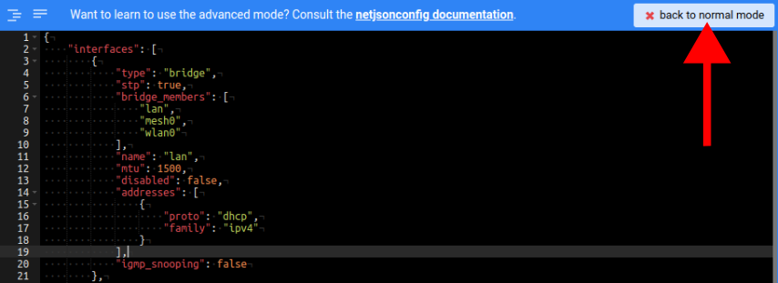

Now you can save the new template.

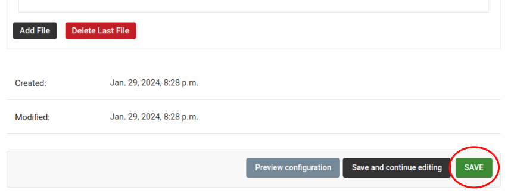

At this point you're ready to assign the template to your devices, but
before doing so you may want to read on to understand the different
components of this template:

- The ``br-lan`` defines a bridge with the following members:
  ``lan``, ``mesh0`` and ``wlan0``.
- The ``mesh0`` provides the encrypted wireless mesh interface bound to
  ``radio0``.
- The ``wlan0`` interface provides WiFi access to the mesh network
  for clients not equipped with 802.11s.
- A ``pre-reload-hook`` script which is executed before OpenWrt
  reloads its services to make the configuration changes effective.

Why we use a ``pre-reload-hook`` script
~~~~~~~~~~~~~~~~~~~~~~~~~~~~~~~~~~~~~~~

In the template shared above, we utilize a
`pre-reload-hook
<https://github.com/openwisp/openwisp-config?tab=readme-ov-file#pre-reload-hook>`_
script to execute the following configuration changes:

- Ensure that ``radio0``  is enabled, set on a specific channel and
  country code to allow communication between mesh nodes.
  You can customize the channel and country
  code according to your preferences.
  However, make these changes before deploying your mesh nodes and
  disconnecting them from the Ethernet network,
  as modifying the channel or country code on an active
  mesh network will disrupt it.
- Disable the default DHCP server preconfigured in OpenWrt on the
  ``br-lan`` interface to prevent interference with the existing
  DHCP server in the LAN.
- Increase the ``test_retries`` option of the openwisp-config agent to 8.
  This enhancement enhances the agent's resilience to temporary failures
  in reaching the OpenWISP server after applying configuration changes.
  Mesh configuration changes trigger a reload of the WiFi stack,
  which may take a few minutes to become effective.
  During this period, we want to avoid the agent to mistakenly consider
  the connection as lost, to prevent it from flagging
  the upgrade as failed and rollback to the previous configuration.

We could have redefined the entire configuration for ``radio0``,
the LAN DHCP server and openwisp-config, but doing so would have posed
some issues:

- There's no guarantee that the same radio settings will work
  uniformly on every hardware supported by OpenWrt.
  By altering only the necessary settings,
  we ensure the same template can be applied across a broad
  spectrum of devices, making the tutorial easy for a wide
  range of users.
- Creating a template that includes all possible settings would
  result in verbosity, making it challenging for readers to digest.

Once you have successfully set this up, feel free to modify the
template configuration and tailor any part to suit your requirements.

Enable the Mesh Template on the Devices
---------------------------------------

Now is time to apply this template to the devices
that we want to make part of the mesh.

Click on "devices" in the navigation menu, click on the device
you want to assign the mesh template to, then go to the
"Configuration" tab, select the template just created, then click on save.

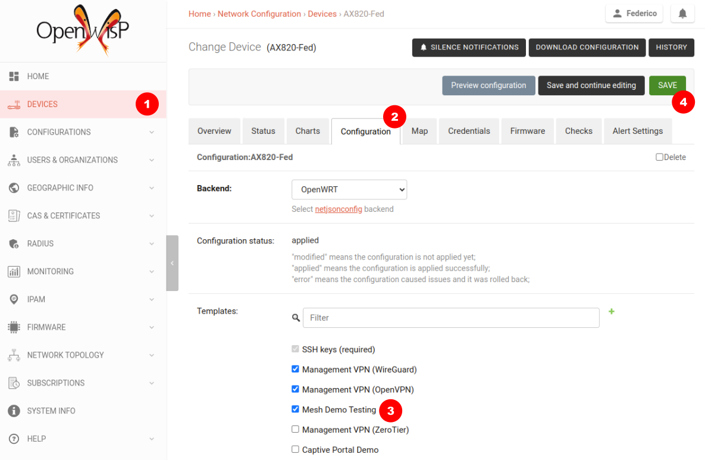

Verifying and Debugging
~~~~~~~~~~~~~~~~~~~~~~~

Once the configuration is applied to the device, if you access
your device via SSH you can double check that everything worked fine by
comparing the output you get from the command outputs shown below.

Check the bridge with ``brctl show``:

.. code-block:: console

    bridge name	bridge id		STP enabled	interfaces
    br-lan		7fff.44d1fad204c5	yes		lan
    							wlan0
    							mesh0

Check the WiFi interfaces with ``iwinfo``:

.. code-block:: console

    mesh0     ESSID: "mesh0"
              Access Point: 44:D1:FA:D2:00:01
              Mode: Mesh Point  Channel: 1 (2.412 GHz)  HT Mode: HT20
              Center Channel 1: 1 2: unknown
              Tx-Power: 20 dBm  Link Quality: 68/70
              Signal: -42 dBm  Noise: -87 dBm
              Bit Rate: 1.0 MBit/s
              Encryption: WPA3 SAE (CCMP)
              Type: nl80211  HW Mode(s): 802.11ax/b/g/n
              Hardware: 14C3:7915 14C3:7915 [MediaTek MT7915E]
              TX power offset: none
              Frequency offset: none
              Supports VAPs: yes  PHY name: phy0

    wlan0     ESSID: "Mesh AP"
              Access Point: 44:D1:FA:D2:00:01
              Mode: Master  Channel: 1 (2.412 GHz)  HT Mode: HE20
              Center Channel 1: 1 2: unknown
              Tx-Power: 20 dBm  Link Quality: unknown/70
              Signal: unknown  Noise: -85 dBm
              Bit Rate: unknown
              Encryption: mixed WPA2/WPA3 PSK/SAE (CCMP)
              Type: nl80211  HW Mode(s): 802.11ax/b/g/n
              Hardware: 14C3:7915 14C3:7915 [MediaTek MT7915E]
              TX power offset: none
              Frequency offset: none
              Supports VAPs: yes  PHY name: phy0

Once you have assigned the template to at least two devices which
are close to each other, you can verify whether they have formed
a mesh with ``iw mesh0 station dump``, which should return the number
of connected mesh nodes (called stations):

.. code-block:: console

    Station 44:d1:fa:d2:04:d6 (on mesh0)
    	inactive time:	10 ms
    	rx bytes:	9050195
    	rx packets:	80356
    	tx bytes:	1169064
    	tx packets:	7196
    	tx retries:	0
    	tx failed:	0
    	rx drop misc:	200
    	signal:  	-42 [-43, -49] dBm
    	signal avg:	-42 [-43, -49] dBm
    	Toffset:	287058701286 us
    	tx bitrate:	243.7 MBit/s HE-MCS 10 HE-NSS 2 HE-GI 1 HE-DCM 0
    	tx duration:	32732793 us
    	rx bitrate:	258.0 MBit/s HE-MCS 10 HE-NSS 2 HE-GI 0 HE-DCM 0
    	rx duration:	3451735 us
    	airtime weight: 256
    	mesh llid:	0
    	mesh plid:	0
    	mesh plink:	ESTAB
    	mesh airtime link metric: 48
    	mesh connected to gate:	yes
    	mesh connected to auth server:	no
    	mesh local PS mode:	ACTIVE
    	mesh peer PS mode:	ACTIVE
    	mesh non-peer PS mode:	ACTIVE
    	authorized:	yes
    	authenticated:	yes
    	associated:	yes
    	preamble:	long
    	WMM/WME:	yes
    	MFP:		yes
    	TDLS peer:	no
    	DTIM period:	2
    	beacon interval:100
    	connected time:	3511 seconds
    	associated at [boottime]:	272718.754s
    	associated at:	1706572676925 ms
    	current time:	1706576187500 ms

If you didn't get the expected results we recommend looking at the
``logread`` output and look for any critical error shown in the log
output, this should help you to fix it.

Monitoring the Mesh Nodes
-------------------------

If everything has worked out successfully and you have the `OpenWISP
monitoring agent <https://github.com/openwisp/openwrt-openwisp-monitoring>`_
running correctly on your device, you should start
seeing monitoring information about the mesh network in the status tab
of the device page.

Bridge interface:

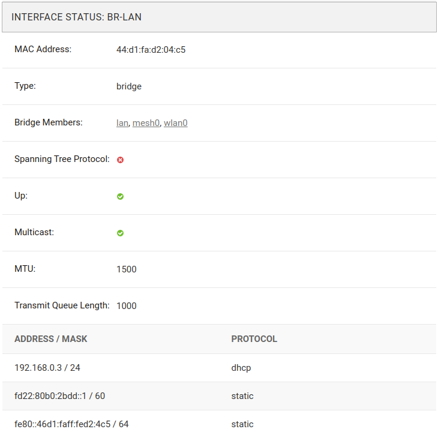

Mesh0 interface:

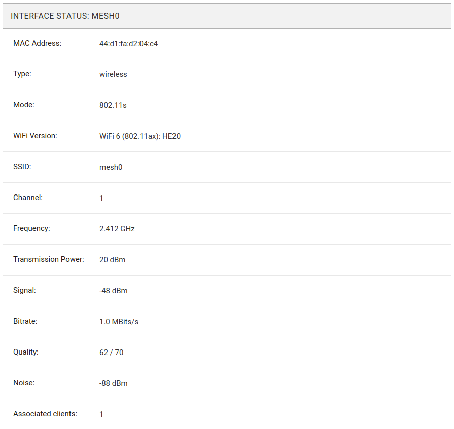

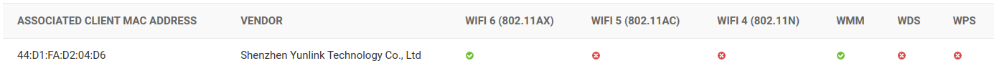

Wlan0 interface:

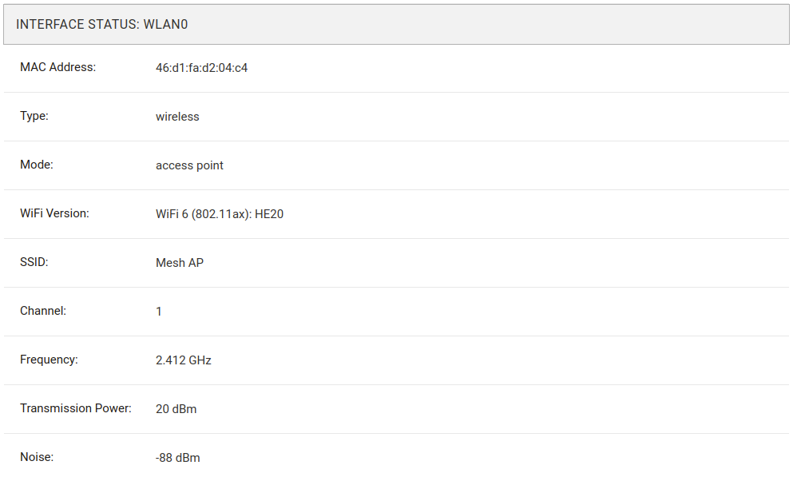

Mesh Topology Collection and Visualization
------------------------------------------

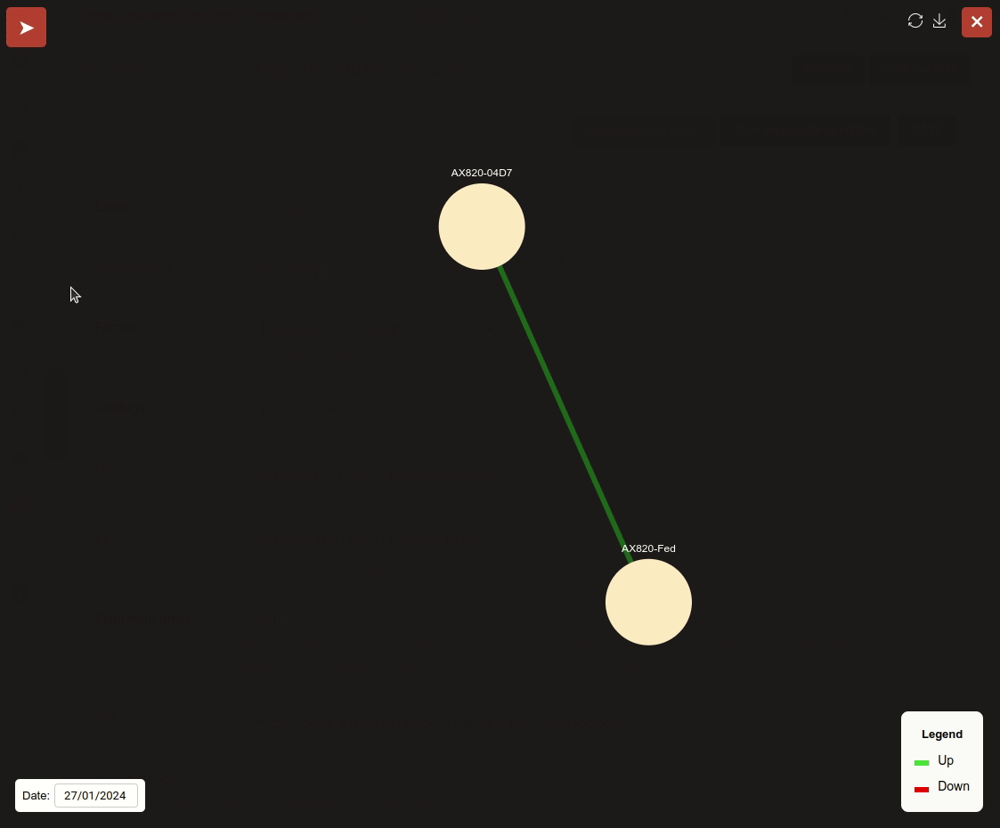

In June 2023, we introduced a new feature to the Network Topology
module of OpenWISP, enabling the automatic collection of network
topology data from mesh interfaces for visualization purposes.

Setting up this feature is beyond the scope of this tutorial,
but we provide pointers to demonstrate its usefulness and guide you
in finding the information needed to set it up:

- Github pull request:
  `[feature] WiFi Mesh integration
  <https://github.com/openwisp/openwisp-network-topology/pull/179>`_
- `Network Topology README
  <https://github.com/openwisp/openwisp-network-topology/blob/master/README.rst>`_,
  look for "Integration with OpenWISP Controller and OpenWISP Monitoring"

If you have been playing with our **Demo System**,
you can try this feature there!
You only have to register at least 2 devices to the
:doc:`Demo System <./demo>`,
enable the `Mesh Demo
<https://demo.openwisp.io/admin/config/template/ae564575-f251-4f78-aaaf-7821e7a06ad3/change/>`_
template on your devices and wait a few minutes until the data is
collected and shown in the **Network Topology List** as shown below.

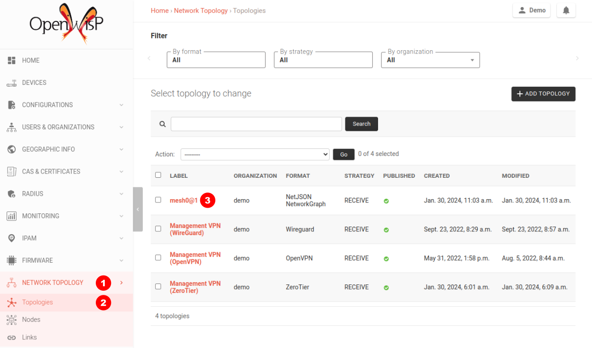

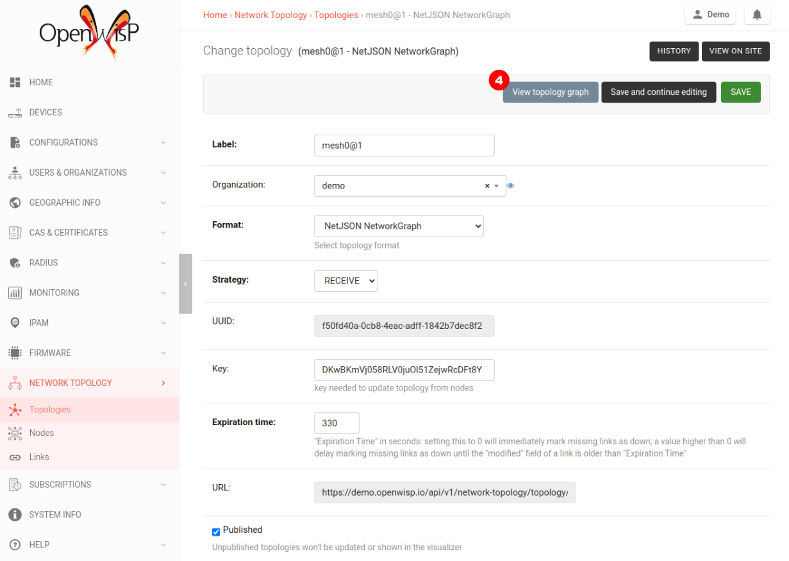

Changing the Default 802.11s Routing Protocol
---------------------------------------------

Using a routing protocol other than the default protocol shipped in
the 802.11s implementation is out of scope of this tutorial but
can be done.

You will need to turn off mesh forwarding and configure the
routing daemon of your choice.
