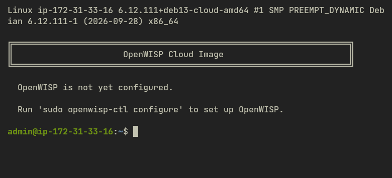
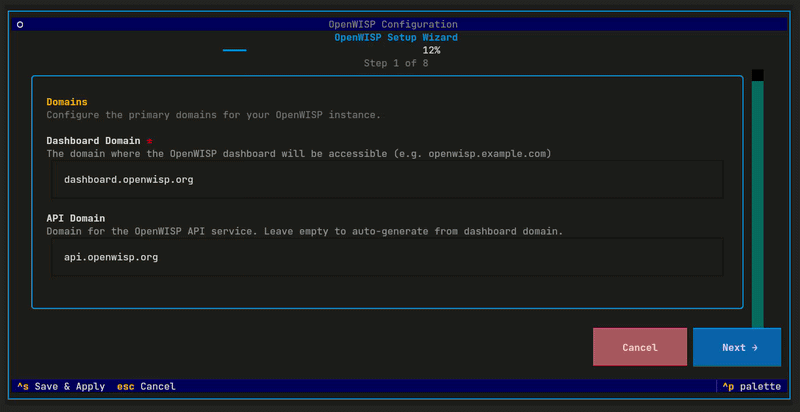
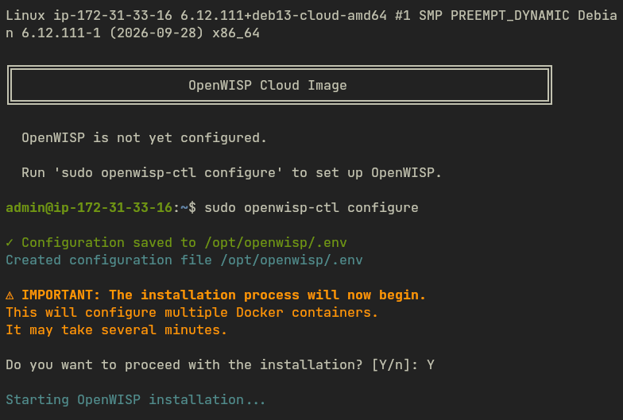
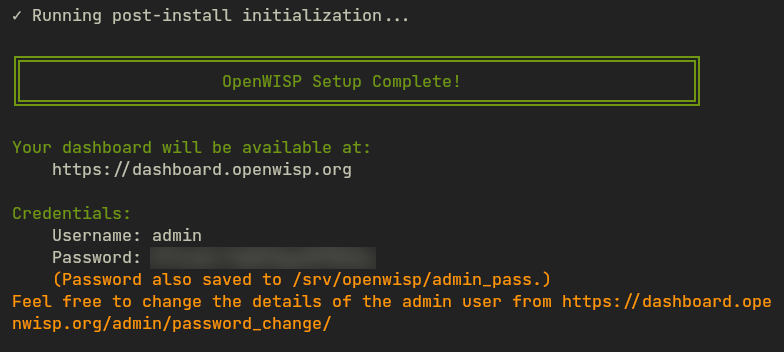

Deploying OpenWISP Pro on AWS
=============================

.. figure:: https://openwisp-pro-public-info-637703784297-us-east-1-an.s3.us-east-1.amazonaws.com/openwisp-pro-aws-architecture.png
    :target: https://openwisp-pro-public-info-637703784297-us-east-1-an.s3.us-east-1.amazonaws.com/openwisp-pro-aws-architecture.png
    :alt: OpenWISP Pro AWS architecture
    :align: center

    OpenWISP Pro deployment architecture on AWS.

**OpenWISP Pro** is a cloud image that you can launch from AWS
Marketplace. This tutorial walks you through subscribing to the image,
deploying it either manually or with a CloudFormation template, and
configuring OpenWISP.

.. important::

    Be among the first to deploy OpenWISP Pro from AWS Marketplace.
    Register through the `interest form
    <https://form.jotform.com/260416646535055>`_ to receive availability
    updates.

.. contents:: **Table of Contents**:
    :depth: 2
    :local:

Launch OpenWISP Pro Standard from AWS Marketplace
-------------------------------------------------

To begin, sign in to the `AWS Management Console
<https://console.aws.amazon.com/>`_. If you do not have an AWS account,
`create one <https://aws.amazon.com/>`_ before continuing.

Open `AWS Marketplace <https://aws.amazon.com/marketplace/>`_, enter
``OpenWISP Pro Standard`` in the search field, and select the listing.
Review the product information, usage instructions, and pricing before
subscribing.

Choose **Continue to Subscribe**, review the terms and conditions, and
choose **Accept Contract**. Once the subscription has been processed,
choose **Continue to Configuration** to prepare the image for launch. You
need an AWS account that can launch EC2 instances. The CloudFormation path
also requires permission to create a stack and its resources.

Choose one of the following deployment paths. Both use the same SSH and
post-launch configuration procedure.

Launch an EC2 instance manually
-------------------------------

Use this path to configure the instance and network settings in the AWS
console yourself.

Configure and launch the instance
~~~~~~~~~~~~~~~~~~~~~~~~~~~~~~~~~

On the configuration page, select **Amazon Machine Image (AMI)** as the
delivery method, the software version you want to deploy, and the AWS
**Region** where the instance will run. Choose **Continue to Launch**.
Under **Launch Action**, choose **Launch from Website**. This AWS
Marketplace action opens the EC2 launch form:

1. For **EC2 Instance Type**, choose an **x86-64 instance** size that
   meets your workload's needs. ``c7a.large`` and ``t3.medium`` are
   suitable starting points, subject to availability in the selected
   Availability Zone.
2. For **VPC Settings**, select the Virtual Private Cloud (VPC) in which
   OpenWISP will run. A VPC is the network that contains your AWS
   resources.
3. For **Subnet Settings**, select a public subnet: a subnet whose route
   table sends internet-bound IPv4 traffic to an internet gateway and that
   assigns a public IPv4 address to the instance. See `enable internet
   access using an internet gateway
   <https://docs.aws.amazon.com/vpc/latest/userguide/VPC_Internet_Gateway.html>`_
   if you need to prepare your VPC first. To use IPv6, select a dual-stack
   subnet and follow AWS guidance to `configure IPv6 for your VPC
   <https://docs.aws.amazon.com/vpc/latest/userguide/vpc-migrate-ipv6.html>`_.
4. For **Security Group Settings**, choose **Create new security group**,
   enter a name and description, then configure the following inbound
   rules:

   .. list-table::
       :header-rows: 1
       :widths: 20 15 15 25 25

       - - Type
         - Protocol
         - Port
         - Source
         - Purpose
       - - HTTP
         - TCP
         - 80
         - ``0.0.0.0/0``
         - HTTP connections
       - - HTTPS
         - TCP
         - 443
         - ``0.0.0.0/0``
         - HTTPS connections
       - - SSH
         - TCP
         - 22
         - An address or network you choose
         - Server administration
       - - Custom UDP
         - UDP
         - 1194
         - ``0.0.0.0/0``
         - VPN connections

   If your VPC and subnet support IPv6, add equivalent HTTP, HTTPS, and
   UDP 1194 rules with ``::/0`` as the source. For SSH, choose the source
   that fits your access policy; for example, the AWS console can use your
   current public IP address. You can change any of these rules later in
   the AWS console.

   Ports 80 and 443 allow web traffic to reach the server. Port 1194
   allows remote VPN clients to establish a connection. For this image,
   the VPN rule uses **UDP**, so select **Custom UDP** and enter ``1194``
   as the port.

   .. figure:: ../../images/tutorials/openwisp-pro/aws/0.security-rules.png
       :alt: Configuring security group rules in the AWS launch form
       :align: center

       Inbound security group rules for web, SSH, and VPN access.

5. For **Key Pair Settings**, select an existing key pair in the chosen
   Region, or choose **Create a key pair in EC2**. Keep the private key on
   your computer: you will need it to authenticate your SSH connection.
6. Review the configuration and choose **Launch**.

Open the `Amazon EC2 console <https://console.aws.amazon.com/ec2/>`_ in
the same Region and select **Instances** to find your new server. Wait for
its state to become **Running** and for its status checks to pass before
connecting.

Associate an Elastic IP address
~~~~~~~~~~~~~~~~~~~~~~~~~~~~~~~

Once the instance is running, consider associating an Elastic IP address
with it. An Elastic IP is a static public IPv4 address that you can keep
associated with the server or move to a replacement instance.

A stable address is useful for both web access and VPN connections: users,
devices, and DNS records can continue to use the same endpoint. An
automatically assigned public IPv4 address can change when an EC2 instance
is stopped and started.

An Elastic IP provides IPv4 connectivity only. If you need IPv6, configure
it on the VPC and subnet, then create a DNS AAAA record for the instance's
assigned IPv6 address.

For instructions, see the AWS guide to `associate an Elastic IP address
with an instance
<https://docs.aws.amazon.com/AWSEC2/latest/UserGuide/working-with-eips.html>`_.

Deploy with a CloudFormation template
-------------------------------------

Use this path to have CloudFormation create an EC2 instance, security
group, and Elastic IP address for you. You provide an existing VPC,
subnet, key pair, and DNS records. The template uses the Marketplace image
and does not create IAM roles, IAM policies, or key pairs.

1. On **Continue to Configuration**, choose the **CloudFormation
   template** delivery method, software version, and Region. Continue to
   launch and open the supplied template in the CloudFormation console.
2. Enter a stack name and review the template parameters:

   - ``OpenWISPAMI``: use the Marketplace-provided image value.
     Marketplace may display this as an SSM parameter rather than an image
     ID.
   - ``VpcId``: select your existing VPC.
   - ``SubnetId``: select a public subnet in that VPC. It must route
     internet-bound IPv4 traffic to an internet gateway and assign a
     public IPv4 address to the instance.
   - ``NetworkMode``: keep ``ipv4`` for IPv4-only or choose ``dual_stack``
     to assign an IPv6 address as well. Dual-stack requires IPv6 CIDRs on
     the VPC and subnet and a ``::/0`` route to the internet gateway. See
     AWS guidance to `configure IPv6 for your VPC
     <https://docs.aws.amazon.com/vpc/latest/userguide/vpc-migrate-ipv6.html>`_.
     The template does not modify your VPC, subnet, or routes.
   - ``VpnCidr``: controls the IPv4 source allowed to connect to OpenVPN.
     It defaults to ``0.0.0.0/0``. Change it if only known networks should
     be able to establish VPN connections.
   - ``KeyName``: select your existing regional EC2 key pair. This is its
     name, not the contents of its private key.
   - ``InstanceType``: select an x86-64 instance type that suits your
     workload and is available in the selected Availability Zone.

3. Review the stack details and create the stack. Wait for
   ``CREATE_COMPLETE``. If creation fails, inspect the **Events** tab
   before retrying. Check instance type availability, subnet/VPC matching,
   and permissions.
4. Open the stack's **Outputs** tab. ``InstanceId`` identifies the EC2
   instance; ``ElasticIpAddress`` is its static public IPv4 address.
5. Locate ``InstanceId`` in the EC2 console and wait for **Running** and
   passing status checks. Point dashboard, API, and any separate VPN DNS
   records to ``ElasticIpAddress`` before running the configuration
   wizard.
6. Follow the shared SSH and configuration steps below. Stack creation
   does not run the interactive wizard or establish application readiness.

The template creates a security group and an Elastic IP address. Review
and adjust the security group rules in the EC2 console to meet your access
policy. Do not allocate a second Elastic IP for this deployment path; the
stack already creates one.

With ``dual_stack``, find the assigned IPv6 address in the EC2 console's
instance networking details. Publish DNS AAAA records only after testing
HTTPS and any required VPN connectivity from an IPv6 client. Keep DNS A
records pointing to the Elastic IP. The IPv6 address is not an Elastic IP
and can change when the instance is replaced.

Choose the network mode at initial launch. Changing ``NetworkMode``
replaces the instance, rather than simply changing its security group. Do
not change it on an existing deployment without a verified backup and
data/settings migration procedure.

Connect to the instance using SSH
---------------------------------

Once the instance has passed its status checks, follow the AWS guide to
`connect to your Linux instance using SSH
<https://docs.aws.amazon.com/AWSEC2/latest/UserGuide/connect-to-linux-instance.html>`_.
Use ``admin`` as the username and the private key for the key pair you
selected at launch. After connecting, you will see the OpenWISP Pro
prompt:

    The OpenWISP Pro welcome message before configuration.

Configure OpenWISP Pro
----------------------

In your SSH session, run the following command to start the configuration
wizard:

.. code-block:: shell

    sudo openwisp-ctl configure

    Entering deployment settings in the configuration wizard.

The wizard asks a series of questions to set up your OpenWISP instance.
Pay particular attention to these settings:

- **Dashboard domain**: The domain where you will access the OpenWISP
  administration interface, for example, ``openwisp.example.com``.
- **API domain**: The domain your devices will use to communicate with
  OpenWISP, for example, ``api.example.com``.
- **VPN domain**: The domain used by OpenVPN clients to connect to the
  server. It defaults to the dashboard domain; you can keep this default
  unless you need a separate VPN domain.
- **SSL certificates**: Choose whether the wizard should provision
  certificates using Let's Encrypt. Before enabling this option, update
  the DNS records for the domains that need certificates to point to the
  instance's public IP address. Make sure the records resolve to this
  address before continuing.
- **Site Manager Email**: Enter the email address to use when creating
  your user account.
- **Logo**: Optionally add a logo for your instance.

Choose **Save and Apply** to save your settings and exit the wizard. At
the installation confirmation prompt, enter ``Y`` to install and start
OpenWISP. This may take several minutes.

    Confirming installation after saving the configuration.

When setup finishes, the command displays your login credentials. Open the
dashboard domain you configured and sign in using those credentials.

    The dashboard address and login credentials shown when setup
    completes.
