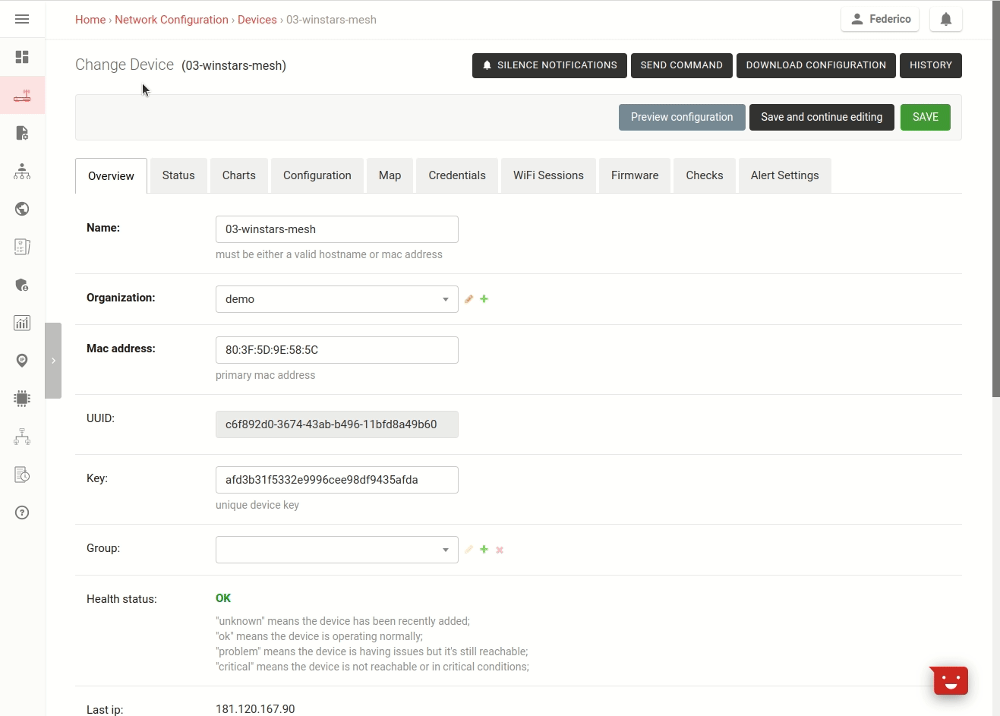
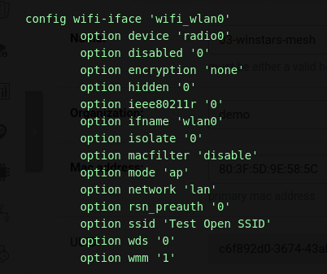
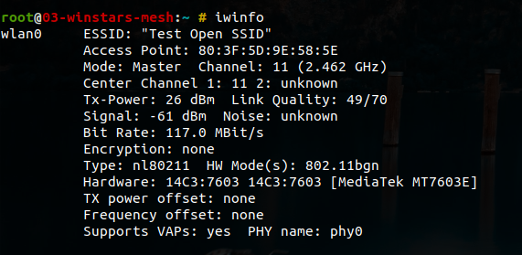
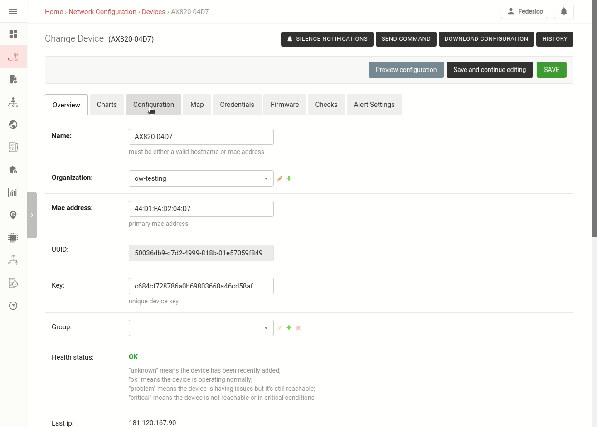
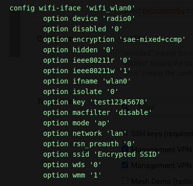
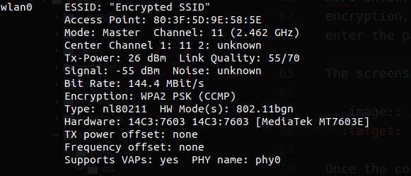
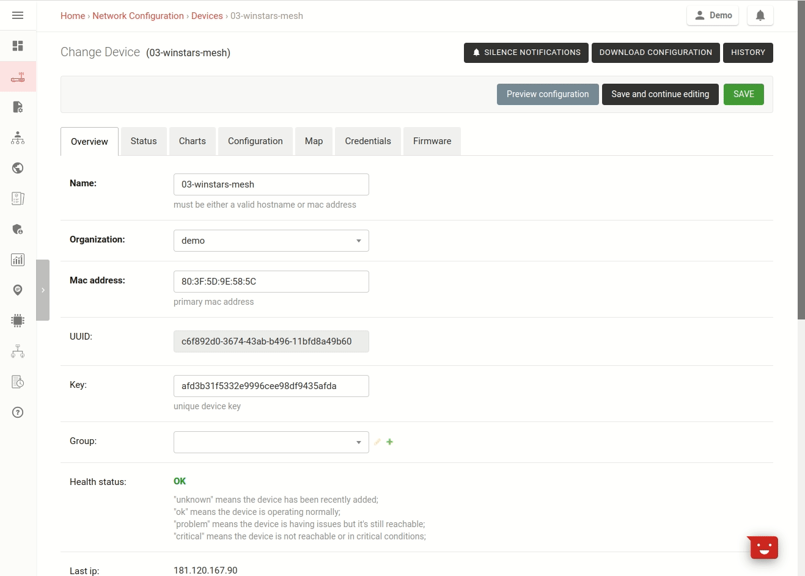
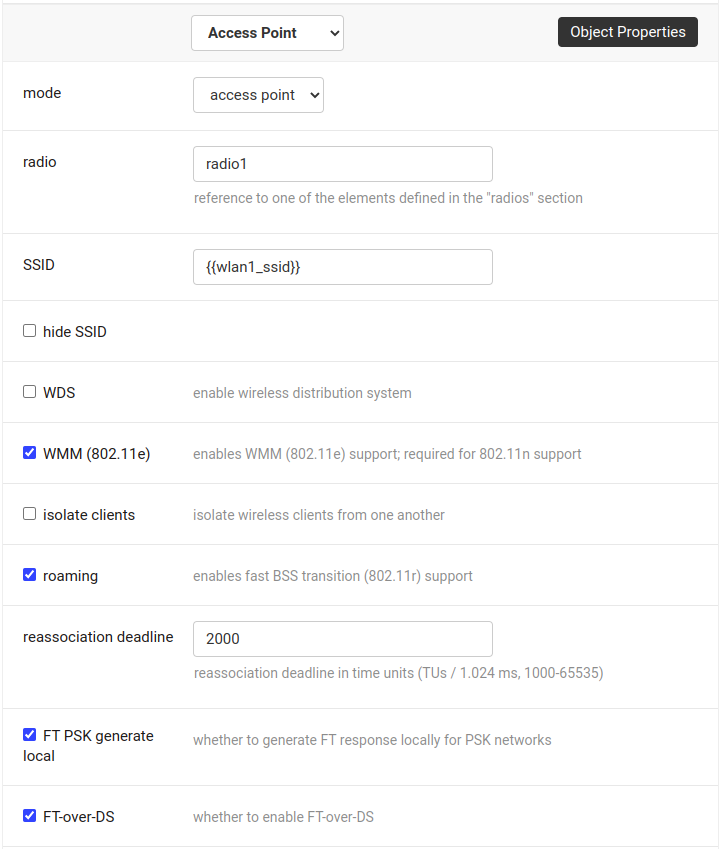
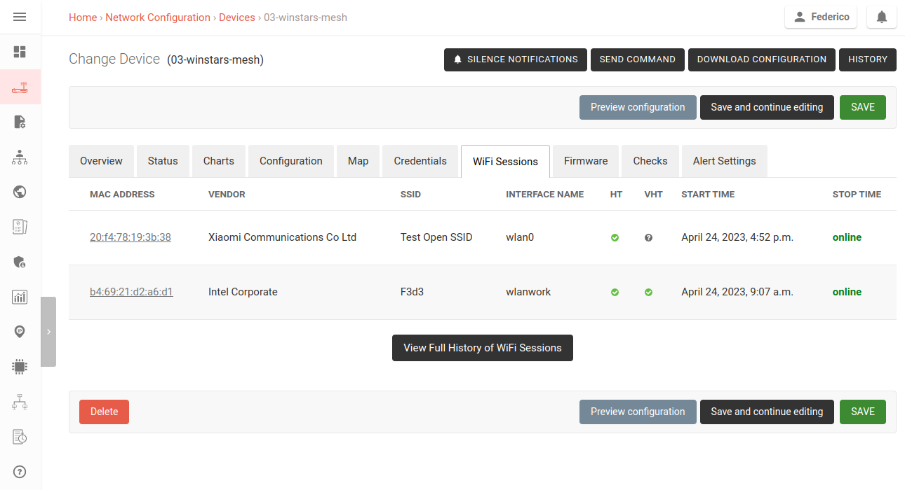
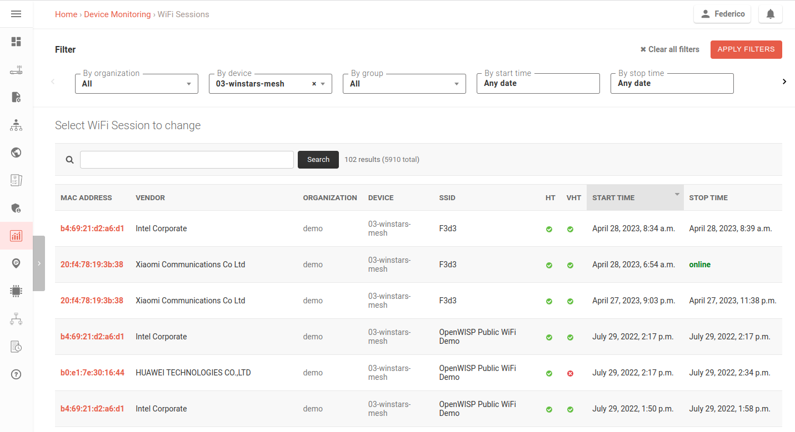

How to Set Up Wi-Fi Access Point SSIDs
======================================

This tutorial shows different ways to set up a WiFi SSID
in access point mode on your devices.

The requirement for this to work is that your device must be equipped with
at least one radio and that it is named ``radio0`` in the OpenWrt
configuration (this is the default).

.. note::
  All the features shown in this page will work on
  any OpenWISP instance.

.. contents:: **Table of Contents**:
   :backlinks: none
   :depth: 3

Set Up an Open Access Point SSID on a Device
--------------------------------------------

Open the device detail page of your device, then
go to the configuration tab, then scroll down and
click on "Configuration Menu", then select "Interfaces",
then click on "Add new interface", select "Wireless interface",
then add ``wlan0`` as interface name, ``radio0`` for the radio,
then type any SSID you want, then in "Attached networks" click
on "Add network" and type ``lan``, this will bridge this
WiFi interface to the LAN interface, now click on
"Save and continue".

The screenshot below shows how the preview will look like.

Once the configuration is applied on the device,
the SSID will be broadacasted.

Once clients start to connect to this access point
their information will be logged in the
:ref:`WiFi Sessions tab <monitoring_wifi_clients>`.

Set Up a WPA Encrypted Access Point SSID on a Device
----------------------------------------------------

Open the detail page of your device, then
go to the configuration tab, then scroll down and
click on "Configuration Menu", then select "Interfaces",
then click on "Add new interface", select "Wireless interface",
then add ``wlan0`` as interface name, ``radio0`` for the radio,
then type any SSID you want, then in "Attached networks" click
on "Add network" and type ``lan``, this will bridge this
WiFi interface to the LAN interface, now select the desired
encryption, for example, WPA3/WPA2 Personal Mixed Mode,
enter the password and finally click on "Save and continue".

The screenshot below shows how the preview will look like.

Once the configuration is applied on the device,
the SSID will be broadacasted.

Once clients start to connect to this access point
their information will be logged in the
:ref:`WiFi Sessions tab <monitoring_wifi_clients>`.

Set Up the Same SSID and Password on Multiple Devices
-----------------------------------------------------

.. image:: ../images/demo/ap/wifi-wpa-template.gif
  :target: ../_images/wifi-wpa-template.gif

The procedure is very similar to the previous one, with the
difference that we will be using a **configuration template**,
then we will assign this template to the devices we want to
have the SSID.

In this example we are defining two variables: ``wlan0_ssid``
and ``wlan0_password``, this allows us to change the SSID and
password on a specific device if we need.
Below you can find a demonstration of how to change these default
template values from the device page in the "configuration variables"
section.

The template can even be flagged as "Default" if we want
this to be applied automatically when new devices register!

.. note::
  If you want to find out more about templates,
  consult the documentation section dedicated to
  :doc:`Configuration Templates <../user/templates>`.

Multiple SSIDs, multiple radios
-------------------------------

Dual radio (2.4 GHz and 5 GHz) hardware is very common nowadays.

Multiple WiFi interfaces can be created for each
available radio, as long as they have different names.
The SSID can be the same, although this only makes sense
for having the same SSID broadcasted on different Wi-Fi bands
(eg: 2.4 GHz and 5 GHz).

In order to do this, just repeat the procedure shown in the
previous sections, with the difference that instead of adding
only one interface, you will have to add multiple wireless interfaces
and define a different ``name`` and, if you want to deploy the
SSID on different bands, a different value for the ``radio`` field,
e.g. ``radio0`` and ``radio1``.

.. _monitoring_wifi_clients:

Roaming (802.11r: Fast BSS Transition)
--------------------------------------

Fast transition enables WiFi clients to seamlessly roam between
access points without interrupting media flows, such as video or
phone calls, streaming, etc., caused by delays in re-authentication.

Enabling 802.11r on OpenWrt via OpenWISP can be easily done with the
following steps:

1. Prepare a WiFi AP template as explained in the previous sections,
   ensuring that the SSID used on
   the access points remains consistent.
2. Check the "roaming" checkbox.
3. Check the "FT PSK generate local" checkbox.
4. Increase the default "reassociation deadline" to at least 2000.
5. Save the changes.

To verify whether WiFi clients are roaming between APs,
launch the shell command ``logread -f`` on each AP.
Then, move the WiFi client from one AP to another, making sure they
are sufficiently distant.

When the WiFi client successfully transitions from one AP to another,
you should see log lines like:

.. code-block::

  WPA: FT authentication already completed - do not start 4-way handshake

You may wish to test the configuration and adjust the following options:

- Reassociation deadline: Increase it to avoid frequent
  timeouts on busy networks.
- FT-over-DS.

Monitoring WiFi Clients
-----------------------

Since OpenWISP 23, in the device page, whenever any WiFi
client data is collected by the
:doc:`Monitoring module of OpenWISP </monitoring/user/wifi-sessions>`,
a "WiFi Sessions" tab will appear as in the screenshot above,
showing WiFi clients connected right now.

The data is sent by default by devices every 5 minutes.

Clicking on "Full History of WiFi Sessions"
will redirect to the full list of all clients which
have connected to this access point, as shown below.

In this page it will be possible to use more filters and even
perform a text search.
