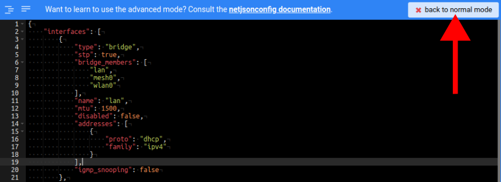
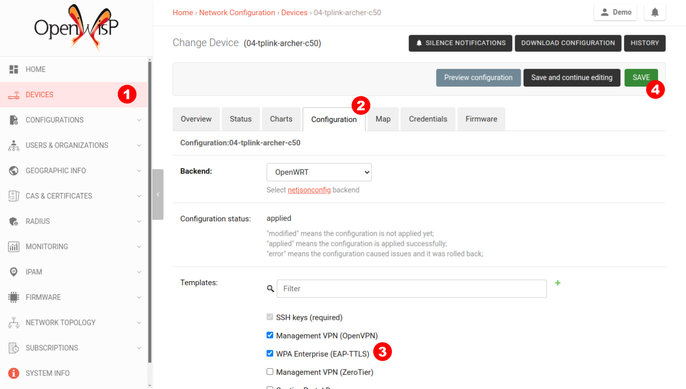

How to Set Up WPA Enterprise (EAP-TTLS-PAP) authentication
==========================================================

In this tutorial, we will guide you set up WPA Enterprise (EAP-TTLS-PAP)
authentication for WiFi networks using OpenWISP. The RADIUS capabilities
of OpenWISP provides integration with FreeRADIUS to allow users to
authenticate with their django user accounts. Users can either be created
manually via the admin interface, generated or imported from CSV.

Pre-requisites for following this tutorial
------------------------------------------

Enable OpenWISP RADIUS
~~~~~~~~~~~~~~~~~~~~~~

.. note::

    You don't need to do anything if you are following this tutorial on
    the :doc:`OpenWisp Demo System <./demo>`. OpenWISP RADIUS is already
    enabled on the :doc:`OpenWISP Demo System <./demo>`.

Your OpenWISP installation should have the RADIUS module enabled. If not,
you can follow the steps at `Enabling the RADIUS module in the OpenWISP
22.05 ansible role documentation
<https://github.com/openwisp/ansible-openwisp2/tree/22.05#enabling-the-radius-module>`_.

Firmware Requirements
~~~~~~~~~~~~~~~~~~~~~

In order to use WPA Enterprise authentication, your firmware needs to be
equipped with a version of the ``wpad`` package which supports WPA
Enterprise encryption.

Please refer to the `OpenWrt WPA encryption documentation
<https://openwrt.org/docs/guide-user/network/wifi/encryption#wpa_encryption>`_
for more information.

This tutorial uses OpenVPN for VPN. Ensure that your OpenWrt device has
``openvpn`` package installed.

.. note::

    The **OpenWrt** firmware image provided for the :doc:`OpenWISP Demo
    System <./demo>` includes ``openvpn`` and the full ``wpad`` package by
    default.

One Radio Available
~~~~~~~~~~~~~~~~~~~

We require at least one radio named ``radio0`` to be available and enabled
for the successful execution of this tutorial.

For simplicity, we will focus on a single radio, but it's important to
note that the WPA Enterprise functionality can be extended to multiple
radios if necessary.

Alternatively, you have the option of using WPA Enterprise encryption on
one radio while the other radios use different encryption methods.

However, these additional scenarios are not explained in this tutorial and
are left as an exercise for the reader.

VPN Tunnel
~~~~~~~~~~

We recommend setting up a VPN tunnel to secure RADIUS communication
between OpenWrt devices and the FreeRADIUS server. Unencrypted RADIUS
traffic exposes sensitive data, such as usernames and passwords. You can
use OpenWISP to automate provisioning of OpenVPN tunnels, just follow the
steps in the :doc:`OpenVPN tunnel Automation <../user/vpn>` section.

.. note::

    If you are following this tutorial on our :doc:`Demo System <./demo>`,
    the ``Management VPN (OpenVPN)`` template will be applied on your
    device by default. If not, you need to enable that template on your
    device. Otherwise, your device won't connect to the FreeRADIUS server.

        .. image:: ../images/tutorials/enable-openvpn-template.png
            :target: ../_images/enable-openvpn-template.png

Configuring FreeRADIUS for WPA Enterprise
-----------------------------------------

.. note::

    You don't need to do anything if your are following this tutorial on
    our :doc:`Demo System <./demo>`. The FreeRADIUS site is already
    configured on the :doc:`OpenWISP Demo System <./demo>`.

Before we go ahead with making changes to the FreeRADIUS configuration, we
need to gather the following information:

    - Organization's UUID
    - Organization's RADIUS token

From the OpenWISP navigation menu, go to ``Users & Organizations`` and
then ``Organizations``, from here click on the desired organziation.

From the organization's page, we need to find the organization's UUID and
RADIUS token.

.. image:: ../images/tutorials/organization-radius-token.png
    :target: ../_images/organization-radius-token.png

This is good point to decide whether to use self-signed certificates or
public certificates issued by a trusted Certificate Authority (CA). Both
options have their pros and cons, and the choice largely depends on your
specific requirements and constraints.

Self-Signed Certificates
~~~~~~~~~~~~~~~~~~~~~~~~

Pros:

    - Generated locally without involving a third-party CA.
    - Eliminates the need for external entities, reducing the risk of
      compromised trust.

Cons:

    - Requires installation of self-signed CA on all client devices.

Public Certificates
~~~~~~~~~~~~~~~~~~~

Pros:

    - Issued by trusted CAs, thus works out of the box with most devices.

Cons:

    - Offers a higher risk of compromise.
    - Cumbersome to set-up.

We recommend to use Ansible OpenWISP2 role to which simplifies configuring
FreeRADIUS to use WPA Enterprise. Please refer to the `"Configuring
FreeRADIUS for WPA Enterprise (EAP-TTLS-PAP)" section in the
ansible-openwisp2 documentation
<https://github.com/openwisp/ansible-openwisp2/tree/master?tab=readme-ov-file#configuring-freeradius-for-wpa-enterprise-eap-ttls-pap>`_
for details.

If you still prefer to configure the FreeRADIUS site manually, you can
refer the `"Freeradius Setup for WPA Enterprise (EAP-TTLS-PAP)
authentication" section of the OpenWISP RADIUS documentation
<https://openwisp-radius.readthedocs.io/en/stable/developer/freeradius_wpa_enterprise.html#freeradius-setup-for-wpa-enterprise-eap-ttls-pap-authentication>`_.

Creating the NAS
----------------

.. note::

    You can skip this step if you are following this tutorial on our
    :doc:`Demo System <./demo>`. The NAS has been already configured on
    the :doc:`Demo System <./demo>`.

From the OpenWISP navigation menu, go to ``RADIUS`` and then ``NAS``, from
here click on the ``Add NAS``.

Fill in the organization, short name, secret, and set the type to
"Wireless - IEEE 802.11". In the **name** field, enter the IP address of
the NAS. Since every device acts as a NAS in our scenario, we specify the
subnet of the VPN. This would allow FreeRADIUS to accept RADIUS traffic
from all the devices.

.. warning::

    Creating or modifying a NAS in OpenWISP requires a restart of the
    FreeRADIUS server. Otherwise, the changes won't take effect.

We would need the NAS's secret in the next step while creating a template.

Creating the Template
---------------------

.. note::

    This template is also available in our :doc:`Demo System <./demo>` as
    `WPA Enterprise (EAP-TTLS)
    <https://demo.openwisp.io/admin/config/template/5f279920-60fd-4274-b367-450aa4d30004/change/>`_,
    **feel free to try it out!**

From the OpenWISP navigation menu, go to ``Configurations`` and then
``Templates``, from here click on the ``Add template``.

.. image:: ../images/tutorials/create-template.png
    :target: ../_images/create-template.png

Fill in name, organization, leave type set to "Generic", backend set to
"OpenWrt", scroll down to the Configuration section, then click on
"Advanced mode (raw JSON)".

.. image:: ../images/tutorials/advanced-mode.png
    :target: ../_images/advanced-mode.png

Before copying the following NetJSON to the advanced mode editor, you will
need to update these fields to reflect your configuration:

- ``key`` - RADIUS secret should be same as set in NAS
- ``server`` - RADIUS server authentication IP
- ``port`` - RADIUS server authentication port
- ``acct_server`` - RADIUS accounting server IP
- ``acct_server_port`` - RADIUS accounting server port

.. code-block:: json

    {
        "interfaces": [{
            "name": "wlan_eap",
            "type": "wireless",
            "mtu": 1500,
            "disabled": false,
            "network": "",
            "mac": "",
            "autostart": true,
            "addresses": [],
            "wireless": {
                "network": [
                    "lan"
                ],
                "mode": "access_point",
                "radio": "radio0",
                "ssid": "WPA Enterprise 2 (EAP-PAP-TTLS)",
                "ack_distance": 0,
                "rts_threshold": 0,
                "frag_threshold": 0,
                "hidden": false,
                "wds": false,
                "wmm": true,
                "isolate": false,
                "ieee80211r": false,
                "reassociation_deadline": 1000,
                "ft_psk_generate_local": false,
                "ft_over_ds": true,
                "rsn_preauth": false,
                "macfilter": "disable",
                "maclist": [],
                "encryption": {
                    "protocol": "wpa2_enterprise",
                    "key": "testing123",
                    "disabled": false,
                    "cipher": "auto",
                    "ieee80211w": "0",
                    "server": "10.8.0.1",
                    "port": 1822,
                    "acct_server": "10.8.0.1",
                    "acct_server_port": 1823
                }
            }
        }],
        "files": [{
            "path": "/etc/openwisp/pre-reload-hook",
            "mode": "0700",
            "contents": "#!/bin/sh\n\n# Ensure radio0 is enabled \nuci set wireless.radio0.disabled='0'\nuci commit wireless"
        }]
    }

Then click on "back to normal mode" to close the advanced mode editor.

Now you can save the new template.

.. image:: ../images/tutorials/save.png
    :target: ../_images/save.png

At this point you're ready to assign the template to your devices, but
before doing so you may want to read on to understand the different
components of this template:

- The ``wlan_eap`` creates the wireless interface that supports WPA 2
  Enterprise encryption bound to ``radio0``. This interface attached to
  the ``lan`` interface which is configured to provide internet access in
  default OpenWrt configuration.
- A ``pre-reload-hook`` script which is executed before OpenWrt reloads
  its services to make ensure that ``radio0`` is enabled.

Enable the WPA Enterprise Template on the Devices
-------------------------------------------------

Now is time to apply this template to the devices where you want to enable
WPA Enterprise authentication on WiFi.

Click on ``Devices`` in the navigation menu, click on the device you want
to assign the WPA Enterprise template to, then go to the ``Configuration``
tab, select the template just created, then click on save.

Connecting to the WiFi with WPA 2 Enterprise
--------------------------------------------

For brevity, this section only includes an example for connecting a
smartphone running Android 11 to the WiFi network. Similar steps can
typically be followed on other devices. If unsure, consult your device's
manual for guidance.

Find the "OpenWISP" SSID in the list of available WiFi networks on your
mobile and click on it. Fill in the details as follows:

    - **EAP method**: Set this to ``TTLS``
    - **Phase 2 authentication**: Set this to ``PAP``
    - **CA certificate**: Select one of the options based on your
      FreeRADIUS configuration
    - **Domain**: Enter the domain based on the server certificate used by
      FreeRADIUS
    - **Identity** and **Password**: Use the OpenWISP user's username for
      ``Identity`` and password for ``Password``.

.. note::

    If you are trying this feature on our :doc:`OpenWISP Demo System
    <./demo>` you can use the **demo** user to authenticate. You will need
    to update the following fields as mentioned:

    - **CA certificate**: Set this to ``Use system certificates``
    - **Domain**: Set this to ``demo.openwisp.io``
    - **Identity** and **Password**: Use the :ref:`demo user credentials
      <accessing_the_demo_system>`.

      .. image:: ../images/wpa-enterprise/connect-to-wpa-enterprise.png
          :target: ../_images/connect-to-wpa-enterprise.png
          :width: 40 %
          :align: center
          :alt: Screenshot of authentication details filled in for
                WPA 2 Enterprise WiFi connection

You can leave the **Advanced options** unchanged and click on **Connect**
after filling on the details.

Verifying and Debugging
~~~~~~~~~~~~~~~~~~~~~~~

If everything worked as expected, your device should connect to the WiFi
and allow you to browse the internet.

You can also verify the RADIUS session created on OpenWISP. From the
OpenWISP navigation menu, go to ``RADIUS`` and then ``Accounting
Sessions``.

.. image:: ../images/tutorials/navigating-to-radius-accounting.png
    :target: ../_images/navigating-to-radius-accounting.png
    :alt: Navigating to RADIUS Accounting on OpenWISP

You should see a RADIUS accounting session for this device

.. image:: ../images/wpa-enterprise/verify-openwisp-radius-accounting.png
    :target: ../_images/verify-openwisp-radius-accounting.png

If your smartphone does not connect to the internet, you can debug the
FreeRADIUS configuration by following the steps in the `"Debugging"
section of OpenWISP RADIUS documentation
<https://openwisp-radius.readthedocs.io/en/stable/developer/freeradius.html#debugging>`_.
