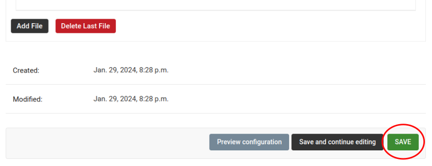

How to Set Up WPA Enterprise (EAP-TTLS-PAP) Authentication
==========================================================

.. contents:: **Table of Contents**:
    :depth: 3
    :local:

Introduction & Prerequisites
----------------------------

In this tutorial, we will guide you on how to set up WPA Enterprise
(EAP-TTLS-PAP) authentication for WiFi networks using OpenWISP. The RADIUS
capabilities of OpenWISP provide integration with FreeRADIUS to allow
users to authenticate with their Django user accounts. Users can either be
created manually via the admin interface, `generated with voucher-like
codes
<https://openwisp-radius.readthedocs.io/en/stable/user/generating_users.html>`_,
`imported from CSV
<https://openwisp-radius.readthedocs.io/en/stable/user/importing_users.html>`_
or can register autonomously via the `REST API of OpenWISP RADIUS
<https://openwisp-radius.readthedocs.io/en/stable/user/api.html#user-registration>`_.

Enable OpenWISP RADIUS
~~~~~~~~~~~~~~~~~~~~~~

.. note::

    If you are following this tutorial on our :doc:`Demo System <./demo>`,
    you can skip this step.

To use WPA2 Enterprise, the :doc:`RADIUS module </radius/index>` must be
enabled first.

See :ref:`ansible_enabling_radius_module` in the Ansible OpenWISP role. In
:doc:`/docker/index`, the RADIUS module is enabled by default.

VPN Tunnel
~~~~~~~~~~

We recommend setting up a VPN tunnel to secure the communication between
the RADIUS server and the NAS devices.

Routing unencrypted RADIUS traffic through the internet is not recommended
for security. When security breaches in the RADIUS protocol are discovered
(like the "Blast-RADIUS attack" in July 2024), your entire network would
be at risk.

If you are using OpenWrt, you can use OpenWISP to automate the
provisioning of OpenVPN tunnels on your OpenWrt devices. For more
information, please refer to :doc:`/controller/user/openvpn`.

.. note::

    If you are following this tutorial on our :doc:`Demo System <./demo>`,
    the ``Management VPN (OpenVPN)`` template will be applied to your
    device by default. If not, you need to enable that template on your
    device. Otherwise, your device won't connect to the FreeRADIUS server.

    .. image:: ../images/tutorials/enable-openvpn-template.png
        :target: ../_images/enable-openvpn-template.png

Using radsec (RADIUS over TLS) is a good option, but it's not covered in
this tutorial.

Firmware Requirements
~~~~~~~~~~~~~~~~~~~~~

To use WPA Enterprise authentication, your firmware needs to be equipped
with a version of the ``wpad`` package that supports WPA Enterprise
encryption.

Please refer to the `OpenWrt WPA encryption documentation
<https://openwrt.org/docs/guide-user/network/wifi/encryption#wpa_encryption>`_
for more information.

In tutorial we use OpenVPN to tunnel RADIUS packets from NAS devices to
FreeRADIUS, for this reason you must ensure that your OpenWrt device has
the ``openvpn`` package installed.

.. note::

    The **OpenWrt** firmware image provided for the :doc:`OpenWISP Demo
    System <./demo>` includes ``openvpn`` and the full ``wpad`` package by
    default.

One Radio Available
~~~~~~~~~~~~~~~~~~~

At least one radio named ``radio0`` needs to be available and enabled for
the successful execution of this tutorial.

For simplicity, we will focus on a single radio, but it's important to
note that the WPA Enterprise functionality can be extended to multiple
radios if necessary.

Alternatively, you have the option of using WPA Enterprise encryption on
one radio while the other radios use different encryption methods.
However, these additional scenarios are not explained in this tutorial and
are left as an exercise for the reader.

Configuring FreeRADIUS for WPA Enterprise
-----------------------------------------

.. note::

    If you are following this tutorial on our :doc:`Demo System <./demo>`,
    you can skip this step.

Before making changes to the FreeRADIUS configuration, we need to gather
the following information:

    - Organization's UUID
    - Organization's RADIUS token

From the OpenWISP navigation menu, go to ``Users & Organizations`` and
then ``Organizations``. From here, click on the desired organization.

.. image:: ../images/tutorials/navigating-to-organization.png
    :target: ../_images/navigating-to-organization.png

From the organization's page, find the organization's UUID and RADIUS
token.

.. image:: ../images/tutorials/organization-uuid.png
    :target: ../_images/organization-uuid.png

This is a good point to decide whether to use self-signed certificates or
public certificates issued by a trusted Certificate Authority (CA). Both
options have their pros and cons, and the choice largely depends on your
specific requirements and constraints.

Self-Signed Certificates
~~~~~~~~~~~~~~~~~~~~~~~~

Pros:

    - Generated locally without involving a third-party CA.
    - Eliminates the need for external entities, reducing the risk of
      compromised trust.

Cons:

    - Requires installation of the self-signed CA on all client devices.

Public Certificates
~~~~~~~~~~~~~~~~~~~

Pros:

    - Issued by trusted CAs, thus works out of the box with most devices.

Cons:

    - Higher risk of compromise.
    - More cumbersome to set up.

We recommend using the Ansible OpenWISP2 role, which simplifies
configuring FreeRADIUS to use WPA Enterprise. Please refer to the
:doc:`"Configuring FreeRADIUS for WPA Enterprise (EAP-TTLS-PAP)" section
in the ansible-openwisp2 documentation
</ansible/user/deploying-wpa-eap-ttls-pap>` for details.

If you prefer to configure the FreeRADIUS site manually, refer to the
`"Freeradius Setup for WPA Enterprise (EAP-TTLS-PAP) authentication"
section of the OpenWISP RADIUS documentation
<https://openwisp-radius.readthedocs.io/en/stable/developer/freeradius_wpa_enterprise.html#freeradius-setup-for-wpa-enterprise-eap-ttls-pap-authentication>`_.

Creating the Template
---------------------

.. note::

    This template is also available in our :doc:`Demo System <./demo>` as
    `WPA Enterprise (EAP-TTLS)
    <https://demo.openwisp.io/admin/config/template/5f279920-60fd-4274-b367-450aa4d30004/change/>`_,
    **feel free to try it out!**

.. hint::

    If you don't know what a template is, please see
    :doc:`/controller/user/templates`.

From the OpenWISP navigation menu, go to ``Configurations`` and then
``Templates``, from here click on ``Add template``.

.. image:: ../images/tutorials/create-template.png
    :target: ../_images/create-template.png

Fill in the name, organization, leave type set to "Generic", and backend
set to "OpenWrt". Scroll down to the ``Configuration variables`` section,
then click on "Toggle Raw JSON Editing".

Paste the following JSON in the ``Raw JSON Editing`` field.

.. code-block:: json

    {
        "mac_address": "00:00:00:00:00:00"
    }

.. hint::

    For more information about variables, please refer to
    :doc:`/controller/user/variables`.

Scroll down to the ``Configuration`` section, then click on "Advanced mode
(raw JSON)".

.. image:: ../images/tutorials/advanced-mode.png
    :target: ../_images/advanced-mode.png

Before copying the following NetJSON to the advanced mode editor, you will
need to update these fields to reflect your configuration:

- ``key`` - RADIUS secret should be the same as set in NAS
- ``server`` - RADIUS server authentication IP
- ``port`` - RADIUS server authentication port
- ``acct_server`` - RADIUS accounting server IP
- ``acct_server_port`` - RADIUS accounting server port

.. code-block:: json

    {
        "interfaces": [{
            "name": "wlan_eap",
            "type": "wireless",
            "mac": "{{mac_address}}",
            "mtu": 1500,
            "disabled": false,
            "network": "",
            "autostart": true,
            "addresses": [],
            "wireless": {
                "network": [
                    "lan"
                ],
                "mode": "access_point",
                "radio": "radio0",
                "ssid": "WPA Enterprise 2 (EAP-PAP-TTLS)",
                "ack_distance": 0,
                "rts_threshold": 0,
                "frag_threshold": 0,
                "hidden": false,
                "wds": false,
                "wmm": true,
                "isolate": false,
                "ieee80211r": false,
                "reassociation_deadline": 1000,
                "ft_psk_generate_local": false,
                "ft_over_ds": true,
                "rsn_preauth": false,
                "macfilter": "disable",
                "maclist": [],
                "encryption": {
                    "protocol": "wpa2_enterprise",
                    "key": "testing123",
                    "disabled": false,
                    "cipher": "auto",
                    "ieee80211w": "0",
                    "server": "10.8.0.1",
                    "port": 1822,
                    "acct_server": "10.8.0.1",
                    "acct_server_port": 1823
                }
            }
        }],
        "files": [{
            "path": "/etc/openwisp/pre-reload-hook",
            "mode": "0700",
            "contents": "#!/bin/sh\n\n# Ensure radio0 is enabled \nuci set wireless.radio0.disabled='0'\nuci commit wireless"
        }]
    }

Then click on "back to normal mode" to close the advanced mode editor.

.. image:: ../images/tutorials/back-to-normal-mode.png
    :target: ../_images/back-to-normal-mode.png

Now you can save the new template.

At this point, you're ready to assign the template to your devices.
However, before doing so, you may want to read on to understand the
different components of this template:

- The ``wlan_eap`` creates the wireless interface that supports WPA2
  Enterprise encryption bound to ``radio0``. This interface is attached to
  the ``lan`` interface, which is configured to provide internet access in
  the default OpenWrt configuration.
- A ``pre-reload-hook`` script is executed before OpenWrt reloads its
  services to ensure that ``radio0`` is enabled.
- The ``mac_address`` configuration variable is added to the template as a
  placeholder. When the template is applied to a device, the device's
  actual MAC address will automatically override the placeholder, ensuring
  that the wireless interface is created with the correct MAC address.
  This is necessary for tracing which device is being used in RADIUS
  accounting stats.

Enable the WPA Enterprise Template on the Devices
-------------------------------------------------

Now it is time to apply this template to the devices where you want to
enable WPA Enterprise authentication on WiFi.

Click on ``Devices`` in the navigation menu, click on the device you want
to assign the WPA Enterprise template to, then go to the ``Configuration``
tab, select the template just created, and then click on save.

.. image:: ../images/wpa-enterprise/enable-wpa-enterprise-template.png
    :target: ../_images/enable-wpa-enterprise-template.png

Connecting to the WiFi with WPA2 Enterprise
-------------------------------------------

For brevity, this section only includes an example of connecting a
smartphone running Android 11 to the WiFi network. Similar steps can
typically be followed on other devices. If unsure, consult your device's
manual for guidance.

Find the "OpenWISP" SSID in the list of available WiFi networks on your
mobile and click on it. Fill in the details as follows:

    - **EAP method**: Set this to ``TTLS``.
    - **Phase 2 authentication**: Set this to ``PAP``.
    - **CA certificate**: Select one of the options based on your
      FreeRADIUS configuration.
    - **Domain**: Enter the domain based on the server certificate used by
      FreeRADIUS.
    - **Identity** and **Password**: Use the OpenWISP user's username for
      ``Identity`` and password for ``Password``.

.. note::

    If you are trying this feature on our :doc:`OpenWISP Demo System
    <./demo>`, you can use the **demo** user to authenticate. You will
    need to update the following fields as mentioned:

    - **CA certificate**: Set this to ``Use system certificates``
    - **Domain**: Set this to ``demo.openwisp.io``
    - **Identity** and **Password**: Use the :ref:`demo user credentials
      <accessing_the_demo_system>`.

      .. image:: ../images/wpa-enterprise/connect-to-wpa-enterprise.png
          :target: ../_images/connect-to-wpa-enterprise.png
          :align: center
          :alt: Authentication details

You can leave the **Advanced options** unchanged and click on **Connect**
after filling in the details.

Verifying and Debugging
~~~~~~~~~~~~~~~~~~~~~~~

If everything worked as expected, your device should connect to the WiFi
and allow you to browse the internet.

You can also verify the RADIUS session created on OpenWISP. From the
OpenWISP navigation menu, go to ``RADIUS`` and then ``Accounting
Sessions``.

You should see a RADIUS accounting session for this device.

.. image:: ../images/wpa-enterprise/verify-openwisp-radius-accounting.png
    :target: ../_images/verify-openwisp-radius-accounting.png

If your smartphone does not connect to the internet, you can debug the
FreeRADIUS configuration by following the steps in the `"Debugging"
section of OpenWISP RADIUS documentation
<https://openwisp-radius.readthedocs.io/en/stable/developer/freeradius.html#debugging>`_.

----

.. seealso::

    - :doc:`Open and/or WPA protected WiFi Access Point SSID
      <./wifi-access-point>`
    - :doc:`WiFi Hotspot, Captive Portal (Public WiFi), Social Login
      <./hotspot>`
    - :doc:`How to Set Up a Wireless Mesh Network <./mesh>`
