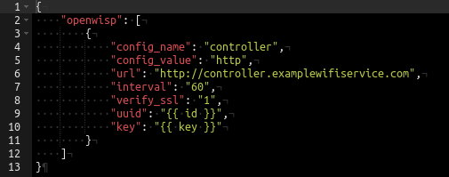
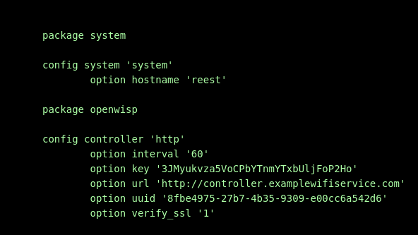
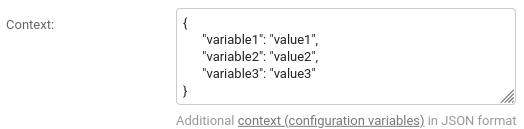
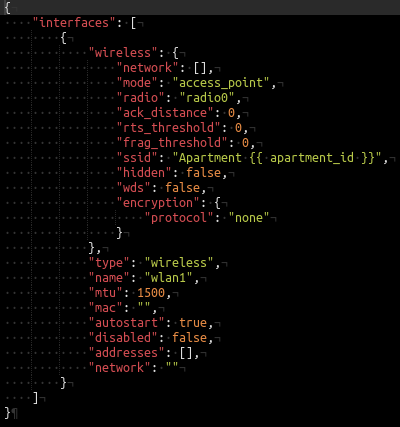
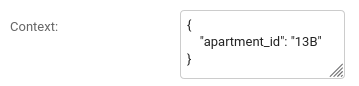
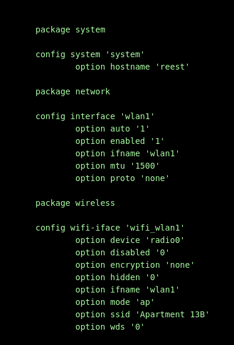

Configuration variables/context in OpenWISP2
============================================

What configuration variables are, why do we need them?
------------------------------------------------------

It's often needed for the configuration to differ a little between
devices, we may need to use device specific values
(like MAC address, or hostname) in it, in such situation
it's not to possible to simply use static templates. 
The configuration variables feature allows us to include in our config
some default/automatically assigned variables
and define our own ones in controller admin.

The set of all configuration variables is known as *context*.

Default context
---------------

Following variables are added automatically
to the context of each device configuration:

- ``id`` - device's UUID
- ``key`` - device's OpenWISP key
- ``name`` - device's name in OpenWISP
- ``mac_address`` - device's MAC address

Variables added automatically to context
of each template:

- ``id`` - template id
- ``name`` - template name

Variables added automatically to context
of each VPN configuration:

- ``dh`` - Diffie-Hellman parameters
- ``ca`` - CA's certificate
- ``cert`` - own certificate
- ``key`` - own private key

Referencing variables in configuration
--------------------------------------

We can include variables in our configuration by simply writing
``{{ variable_name }}`` or ``{{variable_name}}`` in it.

Usage example
~~~~~~~~~~~~~

Using following template 
(JSON/advanced view notation - 'Advanced mode (raw JSON)' button)
we can change OpenWISP connection settings on our devices
without the need to manually set
``UUID`` and ``key`` parameters:

After applying that template to our device
we will get such configuration on it:

It is correct OpenWISP controller connection configuration
and it is now automatically adapted to the details of every device
we assign this template to.

Custom variables
----------------

We can define our custom variables per device in OpenWISP Controller by
putting them in the ``context`` field  (`Device configuration details` tab
in device change screen) as a JSON object:

Variables may *only* contain alphanumeric characters and underscores.

Usage example
~~~~~~~~~~~~~

We may not want our access points to use the same SSIDs,
it's possible to quickly append some text/number to them
and in the same time leave the opportunity to change the base SSID
using configuration variables.

Creating template with SSID ``Apartment {{ apartment_id }}``,
like in following picture (JSON/advanced view):

and setting ``apartment_id`` variable to 1, 2, ... for our devices 
will result in having *Apartment 1*, *Apartment 2*, ... wifi networks.

For example, applying our template to a device with following context:

Will result in such configuration: 

The example above may look like an overkill if we are going to never
change network names, but it may save lots of time if we wanted to
e.g. append our apartment block name to all netwok SSIDs, or do any change
to all the SSIDs at time.

Note, that undefined variables will **not** be evaluated: not defining
``apartment`` variable for some device using template described above
will result in a wifi network named ``Apartment {{ apartment }}``.

